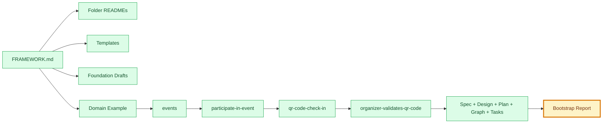
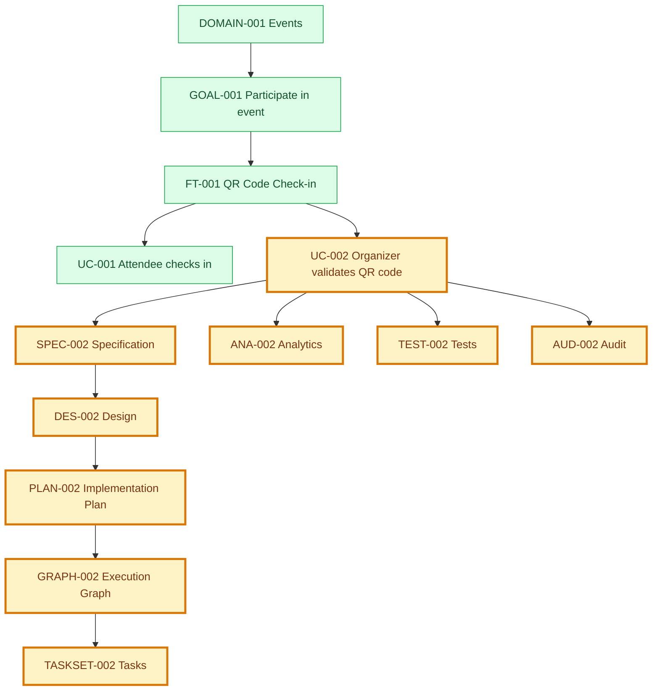
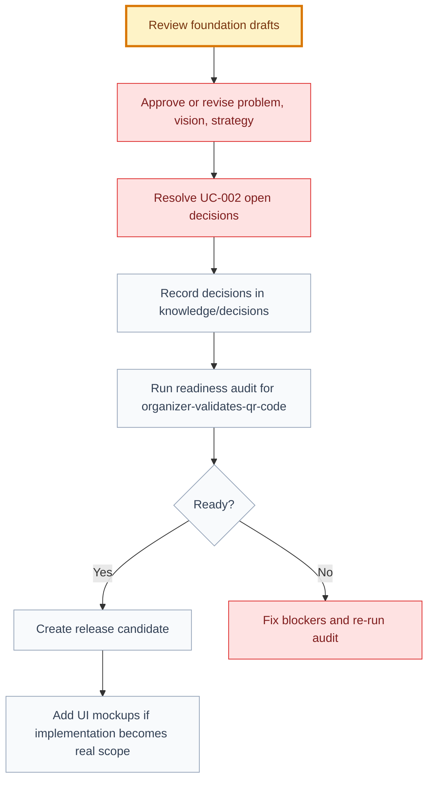

# Bootstrap Documentation Report

## 🧭 Executive Snapshot

| Field | Value |
| --- | --- |
| Date | 2026-07-09 |
| Scope | Framework documentation bootstrap |
| Source of truth | `FRAMEWORK.md` |
| Architecture changes | None |
| Application code | None implemented |
| Files created | 49 |
| Files expanded or normalized | 20 |
| Overall status | 🟡 Bootstrapped, pending human approvals |

## 🗺️ Bootstrap Flow

## 📊 Area Summary

| Icon | Area | Created | Expanded | Status | Notes |
| --- | --- | ---: | ---: | --- | --- |
| 🤖 | Codex and skills indexes | 4 | 0 | ✅ Done | Added project-local navigation and compatibility indexes. |
| 🧭 | Foundation | 16 | 0 | 🟡 Draft | Useful placeholders, not approved product truth. |
| 📚 | Knowledge templates | 6 | 0 | ✅ Done | Added missing report and strategy-support templates. |
| 🧱 | Domains | 23 | 7 | 🟡 Draft/proposed | Added structure and complete organizer validation example. |
| 🔎 | Audits | 1 | 3 | ✅ Done | Added this report and normalized readiness links. |
| 🛠️ | Engineering | 0 | 1 | ✅ Done | Clarified implementation boundaries. |
| 🚢 | Releases | 0 | 1 | ✅ Done | Clarified release gate expectations. |
| 📘 | Knowledge indexes | 0 | 9 | ✅ Done | Expanded previously shallow README files. |

## 🧩 Created Files By Area

### 🤖 Codex And Skills Indexes

| File | Purpose |
| --- | --- |
| `.codex/README.md` | Defines project-local Codex configuration purpose. |
| `.codex/skills/README.md` | Explains repository-local skill usage. |
| `.codex/skills/README.md` | Human-facing and executable index for framework skills. |
| `.codex/skills/*/SKILL.md` | Executable specialist and orchestrator skill contracts. |

### 🧭 Foundation

| File | Purpose |
| --- | --- |
| `foundation/README.md` | Foundation folder contract. |
| `foundation/problem/context.md` | Problem layer context. |
| `foundation/problem/problem.md` | Draft problem placeholder. |
| `foundation/problem/opportunities.md` | Opportunity capture placeholder. |
| `foundation/problem/researches/README.md` | Research evidence guidance. |
| `foundation/problem/interviews/README.md` | Interview evidence guidance. |
| `foundation/vision/context.md` | Vision layer context. |
| `foundation/vision/vision.md` | Draft vision placeholder. |
| `foundation/vision/principles.md` | Candidate product principles. |
| `foundation/vision/north-star.md` | North-star guidance. |
| `foundation/strategy/context.md` | Strategy layer context. |
| `foundation/strategy/strategy.md` | Draft strategy placeholder. |
| `foundation/strategy/personas.md` | Persona structure. |
| `foundation/strategy/competitors.md` | Competitor and alternative structure. |
| `foundation/strategy/metrics.md` | Metric categories. |
| `foundation/strategy/roadmap.md` | Delivery Level roadmap framing. |

### 📚 Knowledge Templates

| File | Purpose |
| --- | --- |
| `knowledge/templates/README.md` | Template catalog and usage. |
| `knowledge/templates/journey-template.md` | Journey artifact shape. |
| `knowledge/templates/persona-template.md` | Persona artifact shape. |
| `knowledge/templates/metric-template.md` | Metric artifact shape. |
| `knowledge/templates/roadmap-item-template.md` | Roadmap item artifact shape. |
| `knowledge/templates/release-template.md` | Release artifact shape. |

### 🧱 Domains And Complete Example

| File | Purpose |
| --- | --- |
| `domains/README.md` | Domain folder contract. |
| `domains/_example-domain/README.md` | Example domain guidance. |
| `domains/_example-domain/goals/_example-goal/README.md` | Example goal guidance. |
| `domains/_example-domain/goals/_example-goal/journeys.md` | Example journey shape. |
| `domains/_example-domain/goals/_example-goal/features/_example-feature/README.md` | Example feature guidance. |
| `domains/_example-domain/goals/_example-goal/features/_example-feature/use-cases/_example-use-case/README.md` | Example use-case bundle guidance. |
| `domains/events/README.md` | Events domain guidance. |
| `domains/events/goals/participate-in-event/README.md` | Goal guidance. |
| `domains/events/goals/participate-in-event/journeys.md` | Goal journey draft. |
| `domains/events/goals/participate-in-event/features/qr-code-check-in/README.md` | Feature guidance. |
| `domains/events/goals/participate-in-event/features/qr-code-check-in/use-cases/README.md` | Use-case collection guidance. |
| `domains/events/goals/participate-in-event/features/qr-code-check-in/use-cases/organizer-validates-qr-code/*` | Complete organizer validation artifact bundle. |

## 🕸️ Organizer Validation Artifact Flow

## 📝 Files Expanded Or Normalized

| Area | Files |
| --- | --- |
| Audits | `audits/README.md`, `audits/readiness/README.md`, `audits/readiness/UC-001-readiness.md` |
| Example domain | `domains/_example-domain/decisions.md`, `domains/_example-domain/.../_example-feature/decisions.md` |
| Events | `domains/events/context.md`, `participate-in-event/context.md`, `qr-code-check-in/context.md`, `qr-code-check-in/feature.md` |
| Engineering and releases | `engineering/README.md`, starter release README |
| Knowledge | `knowledge/business-rules/README.md`, `knowledge/conventions/README.md`, `knowledge/decisions/README.md`, `knowledge/examples/README.md`, `knowledge/glossary/README.md`, `knowledge/patterns/README.md`, `knowledge/prompts/README.md` |
| Decisions | `DEC-001-qr-expiration-duration.md`, `DEC-002-qr-token-strategy.md` |

## 🚦 Incompleteness Matrix

| Status | Item | Why It Is Incomplete | Next Owner |
| --- | --- | --- | --- |
| 🟡 Draft | Foundation artifacts | Useful placeholders but not approved product truth. | Product Orchestrator |
| 🔴 Missing evidence | `researches/` and `interviews/` | No research or interview files yet. | Problem Discovery AI |
| 🟡 Draft | Personas, competitors, metrics, roadmap | Need real research and approval. | Strategy AI |
| 🔵 Example only | `_example-domain` | Structural reference, not product scope. | Documentation Writer AI |
| 🟡 Proposed | `organizer-validates-qr-code` | Needs human approval for open decisions. | Use Case AI |
| 🔴 Missing asset | Scanner mockups/wireframes | Design has states but no visual mockup artifact. | UX/UI AI |
| 🔴 Missing release | `releases/RELEASE-001.md` | No release candidate created yet. | Release Orchestrator |

## 🔐 Decisions Needing Human Approval

| Decision | Blocks | Recommended Owner | Status |
| --- | --- | --- | --- |
| Should L1 organizer QR validation support offline operation or remain online-only? | UC-002 approval and implementation planning | Product + Security | Open |
| Which organizer roles can validate event check-in? | Permission rules and API contract | Product + Engineering | Open |
| Is manual fallback required when camera access fails? | UX acceptance and release readiness | Product + UX | Open |
| Should `events.qr_check_in.organizer_validation` exist as a feature flag? | Rollout strategy | Engineering | Open |
| Can foundation problem, vision, strategy, personas, metrics, and roadmap move beyond draft? | Domain and roadmap confidence | Product | Open |

## 🏁 Recommended Next-Step Flow

## ✅ Validation Performed

| Check | Result |
| --- | --- |
| No application code implemented | ✅ Pass |
| No `FRAMEWORK.md` architecture change | ✅ Pass |
| `organizer-validates-qr-code/execution-graph.json` parses as JSON | ✅ Pass |
| Old `product/...` links normalized in worked areas | ✅ Pass |
