# Framework Validation Report

## 🧭 Executive Snapshot

| Field | Value |
| --- | --- |
| Date | 2026-07-09 |
| Validator | `engineering/validators/framework-validator.mjs` |
| Verdict | ✅ ready |
| Errors | 0 |
| Warnings | 0 |
| Notes | 0 |

## 🗺️ Validation Flow

```mermaid
flowchart LR
  A["Scan repository"] --> B["Validate context.md"]
  B --> C["Validate use-case bundles"]
  C --> D["Validate execution graphs"]
  D --> E["Validate decisions index"]
  E --> F["Validate links and Mermaid"]
  F --> G["Report verdict"]

  classDef done fill:#dcfce7,stroke:#16a34a,color:#14532d;
  classDef current fill:#fef3c7,stroke:#d97706,color:#78350f,stroke-width:3px;
  classDef pending fill:#f8fafc,stroke:#94a3b8,color:#334155;
  classDef blocked fill:#fee2e2,stroke:#dc2626,color:#7f1d1d;

  class A,B,C,D,E,F done;
  class G current;
```

## 🚦 Check Summary

| Check | Status |
| --- | --- |
| Context metadata | ✅ no errors |
| Use-case bundles | ✅ no errors |
| Approval gates | ✅ no findings |
| Approval records | ✅ no findings |
| Derived staleness | ✅ no findings |
| Validation gates | ✅ no findings |
| Traceability | ✅ no findings |
| Status policy | ✅ no findings |
| Delivery metadata | ✅ no findings |
| Execution graph JSON and dependencies | ✅ no errors |
| Decisions index | ✅ no findings |
| Decision references | ✅ no findings |
| Artifacts registry | ✅ no findings |
| Mermaid visual standard | ✅ no findings |
| Mermaid progress state | ✅ no findings |
| Mermaid semantic state | ✅ no findings |
| Markdown links | ✅ no findings |
| Template snapshots | ✅ no findings |

## 🔎 Findings

| Severity | Check | File | Finding | Suggested Fix |
| --- | --- | --- | --- | --- |
| ✅ ready | framework | repository | No findings. | None |

## 🏁 Result

| Field | Value |
| --- | --- |
| Verdict | ✅ ready |
| Required next step | Proceed to next framework step. |
