# Framework Readiness Matrix

## 🧭 Executive Snapshot

| Field | Value |
| --- | --- |
| Date | 2026-07-09 |
| Auditor | `engineering/validators/framework-validator.mjs` |
| Scope | Use cases with real delivery level |
| Use cases checked | 2 |
| Ready for task generation | 0 |
| Ready for validation/release | 0 |
| Overall verdict | 🟡 in_progress |

## 🗺️ Readiness Flow

```mermaid
flowchart LR
  U["Use Case"] --> S["Specification"]
  S --> D["Design"]
  D --> P["Implementation Plan"]
  P --> G["Execution Graph"]
  G --> T["Tasks"]
  T --> Q["QA Evidence"]
  Q --> SR["Security Review"]
  SR --> R["Ready For Validation"]

  classDef done fill:#dcfce7,stroke:#16a34a,color:#14532d;
  classDef current fill:#fef3c7,stroke:#d97706,color:#78350f,stroke-width:3px;
  classDef pending fill:#f8fafc,stroke:#94a3b8,color:#334155;
  classDef blocked fill:#fee2e2,stroke:#dc2626,color:#7f1d1d;

  class U done;
  class S current;
  class D,P,G,T,Q,SR,R pending;
```

## 🚦 Use Case Matrix

| Use Case | Name | Verdict | Score | Spec | Design | Plan | Graph | Tasks | Tests | QA Evidence | Security Review | Can Generate Tasks | Validation Ready | Next Owner |
| --- | --- | --- | --- | --- | --- | --- | --- | --- | --- | --- | --- | --- | --- | --- |
| [UC-001](../../domains/events/goals/participate-in-event/features/qr-code-check-in/use-cases/attendee-checks-in-with-qr-code/context.md) | Attendee checks in with QR code | 🟡 in_progress | 0% | ➖ draft | ➖ draft | ➖ draft | ➖ draft | ➖ draft | ➖ draft | 🔴 missing | 🔴 missing | no | no | Specification AI |
| [UC-002](../../domains/events/goals/participate-in-event/features/qr-code-check-in/use-cases/organizer-validates-qr-code/context.md) | Organizer Validates QR Code | 🟡 in_progress | 0% | 🟡 proposed | ➖ draft | ➖ draft | ➖ draft | ➖ draft | ➖ draft | ➖ draft | ➖ draft | no | no | Specification AI |

## 🏁 Result

| Field | Value |
| --- | --- |
| Current bottleneck | Specification approval and downstream approval gates |
| Recommended next skill | Specification AI |
| Required next step | Review and approve or revise draft/proposed specifications before design, plan, graph, and tasks advance. |
