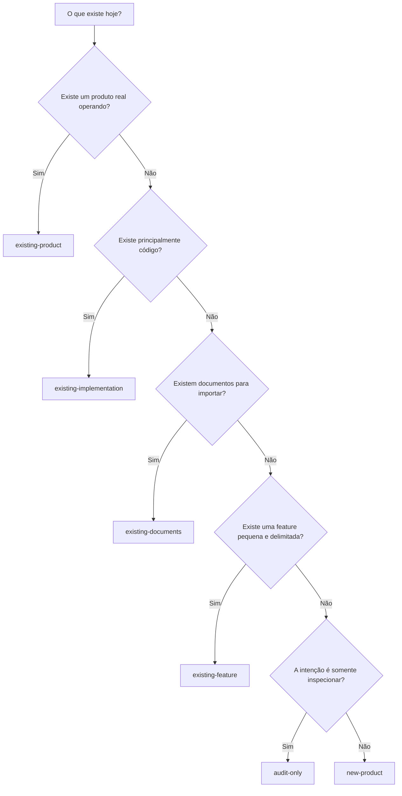

# Starting points do Spec Framework

## Objetivo

Um `starting-point` descreve a situação do produto no momento em que um repositório começa a usar o Spec Framework.

Independentemente do ponto de partida, antes de uma Specification real o produto precisa completar e aprovar três bases: `knowledge/assessments/product-landscape.md`, `engineering/engineering-system.md` e `design/system/design-system.md`. Com código, o Landscape inventaria todas as raízes de código, módulos, superfícies, dados, integrações, regras, testes, configuração e ativos de design; sem código, esses contratos registram hipóteses explícitas e decisões pendentes.

Ele não representa:

- o entrypoint técnico da aplicação, como `main.go` ou `index.ts`;
- a linguagem ou o framework usado pelo produto;
- a arquitetura final do software;
- uma forma de remover skills, validações ou gates do framework.

O starting point responde a duas perguntas:

1. Qual evidência já existe sobre o produto?
2. Qual deve ser o primeiro contrato revisado e aprovado?

O comando `init` registra essa escolha em `product/.product/framework.json`, gera orientação contextual em `product/BOOTSTRAP.md` e configura o primeiro gate do fluxo. A escolha não transforma evidências existentes em verdade aprovada e não elimina os gates posteriores do framework.

## Starting point e estrutura materializada

O starting point controla principalmente o fluxo de adoção:

- a fonte inicial de evidência;
- o primeiro artefato ou contrato;
- o primeiro gate;
- as orientações do bootstrap;
- os comandos permitidos em situações especiais, como `audit-only`.

A estrutura física criada pelo `init` é uma preocupação relacionada, mas diferente. Uma implementação baseada em contratos pode associar cada starting point a um perfil de materialização que selecione os arquivos, templates, diretórios e registros necessários.

Os contratos e templates internos continuam pertencendo ao runtime do framework. O repositório adotante recebe somente os artefatos materializados dentro de `product/`; ele não recebe `framework/`, as decisões do framework, as skills canônicas ou `examples/events/`.

```text
CLI e runtime do framework
  -> resolvem o contrato do starting point
    -> selecionam templates e arquivos
      -> materializam somente o resultado em product/
```

### Matriz de materialização

Os contratos de `init` devem seguir esta matriz. `sim` significa que o
starting point recebe o conjunto inicial; não significa que os artefatos já
estejam aprovados. Diretórios de delivery podem ser criados posteriormente
por uma skill quando a entrega realmente precisar deles.

| Starting point | Foundation | Knowledge | Delivery | Governance |
| --- | --- | --- | --- | --- |
| `new-product` | Problem, Vision, Principles, North Star e Strategy | Sim | Domains, Design e Engineering | Sim |
| `existing-product` | Product Baseline e Strategy | Sim | Domains, Design e Engineering | Sim |
| `existing-implementation` | Implementation Assessment e Foundation completa | Sim | Domains, Design e Engineering | Sim |
| `existing-documents` | Somente artefatos selecionados na materialização do import | Imports | Não inicialmente | Sim |
| `existing-feature` | Feature Brief e bases compartilhadas | Sim | Domains, Design e Engineering | Sim |
| `audit-only` | Nenhuma | Security Baseline mínimo | Não | Relatórios mínimos |

Essa matriz controla a estrutura inicial, mas não remove skills, validações,
gates ou rigor posterior. A materialização de um arquivo importado pode criar
o diretório-pai necessário sem transformar o restante do scaffold em conteúdo
inicial.

## Resumo das opções

| Starting point | Situação inicial | Primeiro contrato ou gate |
| --- | --- | --- |
| `new-product` | Existe uma ideia ou oportunidade, mas o produto ainda precisa ser definido | Foundation completa, começando por Problem |
| `existing-product` | Existe um produto real em operação | Product Baseline e depois Strategy |
| `existing-implementation` | Existe código, mas não há certeza sobre produto, intenção ou operação | Implementation Assessment e depois Foundation completa |
| `existing-documents` | Existem documentos que precisam entrar no framework | Import run, revisão dos mapeamentos e materialização como drafts |
| `existing-feature` | Existe uma entrega pequena e claramente delimitada | Feature Brief, Product Landscape e bases compartilhadas antes da feature alvo |
| `audit-only` | A intenção é somente inspecionar o estado atual | Validação e diagnóstico sem mutações |

## Como escolher

Use esta sequência de perguntas:

1. Existe um produto real operando, com usuários, releases ou evidências operacionais? Use `existing-product`.
2. Não existe evidência suficiente de operação, mas existe principalmente código? Use `existing-implementation`.
3. A principal fonte disponível são documentos, como PRDs, Jira, Confluence ou uma wiki? Use `existing-documents`.
4. A adoção está limitada a uma única feature pequena e bem definida? Use `existing-feature`.
5. A intenção é apenas avaliar gaps sem alterar o produto? Use `audit-only`.
6. Se nenhuma das situações anteriores se aplica, use `new-product`.

Quando mais de uma situação parecer aplicável, escolha a fonte de evidência mais confiável para o primeiro gate. Por exemplo, um repositório pode ter código e documentos, mas, se o produto está comprovadamente em operação, `existing-product` representa melhor o estado inicial do que `existing-implementation`.

### Árvore de decisão simples



Leitura resumida:

- produto comprovadamente em operação: `existing-product`;
- apenas uma implementação ou base de código: `existing-implementation`;
- documentação como principal fonte inicial: `existing-documents`;
- uma única entrega proporcional e delimitada: `existing-feature`;
- inspeção sem alterações: `audit-only`;
- nenhuma das situações anteriores: `new-product`.

Antes de inicializar qualquer ponto de partida, o agente inventaria o repositório completo e classifica semanticamente as raízes de implementação. Ele passa o mapa confirmado por `--code-roots path:role,...`, ou usa `--no-code-roots` depois de confirmar que não existe implementação. A descoberta de marcadores pela CLI é apenas um fallback de compatibilidade, fica marcada para revisão do agente e não libera o gate pré-Specification.

## Evolucao de uma demanda existente

Depois do bootstrap, uma nova demanda nao precisa criar uma nova hierarquia. O agente deve ler o `context.md` local, a cadeia de pais, Features e Use Cases irmaos, decisoes aprovadas, os contratos compartilhados de Engenharia e Design e a evidencia de codigo relacionada. Em seguida, propoe se a demanda estende um Use Case, cria um Use Case na Feature existente, cria uma Feature no Goal atual, ou exige um novo Goal/Domain. Ambiguidade para antes da criacao de artefatos.

Demandas externas seguem `existing-documents` e o Artifact Importer: inventario, rastreabilidade, mapeamento, revisao humana e materializacao como draft. Demandas que ja pertencem ao produto seguem Evolution e a skill proprietaria do proximo artefato. Os campos opcionais `relations`, `traceability` e `evolution` no `context.md` registram reutilizacao, impactos, origem e historico sem alterar a estrutura de diretorios.

## `new-product`

### Quando usar

Use quando o produto ainda está sendo definido. Pode existir uma ideia, uma oportunidade ou pesquisas iniciais, mas ainda não existe um produto operando nem uma entrega suficientemente delimitada.

### Exemplo prático

Uma equipe quer criar uma plataforma para conectar nutricionistas e pacientes, mas ainda precisa definir:

- qual segmento será atendido primeiro;
- qual problema principal será resolvido;
- qual experiência será oferecida;
- como o sucesso será medido;
- quais funcionalidades serão prioritárias.

### Fluxo inicial

```text
Problem
  -> Vision
    -> Product Principles
      -> North Star
        -> Strategy
          -> Domain
```

### Por que atende

Esse caminho impede que features sejam criadas antes que problema, público, direção, métricas e limites do produto estejam suficientemente claros.

Principais artefatos:

```text
product/foundation/problem/problem.md
product/foundation/vision/vision.md
product/foundation/vision/principles.md
product/foundation/vision/north-star.md
product/foundation/strategy/strategy.md
```

## `existing-product`

### Quando usar

Use quando existe um produto real em operação. Normalmente há usuários, releases, código em produção, métricas, suporte ou histórico operacional, mas a documentação canônica de produto está incompleta.

### Exemplo prático

Uma empresa possui um SaaS financeiro há quatro anos, com milhares de clientes, releases semanais, integrações bancárias, métricas e tickets de suporte. Ainda assim, não há documentação clara sobre o público atual, o valor efetivamente entregue, as capacidades existentes e a direção futura.

### Fluxo inicial

```text
Product Baseline
  -> Strategy
    -> Domain
```

### Por que atende

O Product Baseline registra primeiro a realidade observável do produto:

- quem usa;
- qual valor é entregue;
- quais capacidades existem;
- como o produto opera;
- quais sinais sustentam essas afirmações;
- quais limitações, riscos e desconhecimentos existem.

Depois disso, Strategy registra a direção futura.

Principais artefatos:

```text
product/foundation/product-baseline.md
product/foundation/strategy/strategy.md
```

## `existing-implementation`

### Quando usar

Use quando existe código, mas não está claro se ele representa um produto real, validado ou intencional. Pode ser um protótipo, proof of concept, MVP não lançado, ferramenta interna, projeto legado ou repositório herdado.

### Exemplo prático

Uma empresa possui um repositório com backend, banco de dados, algumas telas e testes incompletos. A equipe atual não sabe se ele chegou a ser lançado, quem seria o público, quais comportamentos eram intencionais ou quais partes eram experimentais.

### Fluxo inicial

```text
Implementation Assessment
  -> Problem
    -> Vision
      -> Product Principles
        -> North Star
          -> Strategy
```

### Por que atende

O código é tratado como evidência, não como verdade de produto. A avaliação registra o que foi observado em comportamento, arquitetura, dados, integrações, testes, operação e riscos, além do que não pode ser concluído.

Principal artefato inicial:

```text
product/knowledge/assessments/implementation-assessment.md
```

### Diferença para `existing-product`

| `existing-product` | `existing-implementation` |
| --- | --- |
| Há evidência de produto operando | Há principalmente evidência de código |
| Usuários ou operação real são observáveis | O código pode nunca ter sido lançado |
| Começa com Product Baseline | Começa com Implementation Assessment |
| Segue para Strategy | Segue pela Foundation completa |

Regra simples: se há certeza de que existe um produto real operando, use `existing-product`. Se há certeza apenas de que existe código, use `existing-implementation`.

## `existing-documents`

### Quando usar

Use quando a principal evidência disponível está em documentos que precisam ser incorporados ao Spec Framework, como:

- PRDs;
- páginas do Confluence;
- Epics e Stories do Jira;
- wikis;
- roadmaps;
- regras de negócio;
- ADRs;
- documentos de requisitos ou arquitetura.

Os documentos podem estar fora do repositório. O que define esse starting point é a natureza da fonte, não sua localização.

### Exemplo prático: Jira e Confluence

Uma equipe mantém visão, estratégia e arquitetura no Confluence, enquanto Epics, Stories e critérios de aceitação estão no Jira. O código não é a fonte principal para a adoção.

O starting point correto é `existing-documents`.

```text
Jira e Confluence
  -> coleta ou exportação das fontes
    -> inventário
      -> identificação de duplicações e conflitos
        -> mapeamento para artefatos do framework
          -> revisão humana
            -> materialização como drafts
              -> aprovação normal de cada artefato
```

Possíveis mapeamentos:

| Origem | Destino candidato |
| --- | --- |
| Página de visão no Confluence | `foundation/vision/vision.md` |
| Estratégia ou roadmap | `foundation/strategy/strategy.md` |
| Epic do Jira | User Goal, Feature ou conjunto de Features, após revisão |
| Story do Jira | Use Case ou evidência para uma Specification |
| Acceptance Criteria | Specification e testes |
| ADR no Confluence | `knowledge/decisions/DEC-*.md`, `design/decisions/DEC-*.md`, or `engineering/decisions/DEC-*.md`, according to the declared domain |
| Regras de negócio | `knowledge/business-rules/` |
| Documento de arquitetura | Evidência para Engineering System ou Technical Discovery |

Uma Epic não deve ser convertida automaticamente em Feature e uma Story não deve ser convertida automaticamente em Use Case. Times diferentes usam esses objetos com semânticas diferentes, portanto o mapeamento precisa ser revisado.

### Fluxo inicial

```text
Source Inventory
  -> Mapping
    -> Conflict Review
      -> Explicit Materialization
        -> Draft Product Artifacts
```

O import run canônico contém:

```text
product/knowledge/imports/runs/IMPORT-001/
  inventory.json
  import-plan.json
  mapping.json
  conflicts.md
  import-report.md
```

### Fronteira de aprovação

Importar ou materializar um documento não significa aprová-lo como verdade do produto. A materialização autoriza somente a criação dos arquivos selecionados com status `draft`. Cada artefato resultante continua sujeito ao seu owner, seus parents, validações e aprovações normais.

### Integração direta e exportação local

Se a CLI não possuir um adaptador direto para Jira e Confluence, as fontes podem ser exportadas para Markdown, HTML, CSV ou JSON e fornecidas ao `init` como arquivos locais.

Uma integração direta futura deve:

- autenticar nas APIs sem persistir tokens em `product/`;
- permitir selecionar projetos, spaces, páginas e issues;
- preservar URL, ID, versão e data da fonte;
- criar um snapshot imutável para o import run;
- detectar mudanças de conteúdo por hash;
- manter revisão e materialização como ações explícitas.

## `existing-feature`

### Quando usar

Use quando a adoção está limitada a uma entrega pequena e claramente delimitada, com problema específico, resultado esperado, escopo, não objetivos e uma única feature alvo.

### Exemplo prático

Um e-commerce existente quer permitir pagamento via PIX. A mudança está concentrada no fluxo de checkout, possui resultado esperado, integração conhecida e métrica específica. A equipe não precisa reconstruir toda a estratégia do e-commerce para iniciar essa entrega.

### Fluxo inicial

```text
Feature Brief
  -> Product Landscape completo
    -> Engineering System e Design System compartilhados
      -> Domain
        -> User Goal
          -> Feature
            -> Use Case
              -> Specification
```

Principal artefato inicial:

```text
product/foundation/feature-brief.md
```

### Por que atende

O Feature Brief reúne proporcionalmente o problema, resultado desejado, escopo, não objetivos, restrições, evidências, sinal de sucesso e estratégia da entrega. Quando há código, o agente primeiro confirma todas as raízes e carrega delas o Product Landscape, a engenharia e o Design System observados; essas bases são aprovadas antes da Specification e não ficam limitadas ao escopo da feature.

### Quando não usar

Não use quando a mudança envolve reposicionamento do produto, novo modelo de negócio, múltiplos domínios, política global de segurança, mudança ampla de público ou direção ainda incerta. Nesses casos, a adoção deve escalar para a Foundation completa.

## `audit-only`

### Quando usar

Use quando a intenção é somente avaliar o estado atual, sem criar ou aprovar documentação de produto.

### Exemplo prático

Uma consultoria precisa avaliar um repositório e responder se a documentação está completa, se há decisões sem rastreabilidade, gaps de segurança, Specifications ausentes ou evidências insuficientes de QA. A consultoria ainda não possui autorização para alterar o produto.

### Fluxo inicial

```text
Inspect
  -> Validate
    -> Report gaps
      -> Stop
```

### Por que atende

O modo protege o produto contra mutações acidentais. Enquanto o manifest declarar `audit-only`, ficam bloqueadas ações como:

- aprovações;
- criação de workspaces;
- movimentos de artefatos;
- materialização de imports;
- alterações de registry e relatórios persistidos;
- migrações que escrevem estado;
- inicialização de Design ou Engineering System.

Continuar dos achados para trabalho de produto exige uma transição explícita de starting point.

## Comparações rápidas

### Documentos versus produto operando

- Use `existing-documents` quando Jira, Confluence, PRDs ou wikis são a principal fonte inicial.
- Use `existing-product` quando a realidade operacional, os usuários, as releases e as métricas são a fonte principal, mesmo que documentos também existam.

### Documentos versus implementação

- Use `existing-documents` quando o conhecimento está documentado e precisa ser classificado e importado.
- Use `existing-implementation` quando o principal material existente é código e é necessário determinar o que ele realmente demonstra.

### Feature existente versus documentos existentes

- Use `existing-feature` quando já há uma entrega pequena e delimitada que pode ser descrita por um Feature Brief.
- Use `existing-documents` quando primeiro é necessário descobrir, reconciliar e mapear o conteúdo de Jira, Confluence ou outras fontes.

Se Jira e Confluence contêm muitos documentos sobre vários domínios e entregas, `existing-documents` é a escolha adequada. Se eles contêm apenas o material de uma única feature já delimitada, a equipe pode importar as fontes como evidência e avaliar se `existing-feature` é o caminho proporcional. Essa decisão não deve ser inferida silenciosamente pela CLI.

## Regra final

O starting point escolhe o primeiro caminho confiável para entrar no framework. Ele não concede aprovação, não remove gates e não transforma código ou documentos existentes em verdade canônica automaticamente.

Em uma frase:

| Starting point | Pergunta principal |
| --- | --- |
| `new-product` | Que produto devemos construir e por quê? |
| `existing-product` | Que produto realmente existe hoje? |
| `existing-implementation` | O que este código realmente demonstra? |
| `existing-documents` | Como transformar documentos existentes em drafts rastreáveis? |
| `existing-feature` | Como entregar esta feature delimitada sem reconstruir a Foundation completa, preservando as bases compartilhadas do produto? |
| `audit-only` | Quais gaps existem sem alterar nada? |
