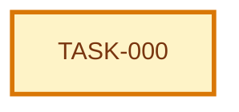

# Tasks Index: Example Use Case

> Generated index. Do not edit manually.
> Source of truth: [execution-graph.json](execution-graph.json) and [tasks/](tasks/).

## Snapshot

| Field | Value |
| --- | --- |
| ID | UC-EXAMPLE:tasks |
| Status | draft |
| Source graph | GRAPH-EXAMPLE |
| Source specification | UC-EXAMPLE:specification |
| Generated from | execution-graph.json + tasks/*.md |
| Owner skill | Task AI |
| Next skill | Code Runner AI or QA AI |

## Navigation

| Artifact | Link |
| --- | --- |
| Context | [context.md](context.md) |
| Specification | [specification.md](specification.md) |
| Implementation Plan | [implementation-plan.md](implementation-plan.md) |
| Execution Graph | [execution-graph.json](execution-graph.json) |
| Tests | [tests.md](tests.md) |
| Audit | [audit.md](audit.md) |

## Delivery

| Field | Value |
| --- | --- |
| Level | N/A |
| Priority | N/A |
| Depends on | none |
| Rationale | Structural example only; not product scope. |

## Task Graph

## Task Files

| Task | File | Type | Depends On | Status | Acceptance |
| --- | --- | --- | --- | --- | --- |
| `TASK-000` Example task | [tasks/TASK-000.md](tasks/TASK-000.md) | example | none | draft | Example task has a visible acceptance check. |

## Canonical Ownership

| Concern | Source of Truth |
| --- | --- |
| Dependency order | [execution-graph.json](execution-graph.json) |
| Task status | [tasks/](tasks/) |
| Task contract | [tasks/](tasks/) |
| Implementation links | [tasks/](tasks/) |
| Validation evidence | [tasks/](tasks/) and QA evidence artifacts |

## Blocked Tasks

| Task | Blocking Reason | Decision/Dependency Needed | Owner |
| --- | --- | --- | --- |
| None | None | None | None |

## Validation Methods

| Task | Validation |
| --- | --- |
| `TASK-000` | Example task has a visible acceptance check. |

## Parallelism Notes

- Parallel execution follows dependency order and write scopes declared in [execution-graph.json](execution-graph.json).

## Handoff

| Field | Value |
| --- | --- |
| Ready for implementation | no |
| Required next skill | Task AI |
| Notes | Regenerate this index whenever graph nodes or task files change. |
