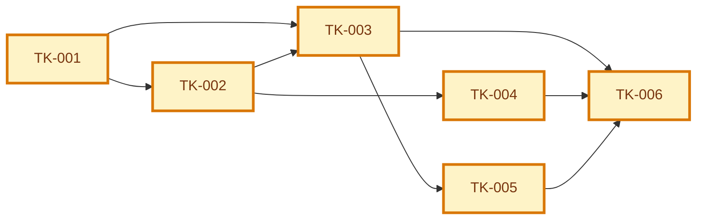

# Tasks Index: Attendee Checks In With Qr Code

> Generated index. Do not edit manually.
> Source of truth: [execution-graph.json](execution-graph.json) and [tasks/](tasks/).

## Snapshot

| Field | Value |
| --- | --- |
| ID | UC-001:tasks |
| Status | draft |
| Source graph | GRAPH-001 |
| Source specification | SPEC-001 |
| Generated from | execution-graph.json + tasks/*.md |
| Owner skill | Task AI |
| Next skill | Code Runner AI or QA AI |

## Navigation

| Artifact | Link |
| --- | --- |
| Context | [context.md](context.md) |
| Specification | [specification.md](specification.md) |
| Implementation Plan | [implementation-plan.md](implementation-plan.md) |
| Execution Graph | [execution-graph.json](execution-graph.json) |
| Tests | [tests.md](tests.md) |
| Audit | [audit.md](audit.md) |

## Delivery

| Field | Value |
| --- | --- |
| Level | L1 |
| Priority | P0 |
| Depends on | SPEC-001, PLAN-001, DEC-001, DEC-002 |
| Rationale | The graph orders the minimum L1 work needed to generate, present, and validate attendee QR codes. |

## Task Graph

## Task Files

| Task | File | Type | Depends On | Status | Acceptance |
| --- | --- | --- | --- | --- | --- |
| `TK-001` Add attendance check-in persistence | [tasks/TK-001.md](tasks/TK-001.md) | database | none | draft | attendance check-in state and token persistence are constrained and testable |
| `TK-002` Implement QR token generation | [tasks/TK-002.md](tasks/TK-002.md) | backend | TK-001 | draft | attendee can generate event-scoped non-PII QR token |
| `TK-003` Implement QR token validation | [tasks/TK-003.md](tasks/TK-003.md) | backend | TK-001, TK-002 | draft | organizer validation is permissioned, idempotent, and rejects invalid tokens |
| `TK-004` Build attendee QR UI states | [tasks/TK-004.md](tasks/TK-004.md) | frontend | TK-002 | draft | attendee sees active, loading, expired, error, and refresh states |
| `TK-005` Build organizer validation UI states | [tasks/TK-005.md](tasks/TK-005.md) | frontend | TK-003 | draft | organizer sees success, already checked in, invalid, expired, and permission denied states |
| `TK-006` Add analytics, tests, and QA evidence | [tasks/TK-006.md](tasks/TK-006.md) | test | TK-003, TK-004, TK-005 | draft | acceptance criteria have automated or documented validation |

## Canonical Ownership

| Concern | Source of Truth |
| --- | --- |
| Dependency order | [execution-graph.json](execution-graph.json) |
| Task status | [tasks/](tasks/) |
| Task contract | [tasks/](tasks/) |
| Implementation links | [tasks/](tasks/) |
| Validation evidence | [tasks/](tasks/) and QA evidence artifacts |

## Blocked Tasks

| Task | Blocking Reason | Decision/Dependency Needed | Owner |
| --- | --- | --- | --- |
| None | None | None | None |

## Validation Methods

| Task | Validation |
| --- | --- |
| `TK-001` | attendance check-in state and token persistence are constrained and testable |
| `TK-002` | attendee can generate event-scoped non-PII QR token |
| `TK-003` | organizer validation is permissioned, idempotent, and rejects invalid tokens |
| `TK-004` | attendee sees active, loading, expired, error, and refresh states |
| `TK-005` | organizer sees success, already checked in, invalid, expired, and permission denied states |
| `TK-006` | acceptance criteria have automated or documented validation |

## Parallelism Notes

- Parallel execution follows dependency order and write scopes declared in [execution-graph.json](execution-graph.json).

## Handoff

| Field | Value |
| --- | --- |
| Ready for implementation | no |
| Required next skill | Task AI |
| Notes | Regenerate this index whenever graph nodes or task files change. |
