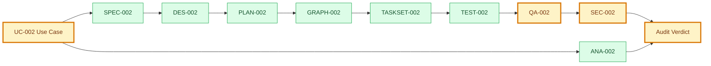
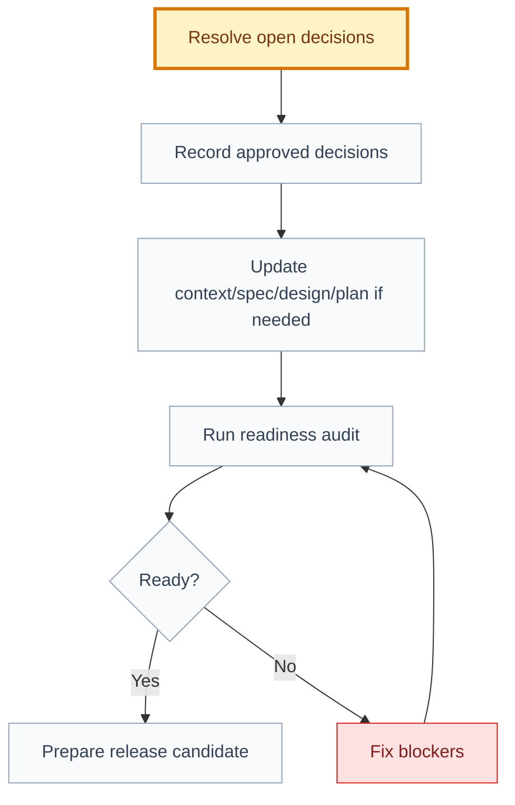

# Audit: Organizer Validates QR Code

## 🧭 Executive Snapshot

| Field | Value |
| --- | --- |
| ID | AUD-002 |
| Status | draft |
| Scope | UC-002, SPEC-002, DES-002, PLAN-002, GRAPH-002, TASKSET-002, TEST-002, QA-002, SEC-002, ANA-002 |
| Verdict | 🟡 approved_with_notes |
| Next recommended skill | Impact Analysis AI, then Product Historian AI |

## 🗺️ Audit Flow

## 🚦 Verdict Matrix

| Area | Result | Evidence | Notes |
| --- | --- | --- | --- |
| Use-case behavior | ✅ pass | `use-case.md` | Main, alternate, error, and edge flows exist. |
| Specification coverage | ✅ pass | `specification.md` | Required framework sections are present. |
| Design readiness | 🟡 notes | `design.md` | Scanner states exist; mockups are not present. |
| Planning readiness | 🟡 notes | `implementation-plan.md` | Sequencing exists; open decisions remain. |
| Execution graph | ✅ pass | `execution-graph.json` | Graph is a DAG and includes dependency metadata. |
| Task traceability | ✅ pass | `tasks.md` | Tasks point to specification-derived work. |
| Test coverage | ✅ pass | `tests.md` | Behavior, permissions, data, UX, analytics, and accessibility are covered. |
| QA evidence | blocked | `qa-evidence.md` | Evidence is planned but not executed; validation remains blocked. |
| Security review | blocked | `security-review.md` | Security review is drafted and blocks validation until role and rollout decisions are approved. |
| Decision readiness | 🔴 blocked | `context.md`, `specification.md`, `implementation-plan.md` | Organizer roles, offline mode, and manual fallback need approval. |

## 🔎 Findings

| Severity | Finding | Evidence | Impact | Required Fix | Owner |
| --- | --- | --- | --- | --- | --- |
| 🟡 medium | Online versus offline validation is not approved. | `specification.md` lists offline validation as non-goal and open question. | Venue operations may be affected by network dependency. | Confirm online-only validation for L1 or approve an offline validation decision. | Product + Security |
| 🔴 high | Organizer permission roles need human approval. | `context.md`, `specification.md`, and `implementation-plan.md` list organizer roles as open. | Permission model cannot be safely implemented. | Approve which roles can validate check-in. | Product + Engineering |
| 🟡 medium | Manual fallback is out of scope. | `design.md` and `implementation-plan.md` leave camera failure fallback open. | Camera failure may block check-in operations. | Decide whether L1 can ship without manual fallback. | Product + UX |

## 🔐 Required Decisions Before Approval

| Decision | Blocks | Recommended Owner | Status |
| --- | --- | --- | --- |
| Which organizer roles can validate check-in? | Permission rules, API contract, tasks | Product + Engineering | Open |
| Should L1 support offline validation? | Specification approval and rollout risk | Product + Security | Open |
| Is manual fallback required for camera failure? | UX acceptance and release readiness | Product + UX | Open |

## 💡 Suggested Improvements

| Improvement | Benefit | Timing |
| --- | --- | --- |
| Add UX review after mockups exist. | Reduces scanner usability risk. | Before implementation approval |
| Add release readiness report. | Makes ship/no-ship criteria explicit. | Before release candidate |
| Link this use case to a release candidate. | Preserves scope and readiness traceability. | After roadmap approval |

## 🌡️ Residual Risk

| Risk | Likelihood | Impact | Mitigation |
| --- | --- | --- | --- |
| Venue operations suffer if network connectivity is poor and online-only validation remains the L1 choice. | Medium | High | Approve online-only explicitly for L1 or create an offline validation decision and follow-up spec update. |

## 🏁 Next-Step Flow

