# Security Review: Organizer Validates QR Code

## Snapshot

| Field | Value |
| --- | --- |
| ID | SEC-002 |
| Status | draft |
| Source use case | UC-002 |
| Source specification | SPEC-002 |
| Source QA evidence | QA-002 |
| Owner skill | Security Review AI |
| Next skill | QA AI or Audit Orchestrator |

## Navigation

| Artifact | Link |
| --- | --- |
| Context | [context.md](context.md) |
| Specification | [specification.md](specification.md) |
| Design | [design.md](design.md) |
| Implementation Plan | [implementation-plan.md](implementation-plan.md) |
| Execution Graph | [execution-graph.json](execution-graph.json) |
| Tasks | [tasks.md](tasks.md) |
| Tests | [tests.md](tests.md) |
| QA Evidence | [qa-evidence.md](qa-evidence.md) |
| Audit | [audit.md](audit.md) |

## Delivery

| Field | Value |
| --- | --- |
| Level | L1 |
| Priority | P0 |
| Depends on | UC-001, DEC-001, DEC-002 |
| Rationale | Organizer validation is a server-authoritative attendance action and must be reviewed before validation or release. |

## Security Gate Flow

```mermaid
flowchart LR
  S["Specification security contract"] --> D["Design privacy states"]
  D --> P["Plan controls"]
  P --> G["Security graph nodes"]
  G --> Q["QA evidence"]
  Q --> R["Security review"]
  R --> A["Audit or release gate"]

  classDef done fill:#dcfce7,stroke:#16a34a,color:#14532d;
  classDef current fill:#fef3c7,stroke:#d97706,color:#78350f,stroke-width:3px;
  classDef pending fill:#f8fafc,stroke:#94a3b8,color:#334155;
  classDef blocked fill:#fee2e2,stroke:#dc2626,color:#7f1d1d;

  class S,D,P,G done;
  class Q,R current;
  class A pending;
```

## Security Scope

| Area | In Scope | Out Of Scope |
| --- | --- | --- |
| Authentication | Organizer must be authenticated before scanning can submit validation. | Anonymous validation. |
| Authorization | Server checks organizer role and event permission on every validation. | Client-only permission checks. |
| Data and privacy | QR payload is opaque; responses and logs avoid attendee PII on failures. | Exposing attendee profile details for failed scans. |
| Abuse prevention | Invalid, expired, wrong-event, duplicate, and replay-like scans return controlled states. | Offline validation unless approved later. |
| Observability | Audit log and analytics capture safe result and reason fields. | Logging raw QR payloads or sensitive attendee data. |

## Threat Model Summary

| Threat | Actor | Impact | Required Control | Evidence |
| --- | --- | --- | --- | --- |
| Unauthorized user validates attendee check-in. | Authenticated user without event permission | False attendance record. | Server-side authorization on every validation. | Pending security test in [qa-evidence.md](qa-evidence.md). |
| QR token replay or duplicate scan creates duplicate check-in. | Organizer or attendee reusing token | Duplicate attendance record. | Idempotent validation and unique attendance constraint. | Pending integration evidence. |
| Invalid scan leaks attendee details. | Organizer scanning wrong or forged token | Privacy leak. | Safe error responses and safe logs. | Pending API/log review. |
| Offline validation changes trust boundary. | Organizer device without network | Fraud, stale state, or conflict risk. | Explicit product/security decision before scope expansion. | Open decision. |

## Control Checklist

| Control | Expected Evidence | Result | Notes |
| --- | --- | --- | --- |
| Server-side authorization | Security test proving unauthorized validation is denied | blocked | Organizer roles need approval before implementation. |
| Least privilege | Approved organizer role matrix | blocked | Role model is an open question. |
| Sensitive data minimization | API response and log review | not run | Must avoid attendee PII on failures. |
| Input validation | Invalid/expired/wrong-event token tests | not run | Planned in TEST-002. |
| Abuse/replay/rate limits | Duplicate and repeated invalid scan tests | not run | Rate limiting depth not yet specified. |
| Secrets and tokens | Review proving QR payload is opaque and raw token is not logged | not run | DEC-002 is approved for token strategy. |
| Safe logging and analytics | Audit/analytics field review | not run | Failure reasons must be safe. |
| Rollback and monitoring | Implementation plan and release readiness review | not run | No release candidate yet. |

## Findings

| Severity | Finding | Evidence | Required Fix | Owner |
| --- | --- | --- | --- | --- |
| blocker | Organizer roles are not approved. | [context.md](context.md), [audit.md](audit.md) | Approve exact roles that can validate check-in. | Product + Engineering |
| high | Validation cannot be marked secure without implementation evidence. | [qa-evidence.md](qa-evidence.md) | Implement planned tests and attach evidence before validation. | QA AI |
| medium | Offline validation remains a trust-boundary decision. | [specification.md](specification.md) | Approve online-only L1 or create an offline validation decision. | Product + Security |
| medium | Manual fallback can affect secure operations. | [design.md](design.md) | Decide whether fallback is required for L1. | Product + UX |

## Residual Risks

| Risk | Severity | Mitigation | Approval Needed | Owner |
| --- | --- | --- | --- | --- |
| Online-only validation may block venue operations during connectivity issues. | medium | Pilot with low-risk events and define manual operational fallback if needed. | yes | Product + Security |
| Broad organizer roles could allow unauthorized check-ins. | high | Approve least-privilege role set and enforce server-side checks. | yes | Product + Engineering |

## Security Verdict

| Field | Value |
| --- | --- |
| Verdict | blocked |
| Blocks validation | yes |
| Blocks release | yes |
| Required decisions | Organizer role decision; online-only/offline decision; manual fallback decision |
| Next owner | Product + Engineering, then Security Review AI |
