# Framework Validation Report

## 🧭 Executive Snapshot

| Field | Value |
| --- | --- |
| Date | 2026-07-10 |
| Validator | `engineering/validators/framework-validator.mjs` |
| Verdict | 🟡 ready_with_notes |
| Errors | 0 |
| Warnings | 14 |
| Notes | 0 |

## 🗺️ Validation Flow

```mermaid
flowchart LR
  A["Scan repository"] --> B["Validate context.md"]
  B --> C["Validate use-case bundles"]
  C --> D["Validate execution graphs"]
  D --> E["Validate decisions index"]
  E --> F["Validate links and Mermaid"]
  F --> G["Report verdict"]

  classDef done fill:#dcfce7,stroke:#16a34a,color:#14532d;
  classDef current fill:#fef3c7,stroke:#d97706,color:#78350f,stroke-width:3px;
  classDef pending fill:#f8fafc,stroke:#94a3b8,color:#334155;
  classDef blocked fill:#fee2e2,stroke:#dc2626,color:#7f1d1d;

  class A,B,C,D,E,F done;
  class G current;
```

## 🚦 Check Summary

| Check | Status |
| --- | --- |
| Context metadata | ✅ no errors |
| Identity policy | ✅ no findings |
| Use-case bundles | ✅ no errors |
| Rigor tiers | ✅ no findings |
| Approval gates | ✅ no findings |
| Approval records | ✅ no findings |
| Derived staleness | ✅ no findings |
| Validation gates | ✅ no findings |
| Code evidence gates | ✅ no findings |
| QA evidence quality | ✅ no findings |
| Code Review quality | ✅ no findings |
| Failure routing | ✅ no findings |
| Traceability | ✅ no findings |
| Skill references | ✅ no findings |
| Status policy | ✅ no findings |
| Delivery metadata | ✅ no findings |
| Execution graph JSON and dependencies | ✅ no errors |
| WriteScope safety | ✅ no findings |
| Decisions index | ✅ no findings |
| Decision references | ✅ no findings |
| Artifacts registry | ✅ no findings |
| Mermaid visual standard | ✅ no findings |
| Mermaid progress state | ✅ no findings |
| Mermaid semantic state | ✅ no findings |
| Markdown links | 🟡 findings |
| Template snapshots | ✅ no findings |

## 🔎 Findings

| Severity | Check | File | Finding | Suggested Fix |
| --- | --- | --- | --- | --- |
| 🟡 warning | links | audits/security/threat-register.md | Markdown link points outside repository: ../../../../engineering/decisions/FDR-009-threat-modeling-baseline.md | Keep local documentation links inside the repository. |
| 🟡 warning | links | domains/events/goals/participate-in-event/features/qr-code-check-in/use-cases/organizer-validates-qr-code/context.md | Markdown link points outside repository: ../../../../../../../../../../FRAMEWORK.md | Keep local documentation links inside the repository. |
| 🟡 warning | links | knowledge/conventions/commits.md | Markdown link points outside repository: ../../../../engineering/decisions/FDR-008-delivery-commits-and-prs.md | Keep local documentation links inside the repository. |
| 🟡 warning | links | knowledge/conventions/gates.md | Markdown link points outside repository: ../../../../engineering/decisions/FDR-002-gate-commands.md | Keep local documentation links inside the repository. |
| 🟡 warning | links | knowledge/conventions/pull-requests.md | Markdown link points outside repository: ../../../../engineering/decisions/FDR-008-delivery-commits-and-prs.md | Keep local documentation links inside the repository. |
| 🟡 warning | links | knowledge/conventions/security-baseline.md | Markdown link points outside repository: ../../../../engineering/decisions/FDR-009-threat-modeling-baseline.md | Keep local documentation links inside the repository. |
| 🟡 warning | links | knowledge/decisions/DEC-003-approval-records.md | Markdown link points outside repository: ../../../../FRAMEWORK.md | Keep local documentation links inside the repository. |
| 🟡 warning | links | knowledge/decisions/DEC-003-approval-records.md | Markdown link points outside repository: ../../../../AGENTS.md | Keep local documentation links inside the repository. |
| 🟡 warning | links | knowledge/decisions/DEC-003-approval-records.md | Markdown link points outside repository: ../../../../engineering/validators/framework-validator.mjs | Keep local documentation links inside the repository. |
| 🟡 warning | links | knowledge/decisions/DEC-003-approval-records.md | Markdown link points outside repository: ../../../../knowledge/templates/approval-record-template.json | Keep local documentation links inside the repository. |
| 🟡 warning | links | knowledge/decisions/DEC-005-derived-staleness.md | Markdown link points outside repository: ../../../../FRAMEWORK.md | Keep local documentation links inside the repository. |
| 🟡 warning | links | knowledge/decisions/DEC-005-derived-staleness.md | Markdown link points outside repository: ../../../../AGENTS.md | Keep local documentation links inside the repository. |
| 🟡 warning | links | knowledge/decisions/DEC-005-derived-staleness.md | Markdown link points outside repository: ../../../../engineering/validators/framework-validator.mjs | Keep local documentation links inside the repository. |
| 🟡 warning | links | knowledge/decisions/DEC-005-derived-staleness.md | Markdown link points outside repository: ../../../../knowledge/templates/derivation-record-template.json | Keep local documentation links inside the repository. |

## 🏁 Result

| Field | Value |
| --- | --- |
| Verdict | 🟡 ready_with_notes |
| Required next step | Review warnings, fix stale metadata, and re-run validator. |
