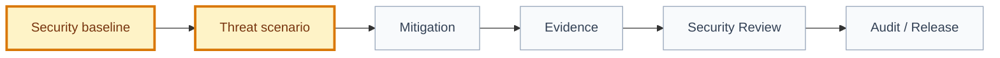

# Threat Register

## Snapshot

| Field | Value |
| --- | --- |
| ID | `THREAT-REGISTER-001` |
| Status | `draft` |
| Owner skill | Threat Modeler AI |
| Governed by | [FDR-009](../../../../engineering/decisions/FDR-009-threat-modeling-baseline.md) |
| Scope | Product/framework adoption baseline |
| Last reviewed | `2026-07-10` |

## Threat Flow

## Register

| ID | Status | Severity | Likelihood | Scenario | Affected Artifacts | Required Mitigation | Evidence | Route | Owner |
| --- | --- | --- | --- | --- | --- | --- | --- | --- | --- |
| `THR-001` | `open` | `medium` | `medium` | A product adopter begins Tier L implementation before defining product-specific security baseline rules. | [security-baseline.md](../../knowledge/conventions/security-baseline.md), Security Review artifacts | Fill actor, data, trust boundary, authorization, logging, and residual-risk sections before validating executable Tier L work. | Baseline currently contains placeholders. | `product-historian/security-review` | Product adopter |
| `THR-002` | `open` | `medium` | `medium` | QR or token-style flows may be replayed, guessed, shared, or validated by the wrong actor if the domain baseline does not define replay and ownership controls. | [events context](../../domains/events/context.md), QR check-in examples | Define QR/token expiry, organizer authority, idempotency, audit logging, and replay evidence before real implementation. | Example docs exist; product-specific controls are not yet approved. | `threat-modeler/security-review` | Product adopter |

## Accepted Residual Risks

| Threat ID | Risk | Approval | Compensating Control | Review Date |
| --- | --- | --- | --- | --- |
| `N/A` | No residual risks accepted in this baseline. | `N/A` | `N/A` | `2026-07-10` |

## Review Notes

| Date | Reviewer | Change | Follow-up |
| --- | --- | --- | --- |
| `2026-07-10` | Threat Modeler AI | Created initial framework threat register for EV-014. | Product adopters should replace placeholders with product-specific baseline decisions before real executable delivery. |
