# QA Evidence: Organizer Validates QR Code

## Snapshot

| Field | Value |
| --- | --- |
| ID | QA-002 |
| Status | draft |
| Source use case | UC-002 |
| Source specification | SPEC-002 |
| Source tests | TEST-002 |
| Engineering System | `ENGSYS-EVENTS-001 @ 0.1.0` |
| Quality policy | [Engineering Quality System](../../../../../../../../engineering/quality/quality-system.md) |
| Owner skill | QA AI |
| Next skill | Security Review AI |

## Navigation

| Artifact | Link |
| --- | --- |
| Context | [context.md](context.md) |
| Specification | [specification.md](specification.md) |
| Implementation Plan | [implementation-plan.md](implementation-plan.md) |
| Execution Graph | [execution-graph.json](execution-graph.json) |
| Tasks | [tasks.md](tasks.md) |
| Tests | [tests.md](tests.md) |
| Security Review | [security-review.md](security-review.md) |
| Audit | [audit.md](audit.md) |

## QA Evidence Flow

```mermaid
flowchart LR
  A["Acceptance criteria"] --> T["Test cases"]
  T --> C["Code traceability"]
  C --> E["Evidence"]
  E --> S["Security checks"]
  S --> V["QA verdict"]
  V --> R["Security review or audit"]

  classDef done fill:#dcfce7,stroke:#16a34a,color:#14532d;
  classDef current fill:#fef3c7,stroke:#d97706,color:#78350f,stroke-width:3px;
  classDef pending fill:#f8fafc,stroke:#94a3b8,color:#334155;
  classDef blocked fill:#fee2e2,stroke:#dc2626,color:#7f1d1d;

  class A,T done;
  class E current;
  class S,V,R pending;
```

## Code Traceability

| Task | Branch | Commits | PR | Code Paths |
| --- | --- | --- | --- | --- |
| TK-002-001 | N/A until implementation | N/A until implementation | N/A until implementation | N/A until implementation |
| TK-002-002 | N/A until implementation | N/A until implementation | N/A until implementation | N/A until implementation |
| TK-002-003 | N/A until implementation | N/A until implementation | N/A until implementation | N/A until implementation |
| TK-002-004 | N/A until implementation | N/A until implementation | N/A until implementation | N/A until implementation |
| TK-002-005 | N/A until implementation | N/A until implementation | N/A until implementation | N/A until implementation |
| TK-002-006 | N/A until implementation | N/A until implementation | N/A until implementation | N/A until implementation |
| TK-002-007 | N/A until implementation | N/A until implementation | N/A until implementation | N/A until implementation |

## Gate Evidence

| Field | Value |
| --- | --- |
| Test command | N/A until implementation |
| Gate logs | N/A until validation |
| CI URL | N/A until validation |
| Screenshots | N/A until validation |
| Environment | N/A until validation |

## Quality System Conformity

| Check | Evidence | Result | Notes |
| --- | --- | --- | --- |
| Pinned policy | [tests.md](tests.md) | passed | Draft plan pins the fixture baseline. |
| Environment and test data policy | No executable environment | blocked | Synthetic data is planned but cannot be executed. |
| Flaky tests and exceptions | No executable tests or accepted exceptions | not run | Missing runtime evidence remains a blocker. |

## Acceptance Evidence Matrix

| Acceptance Criterion | Source | Validation Method | Evidence | Result |
| --- | --- | --- | --- | --- |
| Organizer with approved role can validate a valid QR code. | [specification.md](specification.md) | Integration or E2E test | Pending implementation evidence | not run |
| Duplicate scan returns already-checked-in without duplicate write. | [tests.md](tests.md) | Integration test | Pending implementation evidence | not run |
| Expired, invalid, wrong-event, and outside-window tokens return safe error states. | [tests.md](tests.md) | Integration and UI state tests | Pending implementation evidence | not run |
| Unauthorized users cannot validate check-in. | [tests.md](tests.md) | Security test | Pending permission decision and implementation evidence | blocked |
| Analytics and audit logs capture safe validation outcomes. | [analytics.md](analytics.md) | Event/log assertion | Pending implementation evidence | not run |

## Test Execution

| Test | Type | Command Or Method | Evidence | Result |
| --- | --- | --- | --- | --- |
| TEST-002-BEH-001 valid organizer scan | e2e | Planned app test | Pending | not run |
| TEST-002-SEC-001 unauthenticated validation denied | security | Planned API/integration test | Pending | blocked |
| TEST-002-SEC-002 unauthorized organizer denied | security | Planned API/integration test | Pending role decision | blocked |
| TEST-002-DATA-001 duplicate check-in idempotency | integration | Planned database/service test | Pending | not run |
| TEST-002-UX-001 scanner result states accessible | accessibility/manual | Planned UI and screen reader check | Pending | not run |
| TEST-002-OBS-001 safe analytics and audit fields | observability | Planned event/log review | Pending | not run |

## Security And Privacy Evidence

| Control | Evidence | Result | Notes |
| --- | --- | --- | --- |
| Authorization | Pending API/security test | blocked | Organizer roles are still an open approval question. |
| Data privacy | Pending API response and log review | not run | Error states must avoid attendee PII leakage. |
| Abuse/edge cases | Pending invalid/expired/replay tests | not run | Offline behavior remains out of scope unless approved. |
| Safe logging/analytics | Pending analytics and audit log review | not run | Failure reasons must remain safe and enumerable. |

## Defects And Fix Verification

| Finding | Severity | Fix Evidence | Status |
| --- | --- | --- | --- |
| Organizer permission roles are not approved. | blocker | Requires product and engineering decision | open |
| Offline validation is not approved for L1. | medium | Requires product and security decision or explicit non-goal approval | open |
| Manual fallback for camera failure is not approved. | medium | Requires product and UX decision | open |

## Residual Risk

| Risk | Why It Remains | Mitigation | Approval |
| --- | --- | --- | --- |
| Venue check-in may fail during poor connectivity. | L1 online-only behavior is not approved yet. | Approve online-only L1 or create offline validation scope. | Open |
| Permission model may be too broad or too narrow. | Organizer role set is undecided. | Approve exact roles before implementation. | Open |

## QA Verdict

| Field | Value |
| --- | --- |
| Verdict | blocked |
| Coverage complete | no |
| Security evidence complete | no |
| Blocks validation | yes |
| Blocks release | yes |
| Next owner | Product + Engineering decision, then QA AI |
