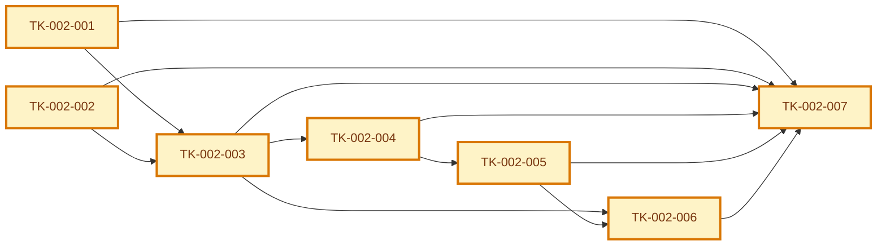

# Tasks Index: Organizer Validates Qr Code

> Generated index. Do not edit manually.
> Source of truth: [execution-graph.json](execution-graph.json) and [tasks/](tasks/).

## Snapshot

| Field | Value |
| --- | --- |
| ID | TASKSET-002 |
| Status | draft |
| Source graph | GRAPH-002 |
| Source specification | SPEC-002 |
| Generated from | execution-graph.json + tasks/*.md |
| Owner skill | task-generator |
| Next skill | Code Runner AI or QA AI |

## Navigation

| Artifact | Link |
| --- | --- |
| Context | [context.md](context.md) |
| Specification | [specification.md](specification.md) |
| Implementation Plan | [implementation-plan.md](implementation-plan.md) |
| Execution Graph | [execution-graph.json](execution-graph.json) |
| Tests | [tests.md](tests.md) |
| Audit | [audit.md](audit.md) |

## Delivery

| Field | Value |
| --- | --- |
| Level | L1 |
| Priority | P0 |
| Depends on | DEC-001, DEC-002 |
| Rationale | Organizer validation is required to close the walking skeleton for event attendance. |

## Task Graph

## Task Files

| Task | File | Type | Depends On | Status | Acceptance |
| --- | --- | --- | --- | --- | --- |
| `TK-002-001` Define attendance idempotency and audit persistence | [tasks/TK-002-001.md](tasks/TK-002-001.md) | data | none | draft | One check-in per attendee per event is explicitly protected. |
| `TK-002-002` Define organizer permission validation | [tasks/TK-002-002.md](tasks/TK-002-002.md) | security | none | draft | Organizer permission is checked server-side for validation. |
| `TK-002-003` Define QR token validation service contract | [tasks/TK-002-003.md](tasks/TK-002-003.md) | backend | TK-002-001, TK-002-002 | draft | All validation outcomes map to specification result states. |
| `TK-002-004` Define check-in session query and validation mutation | [tasks/TK-002-004.md](tasks/TK-002-004.md) | api | TK-002-003 | draft | API responses support UI states without unsafe data exposure. |
| `TK-002-005` Define organizer scanner UI states | [tasks/TK-002-005.md](tasks/TK-002-005.md) | frontend | TK-002-004 | draft | Every design state is represented in the UI state model. |
| `TK-002-006` Define analytics and observability instrumentation | [tasks/TK-002-006.md](tasks/TK-002-006.md) | analytics | TK-002-003, TK-002-005 | draft | Validation attempts and failure reasons are measurable. |
| `TK-002-007` Define validation test coverage | [tasks/TK-002-007.md](tasks/TK-002-007.md) | qa | TK-002-001, TK-002-002, TK-002-003, TK-002-004, TK-002-005, TK-002-006 | draft | Tests cover behavior, security, UX, analytics, and accessibility. |

## Canonical Ownership

| Concern | Source of Truth |
| --- | --- |
| Dependency order | [execution-graph.json](execution-graph.json) |
| Task status | [tasks/](tasks/) |
| Task contract | [tasks/](tasks/) |
| Implementation links | [tasks/](tasks/) |
| Validation evidence | [tasks/](tasks/) and QA evidence artifacts |

## Blocked Tasks

| Task | Blocking Reason | Decision/Dependency Needed | Owner |
| --- | --- | --- | --- |
| None | None | None | None |

## Validation Methods

| Task | Validation |
| --- | --- |
| `TK-002-001` | One check-in per attendee per event is explicitly protected. |
| `TK-002-002` | Organizer permission is checked server-side for validation. |
| `TK-002-003` | All validation outcomes map to specification result states. |
| `TK-002-004` | API responses support UI states without unsafe data exposure. |
| `TK-002-005` | Every design state is represented in the UI state model. |
| `TK-002-006` | Validation attempts and failure reasons are measurable. |
| `TK-002-007` | Tests cover behavior, security, UX, analytics, and accessibility. |

## Parallelism Notes

- Parallel execution follows dependency order and write scopes declared in [execution-graph.json](execution-graph.json).

## Handoff

| Field | Value |
| --- | --- |
| Ready for implementation | no |
| Required next skill | task-generator |
| Notes | Regenerate this index whenever graph nodes or task files change. |
