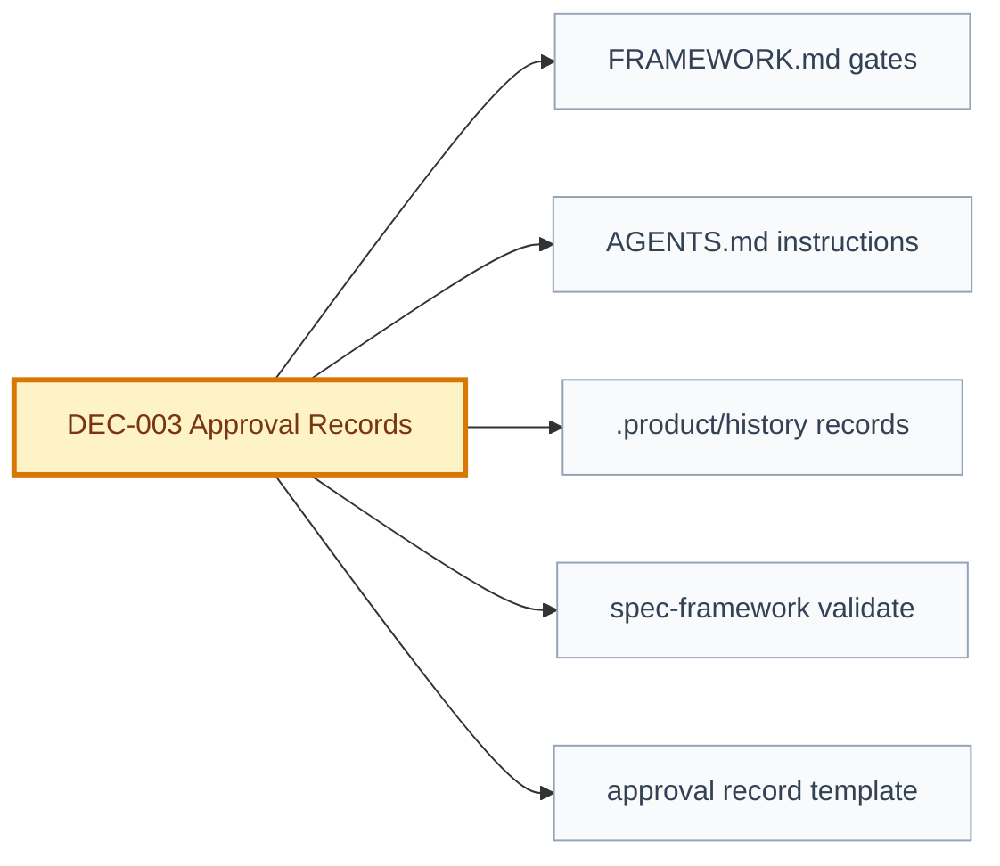

# Decision: Approval Records

## Snapshot

| Field | Value |
| --- | --- |
| ID | DEC-003 |
| Status | approved |
| Date | 2026-07-09 |
| Scope | governance/approval-gates/auditability |
| Owner | Product Engineering Framework |

## Decision

Artifacts with status `approved`, `in_progress`, `implemented`, `validated`, or `released` require a matching approval record under [.product/history/](../../.product/history).

`proposed` does not require an approval record. It means the artifact is ready for review, not approved for downstream execution.

Draft downstream artifacts remain allowed. The validator must block only when:

- a downstream artifact advances to `proposed` or later while its required parent gate is not approved;
- an artifact is `approved` or later without a matching approval record.

Approval records are one JSON file per approval and must contain:

- `artifact_id`
- `path`
- `content_hash`
- `status_granted`
- `approved_by`
- `approved_at`
- `notes`

The approval hash is the SHA-256 hash of the entire artifact file after normalization:

- line endings converted to LF;
- trailing spaces and tabs removed from each line.

This hash utility is shared validator infrastructure and will also support future staleness checks.

## Why

The framework already has approval gates in prose and partial validator checks, but an agent could still edit a YAML or Markdown status from `draft` to `approved` without durable approval evidence. Approval records add a machine-verifiable audit layer while preserving the existing draft workflow.

This mechanism provides auditability and a mechanical gate. It is not cryptographic proof of human intent. In a repository where agents can write files, approval records are technically forgeable. The protection is layered: validator checks, human commits or merges, and pull request review.

## Options Considered

| Option | Pros | Cons | Result |
| --- | --- | --- | --- |
| Keep approval in prose only | Simple and flexible | Does not prevent silent status flips | Rejected |
| Require approval record for `proposed` | Maximally strict | Makes review workflow too heavy; proposed is not approval | Rejected |
| Require approval record for `approved+` only | Blocks real gate bypass while preserving drafts and proposals | Requires baseline migration and history files | Chosen |
| Hash sections instead of full file | More semantic precision | More complex and fragile for v1 | Rejected for now |

## Decision Impact Flow

## Consequences

| Type | Consequence | Follow-up |
| --- | --- | --- |
| Positive | `approved+` status becomes mechanically auditable. | Validator checks approval records. |
| Positive | Future staleness work can reuse the same content hash function. | EV-004 should extend this utility. |
| Negative | Humans must create approval records when approving artifacts. | Document the template and required fields. |
| Negative | Baseline approval records are retroactive, not original approval proof. | Mark baseline records with `retroactive baseline`. |

## Affected Artifacts

| Artifact | Required Update |
| --- | --- |
| [FRAMEWORK.md](../../../../FRAMEWORK.md) | Reference approval records in approval gates. |
| [AGENTS.md](../../../../AGENTS.md) | Instruct agents not to create or edit approval records except explicit approved migrations. |
| `spec-framework validate` | Validate approval records and stricter gate transitions. |
| [.product/history/](../../.product/history) | Store approval records. |
| [approval-record-template.json](../../../../framework/template/approval-record-template.json) | Provide machine-readable template. |

## Supersedes

- N/A

## Approval

| Field | Value |
| --- | --- |
| Approved by | JonatasFreireDev |
| Date | 2026-07-09 |
| Notes | Approved by user instruction: `APROVAR EVOLU��O EV-001`. |
