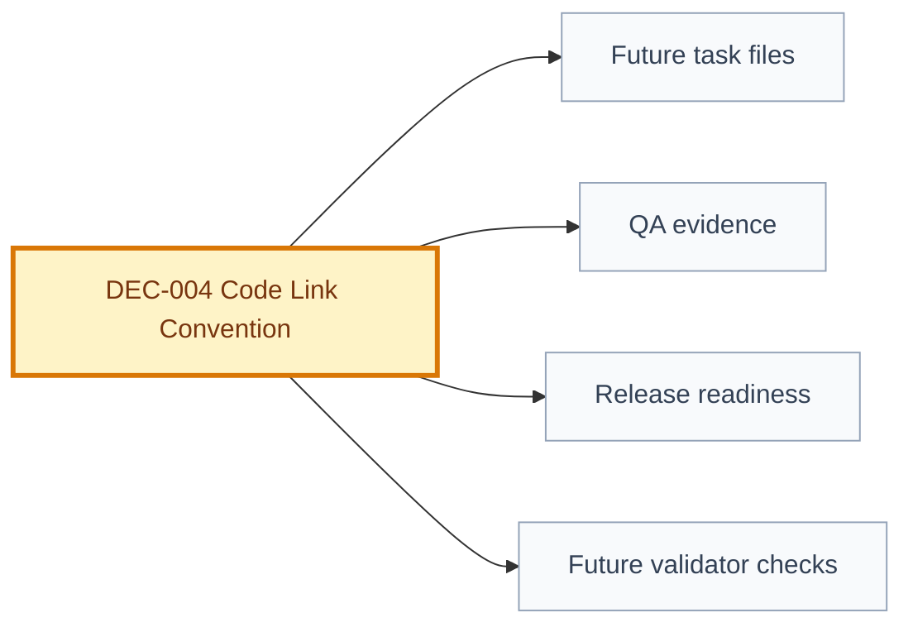

# Decision: Code Link Convention

## Snapshot

| Field | Value |
| --- | --- |
| ID | DEC-004 |
| Status | approved |
| Date | 2026-07-09 |
| Scope | engineering/code-links/validation |
| Owner | Product Engineering Framework |

## Decision

The framework operates as a monorepo model: product documentation lives inside the product repository, and task-to-code links use repository-relative paths. A pull request should carry documentation and code changes together when a delivery reaches implementation.

This repository remains a framework template and laboratory. The decision defines the future convention; it does not implement EV-005 in this round.

Future rules:

- `implemented` will require structured task fields for `branch` and `commits`;
- `validated` will require structured evidence such as pull request URL or ID, gate logs, screenshots, CI URL, or equivalent test evidence;
- task-to-code links should be relative paths inside the monorepo whenever possible.

## Why

The framework flow ends in `Code -> Validation`, but the current artifacts do not define where code lives or how evidence returns to the use case. A monorepo convention keeps documentation, implementation, and validation in one review surface and preserves traceability from task to code.

## Options Considered

| Option | Pros | Cons | Result |
| --- | --- | --- | --- |
| Monorepo doc and code convention | Single PR can review product contract, code, and evidence together | Requires product repos to include the framework structure | Chosen |
| Separate docs repository and app repository | Keeps framework docs isolated | Creates cross-repo traceability and approval friction | Rejected for product delivery |
| Leave repo topology undefined | Flexible | Keeps `Code -> Validation` vague and weakens QA evidence | Rejected |

## Decision Impact Flow

## Consequences

| Type | Consequence | Follow-up |
| --- | --- | --- |
| Positive | Documentation, code, and validation evidence can be reviewed together. | EV-005 should add structured task and QA evidence fields. |
| Positive | Relative paths reduce external coupling. | Validator can check path existence in monorepo deliveries. |
| Negative | Product repositories must carry framework documentation. | Keep this repository as a reusable template/lab. |
| Negative | External CI and PR URLs still need structured fields. | Define fields during EV-005. |

## Affected Artifacts

| Artifact | Required Update |
| --- | --- |
| Future task template | Add branch, commits, PR, code paths, and evidence fields during EV-005. |
| Future QA evidence template | Add structured evidence fields during EV-005. |
| Future validator | Validate implementation and validation evidence during EV-005. |

## Supersedes

- N/A

## Approval

| Field | Value |
| --- | --- |
| Approved by | JonatasFreireDev |
| Date | 2026-07-09 |
| Notes | Approved by user instruction while approving EV-001; implementation deferred to EV-005. |
