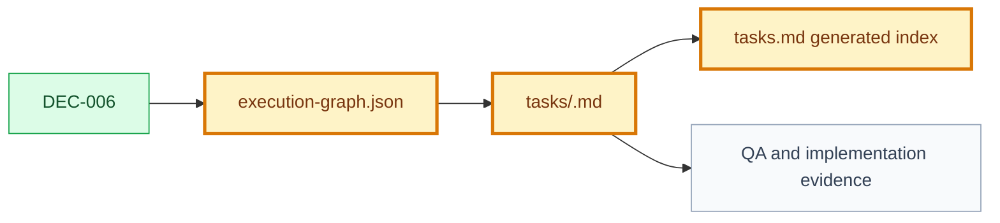

# Decision: Task Files As Canonical Task Records

## Snapshot

| Field | Value |
| --- | --- |
| ID | `DEC-006` |
| Status | `approved` |
| Date | `2026-07-09` |
| Scope | `planning/tasks/execution-graph` |
| Owner | `Product Engineering Framework` |

## Decision

Each executable task must live in its own task file under the use case directory:

```text
use-cases/<use-case>/tasks/<task-id>.md
```

`tasks.md` remains in the use case bundle, but it is a generated index only. It must not be treated as the source of truth for task status, task contract, delivery metadata, implementation links, or validation evidence.

`execution-graph.json` remains the DAG source of truth. Each graph node must include:

- `id`
- `path`
- `dependsOn`

The graph may keep generated snapshots such as `title` and `type`, but the validator must compare those snapshots with the referenced task file. If they diverge, the graph or task file is inconsistent.

## Why

Keeping multiple tasks inside one manually edited `tasks.md` made the task set a second source of truth beside `execution-graph.json`. It also made task status difficult to audit, approve, move, or evidence independently.

One task per file gives each node a durable contract and lets future agents update, approve, validate, and link implementation evidence at the smallest executable unit.

## Options Considered

| Option | Pros | Cons | Result |
| --- | --- | --- | --- |
| Keep `tasks.md` as the canonical task list | Simple and compatible with existing docs | Duplicates graph data and keeps statuses mixed in one editable file | Rejected |
| Make `execution-graph.json` the only task source | Machine-friendly DAG | Poor human review surface; hard to attach rich evidence | Rejected |
| Store each task in `tasks/<task-id>.md` and generate `tasks.md` as an index | Clear ownership, reviewable task records, validator-friendly links | Requires migration and stricter validation | Chosen |

## Decision Impact Flow



## Consequences

| Type | Consequence | Follow-up |
| --- | --- | --- |
| Positive | Task status becomes canonical at the task-file level. | Validator must index task files as task artifacts. |
| Positive | `execution-graph.json` can focus on DAG structure and references. | Graph nodes must include valid `path` values. |
| Positive | `tasks.md` becomes a readable generated index for humans. | Task Generator must regenerate it from graph + task files. |
| Negative | Existing use cases need a one-time migration. | Preserve current task statuses and content during migration. |
| Negative | Snapshot fields can drift if edited by hand. | Validator must compare graph snapshots against task file fields. |

## Affected Artifacts

| Artifact | Required Update |
| --- | --- |
| `FRAMEWORK.md` | Document task files and generated `tasks.md` index. |
| `AGENTS.md` | Instruct agents to edit task files, not generated `tasks.md`. |
| `engineering/validators/framework-validator.mjs` | Validate task paths, task file metadata, generated index, and graph snapshots. |
| `knowledge/templates/task-template.md` | Add canonical one-task file template. |
| `knowledge/templates/tasks-template.md` | Mark as generated index template. |
| `knowledge/templates/execution-graph-template.json` | Add `path` to every graph node. |
| Existing use case task bundles | Migrate embedded task sections into `tasks/<task-id>.md`. |

## Supersedes

- N/A

## Approval

| Field | Value |
| --- | --- |
| Approved by | `JonatasFreireDev` |
| Date | `2026-07-09` |
| Approval record | `.product/history/approval-DEC-006-approved-*.json` |
| Notes | Approved by user instruction: `APROVAR EVOLUCAO EV-002`. |
