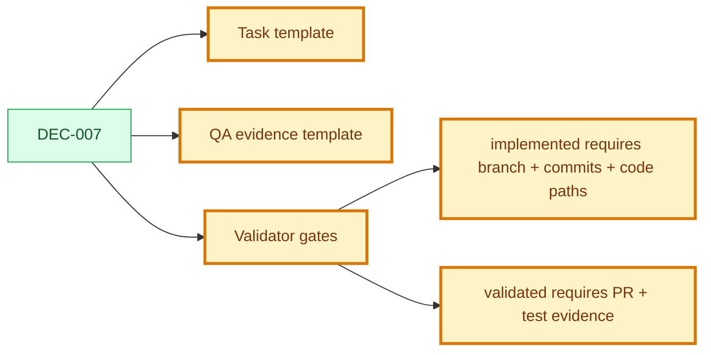

# Decision: Code Evidence Gates

## Snapshot

| Field | Value |
| --- | --- |
| ID | DEC-007 |
| Status | approved |
| Date | 2026-07-09 |
| Scope | engineering/code-links/validation-gates |
| Owner | Product Engineering Framework |

## Decision

EV-005 implements the code link convention from DEC-004 as machine-verifiable gates.

The framework operates with a monorepo delivery model:

- framework documentation lives inside the product repository;
- task-to-code links use repository-relative paths whenever the target is inside the monorepo;
- a delivery PR carries documentation, code, and validation evidence together;
- this `spec-framework` repository remains the framework template and laboratory.

Task files are the canonical bridge between documentation and code.

When a task reaches `implemented`, it must include structured implementation evidence:

- branch;
- commits;
- code paths.

When a task reaches `validated` or `released`, it must also include structured validation evidence:

- PR;
- test status;
- at least one concrete evidence pointer such as gate logs, CI URL, screenshots, QA evidence path, or equivalent validation output.

## Why

The canonical framework sequence already ends in `Code -> Validation`, but without structured links an agent could mark work as implemented or validated without showing where the code lives or how the evidence returned to the use case. These gates keep implementation traceability local, reviewable, and mechanically checkable.

## Options Considered

| Option | Pros | Cons | Result |
| --- | --- | --- | --- |
| Require structured evidence in each task file | Smallest executable unit owns code and evidence traceability | Adds validator and template requirements | Chosen |
| Put all code evidence only in QA evidence | Centralized validation report | Harder to review each task independently | Rejected |
| Allow free-form links | Flexible | Not reliably machine-verifiable | Rejected |

## Decision Impact Flow

## Consequences

| Type | Consequence | Follow-up |
| --- | --- | --- |
| Positive | `implemented` can no longer mean undocumented code work. | Validator checks branch, commits, and code paths on implemented task files. |
| Positive | `validated` requires concrete QA evidence linked back to the task. | Validator checks PR plus gate logs, CI URL, screenshots, or QA evidence. |
| Positive | Monorepo delivery keeps product docs and code in one review surface. | Future product repos should carry docs and code together. |
| Negative | External services still appear as URLs rather than repository-relative paths. | Keep URL fields structured and reviewable. |
| Negative | Draft tasks may contain placeholder evidence fields. | Gates enforce only when status advances to implemented or validated+. |

## Affected Artifacts

| Artifact | Required Update |
| --- | --- |
| `FRAMEWORK.md` | Define monorepo code link convention and implementation/validation evidence gates. |
| `AGENTS.md` | Instruct agents not to advance task status without structured evidence. |
| `framework/template/task-template.md` | Add structured implementation and validation evidence fields. |
| `framework/template/qa-evidence-template.md` | Add code traceability and gate log fields. |
| `spec-framework validate` | Check implemented and validated task evidence. |
| Existing task files | Normalize evidence placeholders to the new structure without changing task status. |

## Supersedes

- N/A

## Approval

| Field | Value |
| --- | --- |
| Approved by | JonatasFreireDev |
| Date | 2026-07-09 |
| Approval record | `.product/history/approval-DEC-007-approved-*.json` |
| Notes | Approved by user instruction: `APROVAR EVOLUCAO EV-005`. |
