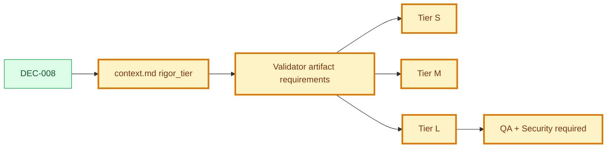

# Decision: Rigor Tiers For Use Cases

## Snapshot

| Field | Value |
| --- | --- |
| ID | DEC-008 |
| Status | approved |
| Date | 2026-07-09 |
| Scope | governance/use-case-rigor/validation |
| Owner | Product Engineering Framework |

## Decision

Use cases must declare a proportional rigor tier in their `context.md`:

```yaml
rigor_tier: S | M | L | N/A
```

The tier controls which artifacts the validator requires for that use case.

| Tier | Use When | Required Artifacts |
| --- | --- | --- |
| `S` | Small, low-risk behavior with no UI complexity and no security/privacy triggers. | `context.md`, `use-case.md`, `specification.md`, `tasks.md`, `tests.md` |
| `M` | Normal product behavior that needs design/planning before execution. | Tier S + `design.md`, `implementation-plan.md`, `execution-graph.json` |
| `L` | High-risk or release-critical behavior. | Tier M + `analytics.md`, `audit.md`, `qa-evidence.md`, `security-review.md` |
| `N/A` | Structural examples or placeholders that are not product scope. | Existing example bundle only; not product delivery. |

Tier S may mark `design.md`, `analytics.md`, and `audit.md` as `Not applicable` when those files exist. The validator must not force the full L checklist on low-risk use cases.

Automatic Tier L triggers:

- authentication or authorization;
- permissions or roles;
- payment;
- PII or sensitive personal data;
- upload, UGC, or user-generated content;
- public surface;
- migration that touches RLS or database policies.

Tier is proposed by the orchestrator through a checklist and approved by the human at the use case gate. Changing a tier later requires an approval record for the use case artifact; it does not require a new DEC unless the policy itself changes.

## Why

The framework previously treated every use case as if it needed the same complete artifact bundle. That protects important flows, but it makes small, low-risk changes too heavy and encourages agents to bypass process. Tiers keep the core discipline while scaling required documentation to risk.

## Options Considered

| Option | Pros | Cons | Result |
| --- | --- | --- | --- |
| Keep one checklist for every use case | Simple validator | Too heavy for trivial work | Rejected |
| Let agents decide required artifacts freely | Flexible | Weakens gates and consistency | Rejected |
| Use S/M/L tiers with automatic L triggers | Proportional and machine-checkable | Requires tier metadata and migration | Chosen |

## Decision Impact Flow



## Consequences

| Type | Consequence | Follow-up |
| --- | --- | --- |
| Positive | Low-risk use cases can stay lightweight. | Validator reads `rigor_tier` before requiring artifacts. |
| Positive | High-risk flows get QA and Security Review by default. | Auth, permissions, PII, payments, uploads, public surfaces, and RLS/policies trigger Tier L. |
| Negative | Tier metadata becomes another gate surface. | Context template and validator must make it visible. |
| Negative | Incorrectly low tiers become a risk. | Automatic triggers force L for known high-risk signals. |

## Affected Artifacts

| Artifact | Required Update |
| --- | --- |
| `FRAMEWORK.md` | Define S/M/L tier policy and trigger rules. |
| `AGENTS.md` | Instruct agents to respect tier requirements. |
| `framework/template/context-template.md` | Add `rigor_tier`. |
| `framework/template/use-case-template.md` | Add tier checklist. |
| `framework/validators/framework-validator.mjs` | Validate tier metadata and tier-specific required artifacts. |
| Existing use case contexts | Add `rigor_tier`. |
| Tier L use cases missing evidence | Add missing QA/Security draft artifacts. |

## Supersedes

- N/A

## Approval

| Field | Value |
| --- | --- |
| Approved by | JonatasFreireDev |
| Date | 2026-07-09 |
| Approval record | `.product/history/approval-DEC-008-approved-*.json` |
| Notes | Approved by user instruction: `APROVAR EVOLUCAO EV-003`. |
