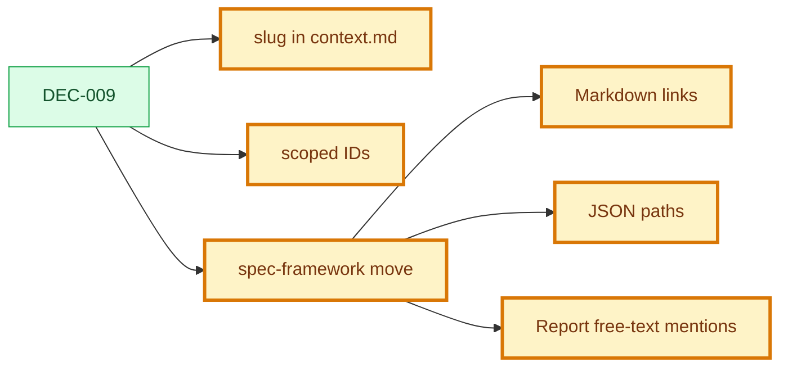

# Decision: Scoped IDs, Immutable Slugs, And Move Tooling

## Snapshot

| Field | Value |
| --- | --- |
| ID | DEC-009 |
| Status | approved |
| Date | 2026-07-10 |
| Scope | governance/identity/links/tooling |
| Owner | Product Engineering Framework |

## Decision

Artifact identity uses immutable slugs plus scoped IDs.

- `slug` is defined when an artifact folder is created and must not change when the title changes.
- IDs are unique within the parent scope, not allocated from a central counter.
- Full references use path plus ID when ambiguity is possible.
- `.product/ids.json` is not a global counter source of truth; it records the identity policy.

Moving an artifact must use the repository move tool:

```bash
spec-framework move --from <old-path> --to <new-path>
```

The move tool rewrites Markdown links and JSON path strings that can be resolved mechanically. Mentions in free text are reported, not rewritten.

## Why

A central counter such as `ids.json` creates merge conflicts when agents create artifacts in parallel. Moving a feature or use case can also break relative links. Immutable slugs and scoped IDs reduce merge pressure, while a move tool keeps links and JSON paths coherent.

## Options Considered

| Option | Pros | Cons | Result |
| --- | --- | --- | --- |
| Keep central numeric counters | Easy to understand | Merge conflicts in parallel work | Rejected |
| Allocate ID ranges per agent | Reduces conflicts | Requires agent coordination and still centralizes allocation | Rejected |
| Immutable slug plus parent-scoped IDs | Parallel-friendly and stable under title changes | Requires path-aware references | Chosen |
| Rewrite all text mentions during moves | More complete-looking migration | Risky false positives in prose | Rejected |

## Decision Impact Flow



## Consequences

| Type | Consequence | Follow-up |
| --- | --- | --- |
| Positive | Agents can create sibling artifacts without touching a shared counter. | Templates and contexts include `slug`. |
| Positive | Title changes do not force path changes. | Slug changes require an explicit move. |
| Positive | Moves become auditable and repeatable. | Use `spec-framework move`. |
| Negative | Some prose mentions remain manual. | Move report lists unresolved mentions. |
| Negative | Existing globally unique IDs remain valid during migration. | Validator starts by enforcing slugs and policy metadata. |

## Affected Artifacts

| Artifact | Required Update |
| --- | --- |
| `FRAMEWORK.md` | Define slug, scoped ID, and move policy. |
| `AGENTS.md` | Instruct agents to use the move tool and preserve slugs. |
| `.product/ids.json` | Replace counter semantics with identity policy metadata. |
| `framework/template/context-template.md` | Add `slug`. |
| `spec-framework move` | Move artifacts and rewrite references. |
| `spec-framework validate` | Validate slugs and identity policy metadata. |
| Existing `context.md` files | Add slugs matching current folders. |

## Supersedes

- N/A

## Approval

| Field | Value |
| --- | --- |
| Approved by | JonatasFreireDev |
| Date | 2026-07-10 |
| Approval record | `.product/history/approval-DEC-009-approved-*.json` |
| Notes | Approved by user instruction: `APROVAR EVOLUCAO EV-006`. |
