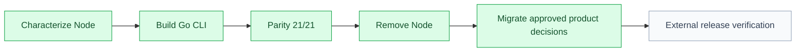

# Go CLI Migration Report

## Executive Snapshot

| Area | Status | Evidence |
| --- | --- | --- |
| Go CLI | ✅ complete | `cmd/spec-framework` exposes init, validate, move, upgrade, version, and help. |
| Node cutover | ✅ complete | `package.json` and executable `.mjs` sources were removed. |
| Multi-agent skills | ✅ complete | Codex, Cursor, and Claude Code renderers have isolated target trees. |
| Bubble Tea | ✅ complete | Multi-select, target entry, review, confirmation, and cancellation are model-tested. |
| Validator parity | ✅ complete | Historical 21-case harness passed 21/21 against the Go binary before Node removal. |
| Cross-build | ✅ complete | Windows, Linux, and macOS builds passed for amd64 and arm64. |
| Product decision migration | ✅ complete | Six decisions and their approval records were migrated after explicit human approval. |
| External/sandbox gates | 🟡 deferred | Linux race CI, GitHub release publication, checksum download, and real interactive terminal smoke remain final external checks. |

## Flow

## Approved Product Decision Migration

The framework owner explicitly approved updating these product decisions and regenerating their matching approval records:

- `examples/events/knowledge/decisions/DEC-003-approval-records.md`
- `examples/events/knowledge/decisions/DEC-005-derived-staleness.md`
- `examples/events/knowledge/decisions/DEC-006-task-files.md`
- `examples/events/knowledge/decisions/DEC-007-code-evidence-gates.md`
- `examples/events/knowledge/decisions/DEC-008-rigor-tiers.md`
- `examples/events/knowledge/decisions/DEC-009-identity-and-move-tooling.md`

The migration preserved approver identity, status, and approval timestamp and added explicit migration notes.

## Deferred External Verification

| Check | Environment |
| --- | --- |
| `go test -race ./...` | Linux CI with race-detector toolchain |
| GitHub release draft | GitHub Actions tag workflow |
| Archive checksum/install | Clean Windows, Linux, and macOS runners |
| Bubble Tea terminal smoke | Real interactive TTY |

## Result

| Field | Value |
| --- | --- |
| Verdict | ✅ Go migration complete; external/sandbox checks deferred as requested |
| Next owner | Release owner |
| Next step | Run the tag release workflow and clean-runner checks when publishing the first Go release. |
