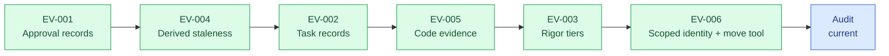
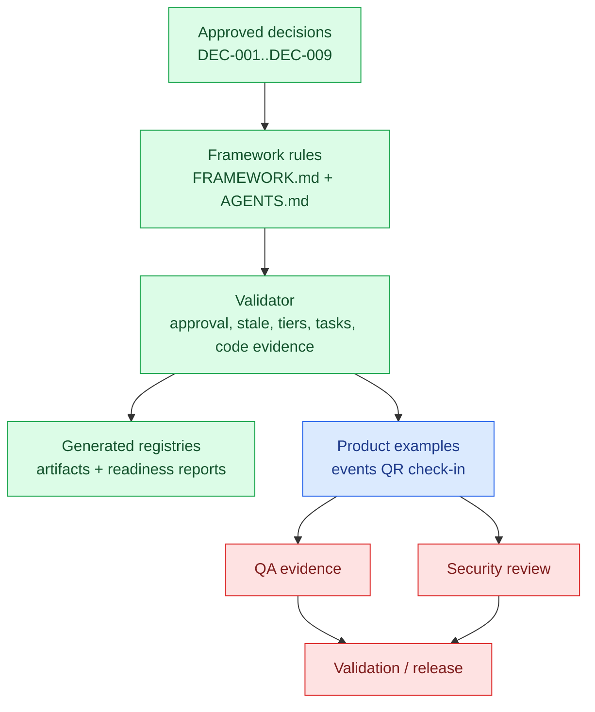

# Post-Evolution Framework Audit - 2026-07-10

## Executive snapshot

| Item | Status | Evidence |
| --- | --- | --- |
| Framework validator | ✅ ready | `node framework\validators\framework-validator.mjs --write-registry --write-report` returned `Verdict: ✅ ready (0 errors, 0 warnings, 0 notes)`. |
| Syntax checks | ✅ passed | Historical Node syntax checks passed before the Go cutover; current gates use `go vet ./...`. |
| Decisions indexed | ✅ complete | [.product/decisions.json](../../examples/events/.product/decisions.json) lists `DEC-001` through `DEC-009` as approved. |
| Artifact registry | ✅ generated | [.product/artifacts.json](../../examples/events/.product/artifacts.json) contains 60 artifacts after registry refresh. |
| Framework scope | 🟡 ready with notes | Framework mechanics and the reorganized source boundary are green; product examples still include draft/blocked QA and security evidence by design. |

**Verdict:** 🟡 `ready_with_notes`

The framework evolution chain is coherent and mechanically enforced. Initial fixture tests now cover the validator and move tool; the remaining work is broader test coverage and keeping product examples from being mistaken for implementation-ready work.

## Evolution coverage

| Evolution | Audit result | Evidence |
| --- | --- | --- |
| EV-001 approval records | ✅ enforced | [AGENTS.md](../../AGENTS.md) requires agents to stop on missing approval records; validator has approval record checks. |
| EV-004 staleness | ✅ enforced | [FRAMEWORK.md](../../FRAMEWORK.md) defines stale as derived from [.product/derivations.json](../../examples/events/.product/derivations.json). |
| EV-002 task records | ✅ enforced | Task files are canonical and taskset indexes are generated/validated. |
| EV-005 code evidence | ✅ enforced | Implemented/validated task gates require branch, commits, PR, test evidence, and security evidence. |
| EV-003 rigor tiers | ✅ enforced | Validator checks `rigor_tier` and Tier L trigger rules. |
| EV-006 identity and move tooling | 🟡 usable with manual review | [.product/ids.json](../../examples/events/.product/ids.json) declares slug-scoped identity; move dry-run reports rewritten files and free-text mentions requiring review. |

## Findings

| Severity | Finding | Evidence | Recommendation |
| --- | --- | --- | --- |
| 🟢 Info | The framework validates cleanly after all approved evolutions. | Validator output: `0 errors, 0 warnings, 0 notes`. | Keep validator as required CI/local gate before commits. |
| 🟢 Resolved | Engineering tools have fixture tests. | [Go package tests](../../internal/) cover approval records, staleness, writeScope, QA evidence, moves, installation, and CLI integration. | Expand future Phase B writeScope coverage. |
| 🟢 Resolved | Framework source paths now mirror installed asset boundaries. | `framework/validators` and `framework/tools` map directly to the external runtime; `framework/tests` remains laboratory-only. | Keep distribution tests green when adding framework assets. |
| 🟢 Resolved | Audit links were normalized after removing the `engineering/` level. | Repository-wide link inspection corrected stale audit links; the final focused scan reports `BROKEN 0`. | Keep link validation in the structural-move review checklist. |
| 🟡 Medium | Move tooling intentionally reports free-text mentions instead of rewriting them, which creates a manual review step after moves. | `move-artifact --dry-run` reported 5 rewritten files and 90 free-text mentions requiring review for the organizer use case path. | Keep this behavior, but require the move report to be attached to the audit or PR when a move is executed. |
| 🟡 Medium | Product example artifacts are not implementation-ready, especially QA and security evidence. | Event use case QA/security files contain `blocked`, `not run`, and pending role/test evidence. | Treat them as framework examples until a product owner approves role, rollout, QA, and security evidence. |
| 🟢 Info | No mojibake pattern was found in Markdown files during this audit. | `rg "ð|âœ|âž|ï¸|Ÿ" --glob "*.md"` returned no matches. | No encoding cleanup is needed right now. |

## Dependency and gate view

## Files changed by this audit

| File | Reason |
| --- | --- |
| [.product/artifacts.json](../../examples/events/.product/artifacts.json) | Regenerated by validator with current registry data. |
| [audits/framework-validation-report.md](framework-validation-report.md) | Regenerated validator report. |
| [audits/readiness/framework-readiness.md](../../examples/events/audits/readiness/framework-readiness.md) | Regenerated readiness report. |
| [audits/post-evolution-framework-audit-2026-07-10.md](post-evolution-framework-audit-2026-07-10.md) | Updated consolidated audit report. |

## Incomplete or intentionally blocked

| Area | Status | Notes |
| --- | --- | --- |
| Framework mechanics | ✅ complete for approved EVs | No blocking validator issues. |
| Script test harness | ✅ complete for current contracts | The current suite passes 20/20 tests, including bootstrap, upgrade, packaging, installed CLI, links, approval gates, and move tooling. |
| Product QA evidence | 🔴 blocked | Event examples contain planned but not executed QA evidence. |
| Product security evidence | 🔴 blocked | Security reviews remain blocked until implementation evidence and role decisions exist. |
| Approval records | ✅ complete | Current approved+ artifacts have records; agents must not repair them without explicit migration approval. |

## Human approval questions

| Question | Recommendation |
| --- | --- |
| Should script fixture tests become mandatory before the next framework evolution? | ✅ Accept. Initial tests exist; require them before changing validator or move-tool behavior. |
| Should every executed move produce a saved audit artifact? | ✅ Accept with adjustment: require it for non-dry-run moves that touch more than one artifact subtree. |
| Should product examples advance toward implementation readiness now? | 🟡 Only if this repo is acting as the product repo. As a framework lab, keep examples demonstrative. |

## Recommended next steps

| Priority | Next step | Owner skill |
| --- | --- | --- |
| P1 | Expand fixture-based tests for task-file validation, code evidence, rigor tiers, and Mermaid semantic bindings. | `audit-orchestrator` + engineering |
| P2 | Add a generated move report option to `move-artifact.mjs` for executed moves. | `impact-analyzer` + engineering |
| P2 | Add CI guidance showing the exact validator and script checks expected before merge. | `documentation-orchestrator` |
| P3 | Decide whether the events examples should stay illustrative or become a real product slice. | `product-orchestrator` |

## Validation performed

| Command | Result |
| --- | --- |
| `node framework\validators\framework-validator.mjs --write-registry --write-report` | ✅ `Verdict: ✅ ready (0 errors, 0 warnings, 0 notes)` |
| `node --check framework\validators\framework-validator.mjs` | ✅ passed |
| `node --check framework\tools\move-artifact.mjs` | ✅ passed |
| `node --check framework\tests\run-tests.mjs` | ✅ passed |
| `node framework\tests\run-tests.mjs` | ✅ `20/20 tests passed` |
| `node framework\tools\move-artifact.mjs --from ... --to ... --dry-run` | ✅ passed; reported rewrites and free-text review items |
| Focused Markdown link scan across framework runtime/docs and product examples | ✅ `BROKEN 0` |
| `rg "ð\|âœ\|âž\|ï¸\|Ÿ" --glob "*.md"` | ✅ no matches |

## Final result

| Verdict | Blockers | Next owner |
| --- | --- | --- |
| 🟡 `ready_with_notes` | None for framework mechanics; product examples remain blocked for real implementation validation. | Audit Orchestrator, then engineering test hardening. |
