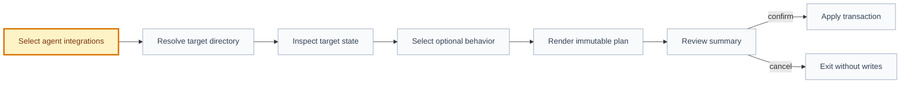
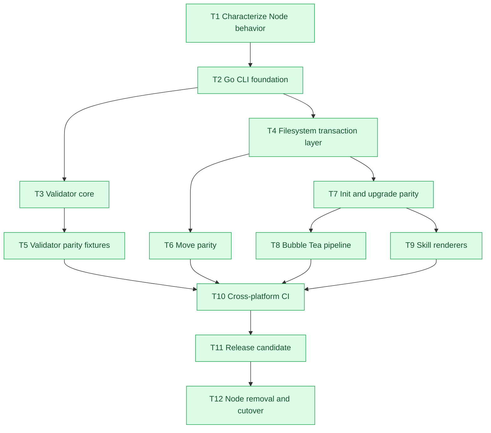

# FDR-013: Go CLI and multi-agent skill installation

## Snapshot

| Field | Value |
| --- | --- |
| ID | `FDR-013` |
| Status | `approved` |
| Origin EV | `CLI portability migration` |
| Date | `2026-07-10` |
| Owner | `Framework owner + Implementation Planner` |

## Context

The framework CLI, bootstrap, upgrade wrapper, validator, move tool, and fixture tests are implemented in JavaScript and distributed through npm. This contract works, but every adopter and CI environment must provide Node.js 22 even when the product stack does not use Node. The framework also mirrors only one skill-discovery layout during `init`, while adopters may use Codex, Cursor, Claude Code, or more than one of them.

The migration must preserve the observable behavior already covered by the current 20-test suite. It must not replace the JavaScript implementation until the Go implementation produces equivalent exit codes, generated files, reports, rewrites, warnings, and validation findings for the same fixtures.

## Decision

The framework will migrate to a single Go CLI named `spec-framework` with these stable commands:

```text
spec-framework init
spec-framework validate
spec-framework move
spec-framework upgrade
spec-framework version
```

Interactive terminal flows will use [Bubble Tea](https://github.com/charmbracelet/bubbletea) v2. The interactive layer only collects and validates answers. Filesystem mutations execute after the user reviews and confirms an immutable installation plan. Every interactive choice has an equivalent flag so CI, scripts, and LLMs can run headlessly.

The first `init` step selects one or more agent integrations:

```text
Codex       -> .agents/skills/<skill>/SKILL.md
Cursor      -> .cursor/skills/<skill>/SKILL.md
Claude Code -> .claude/skills/<skill>/SKILL.md
```

`framework/skills/` remains the canonical source. Target renderers copy common Agent Skills content and include only target-supported extensions. Codex may receive `agents/openai.yaml`; Claude-specific frontmatter must not leak into Codex or Cursor output. Selecting multiple integrations generates multiple derived trees from the same source and records the selection in the installed manifest.

Distribution will use versioned release binaries for Windows, Linux, and macOS on `amd64` and `arm64`. Binaries are release artifacts, not committed project assets. Product repositories pin the expected framework version and invoke the installed `spec-framework` command. The npm package and JavaScript files remain during parity validation and are removed only after the Go release candidate passes all migration gates.

## Current JavaScript Contract

| Area | Required parity |
| --- | --- |
| CLI dispatch | Commands, help, flags, exit codes, stdout/stderr separation. |
| Init | Starter copy, non-empty target protection, framework asset installation, manifest update, agent skill generation, CI workflow generation. |
| Upgrade | Preserve product-owned files and refresh only framework-owned assets. |
| Validate | Preserve all current checks, deterministic findings, registry/report formats, hashes, and readiness output. |
| Move | Root confinement, dry run, Markdown link rewrite, JSON path rewrite, and free-text mention reporting. |
| Tests | Existing 20 scenarios become black-box characterization fixtures before Node removal. |

## Interactive Init Pipeline



Non-interactive equivalent:

```bash
spec-framework init --target ../my-product --agents codex,cursor,claude --yes
```

When stdin is not a TTY, missing required answers are errors rather than prompts.

## Implementation Plan

| Phase | Output | Entry gate | Exit gate |
| --- | --- | --- | --- |
| 1. Characterization | Golden fixtures for all existing commands and reports. | Current Node suite green. | Node behavior captured without implementation changes. |
| 2. Go foundation | `go.mod`, command router, configuration, filesystem abstraction, deterministic diagnostics. | FDR-013 approved. | `go test`, `go test -race`, and `go vet` green. |
| 3. Validator parity | Go registry builder, validation checks, reports, readiness output. | Characterization fixtures exist. | Node/Go fixture outputs match or approved differences are recorded. |
| 4. Move parity | Transactional move planner and sequential apply phase. | Validator parity infrastructure reusable. | Dry-run and apply fixtures match Node behavior. |
| 5. Init/upgrade parity | Starter installer, manifest ownership rules, rollback-safe writes. | Filesystem abstraction stable. | Init and upgrade black-box tests pass on Windows and Linux. |
| 6. Bubble Tea flow | Multi-select agents, target questions, summary, confirmation, cancellation. | Headless init flags work first. | TUI model tests and terminal smoke tests pass. |
| 7. Skill renderers | Codex, Cursor, and Claude Code derived trees plus manifest selection. | Canonical skill schema defined. | Single and multi-selection fixtures pass. |
| 8. Release engineering | Cross-platform builds, checksums, install documentation, version command. | Functional parity green. | Release candidate installs and validates on all target OS/arch pairs. |
| 9. Cutover | Docs/CI use Go; npm and `.mjs` removed. | Release candidate and rollback approved. | Clean install, upgrade, validate, move, and agent discovery verified. |

## Execution Graph



## Goroutine Policy

### Safe parallel work

| Operation | Concurrency rule |
| --- | --- |
| File discovery reads | Bounded worker pool after a deterministic path list is built. |
| UTF-8 reads, JSON parsing, Markdown parsing, hashes | Parallel per file; results stored by stable path/index. |
| Independent validator checks | Parallel over immutable snapshots; findings sorted before output. |
| Skill rendering | Parallel in memory per selected target; filesystem commit remains sequential. |
| Fixture tests | `t.Parallel()` only when each test owns a separate temporary root. |
| Release builds | CI matrix per OS/architecture, not runtime goroutines. |

### Sequential or synchronized work

| Operation | Reason |
| --- | --- |
| Bubble Tea input/state transitions | One event loop owns the model. |
| Move planning and apply | Global path references and rollback order share state. |
| Init/upgrade filesystem commit | Manifest and destination trees require transactional ownership. |
| Registry/report writes | One writer guarantees stable output and atomic replacement. |
| Diagnostic emission | Findings must have deterministic ordering across runs. |

All concurrent code must accept cancellation through `context.Context`, use bounded concurrency, avoid concurrent mutation of shared slices/maps, and pass `go test -race ./...`.

## Test Plan

| Test layer | Required coverage |
| --- | --- |
| Unit | Parsers, hashes, path normalization, skill renderers, Bubble Tea model updates. |
| Golden | Registry, validation report, readiness report, manifests, generated skills. |
| Integration | Init, upgrade, validate, move dry-run/apply, cancellation and rollback. |
| Compatibility | Node versus Go output for every characterization fixture. |
| Race | `go test -race ./...` on supported CI environments. |
| Cross-platform | Windows and Linux on every PR; macOS plus all release architectures before tags. |
| Security | Root confinement, symlink/path traversal, archive extraction, permissions, and no secret logging. |

## Rollback Plan

| Scenario | Action |
| --- | --- |
| Go output differs before cutover | Keep Node as default; fix Go behind an explicit experimental command/path. |
| TUI unavailable or stdin is not a TTY | Require flags and use the headless executor. |
| Install/upgrade fails while writing | Restore the precomputed backup/staging state and leave product-owned paths untouched. |
| Release binary is unavailable for a platform | Keep the prior release and Node migration path documented until support exists. |
| Post-cutover regression | Re-release the previous known-good binary and restore the pinned version. |

## Consequences

| Type | Consequence |
| --- | --- |
| Positive | Adopters no longer need Node after cutover. |
| Positive | Humans receive a guided multi-select installer while CI and LLMs retain stable flags. |
| Positive | A single canonical skill source can target Codex, Cursor, and Claude Code. |
| Positive | Release binaries provide the same command surface across operating systems. |
| Negative | Bubble Tea adds a runtime dependency and requires TUI-specific tests. |
| Negative | Cross-platform releases and installer maintenance become framework responsibilities. |
| Negative | The parity period temporarily maintains both Node and Go implementations. |
| Follow-up | Add release automation, checksums, provenance, version pinning, and installation docs. |

## FRAMEWORK.md Amendments

| Section | Amendment |
| --- | --- |
| `4. Folder Structure` | After cutover, installed framework assets no longer include JavaScript validators/tools; products pin a CLI version. |
| `12. Decisions` | Go CLI behavior and distribution changes remain framework decisions. |
| `15. How To Use With Codex` | Replace Node commands with stable `spec-framework` commands and describe multi-agent skill generation. |

## Related Artifacts

| Artifact | Link |
| --- | --- |
| FRAMEWORK | [../../FRAMEWORK.md](../../FRAMEWORK.md) |
| Go CLI | [../../cmd/spec-framework/](../../cmd/spec-framework/) |
| Validator | [../../internal/validator/](../../internal/validator/) |
| Move tool | [../../internal/moveartifact/](../../internal/moveartifact/) |
| Tests | [../../internal/](../../internal/) |
| Bubble Tea | [charmbracelet/bubbletea](https://github.com/charmbracelet/bubbletea) |
| Codex skills | [OpenAI Codex skills](https://developers.openai.com/codex/skills) |
| Claude Code skills | [Claude Code skills](https://code.claude.com/docs/en/skills) |
| Cursor skills | [Cursor Agent Skills](https://cursor.com/docs/skills) |

## Supersedes

- `N/A`
