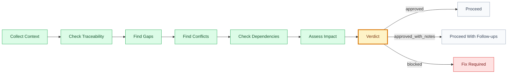

# Audit: [scope]

## 🧾 Generation And Agent Self-Check

> Complete this section when materializing the artifact. Keep unresolved items explicit in the relevant scope, findings, risks, or handoff section.

| Field | Value |
| --- | --- |
| Generated on | `YYYY-MM-DD` |
| Purpose | `[decision, evidence, contract, or handoff this artifact supports]` |
| Use when | `[workflow stage, trigger, or condition]` |
| Prepared by | `[owning skill, role, or accountable person]` |
| Scope covered | `[artifact, product area, use case, or review boundary]` |
| Required inputs and evidence | `[links to approved parents, documents, code, decisions, or observations]` |
| Ready when | `[artifact-specific completion, evidence, and gate conditions]` |
| Current status | `[status allowed by this artifact's owning workflow]` |

## 🧭 Executive Snapshot

| Field | Value |
| --- | --- |
| Scope | `[domain/goal/feature/use-case/release]` |
| Auditor skill | `[skill]` |
| Date | `[YYYY-MM-DD]` |
| Verdict | `[✅ approved | 🟡 approved_with_notes | 🔴 blocked]` |
| Next owner | `[skill/person]` |

## 🗺️ Audit Flow

## 📌 Summary

[Short summary of what was checked and result.]

## 🚦 Verdict Matrix

| Area | Result | Evidence | Notes |
| --- | --- | --- | --- |
| Traceability | `[✅/🟡/🔴]` | `[path/section]` | `[note]` |
| Completeness | `[✅/🟡/🔴]` | `[path/section]` | `[note]` |
| Consistency | `[✅/🟡/🔴]` | `[path/section]` | `[note]` |
| Dependencies | `[✅/🟡/🔴]` | `[path/section]` | `[note]` |
| Security/privacy | `[✅/🟡/🔴/➖]` | `[path/section]` | `[note]` |
| UX/accessibility | `[✅/🟡/🔴/➖]` | `[path/section]` | `[note]` |
| Release readiness | `[✅/🟡/🔴/➖]` | `[path/section]` | `[note]` |

## 🔎 Findings

| Severity | Finding | Evidence | Impact | Required Fix | Route | Owner |
| --- | --- | --- | --- | --- | --- | --- |
| `[🔴 blocker/🟡 warning/🔵 note]` | `[finding title]` | `[file/path/section]` | `[why it matters]` | `[fix]` | `[bug-fixer/code-runner/qa/product-historian]` | `[role]` |

## 🧱 Gaps

| Gap | Blocks | Required Fix | Owner |
| --- | --- | --- | --- |
| `[gap]` | `[artifact/task]` | `[fix]` | `[role]` |

## ⚔️ Conflicts

| Conflict | Artifacts | Impact | Resolution Needed |
| --- | --- | --- | --- |
| `[conflict]` | `[paths]` | `[impact]` | `[decision/fix]` |

## 🔗 Dependencies

| Dependency | Required By | Status | Risk |
| --- | --- | --- | --- |
| `[dependency]` | `[artifact/task]` | `[open/ready/blocked]` | `[risk]` |

## 🔐 Decisions

| Decision | Status | Blocks | Owner |
| --- | --- | --- | --- |
| `[decision]` | `[open/proposed/approved]` | `[artifact/task]` | `[role]` |

## 🌡️ Residual Risk

| Risk | Likelihood | Impact | Mitigation |
| --- | --- | --- | --- |
| `[risk]` | `[low/medium/high]` | `[low/medium/high]` | `[mitigation]` |

## 🏁 Approval

| Field | Value |
| --- | --- |
| Approved by |  |
| Date |  |
| Notes |  |

## ✅ Agent Verification Checklist

- [ ] The audited scope, source evidence, date, and auditor are explicit.
- [ ] Each finding has evidence, severity, owner, required fix, and affected artifact links.
- [ ] Gaps, conflicts, dependencies, decisions, and residual risks are reconciled with the verdict.
- [ ] The verdict and next owner follow the framework gate vocabulary without fabricating approval.
