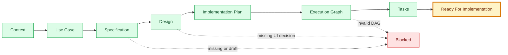
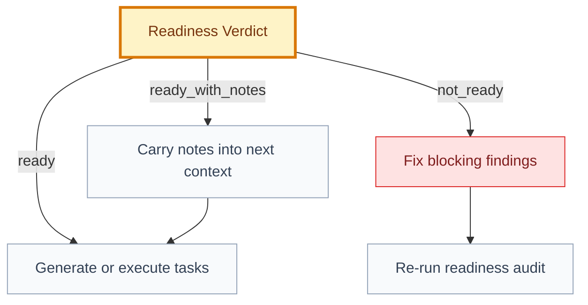

# Readiness Report: [feature/use case]

## 🧾 Generation And Agent Self-Check

> Complete this section when materializing the artifact. Keep unresolved items explicit in the relevant scope, findings, risks, or handoff section.

| Field | Value |
| --- | --- |
| Generated on | `YYYY-MM-DD` |
| Purpose | `[decision, evidence, contract, or handoff this artifact supports]` |
| Use when | `[workflow stage, trigger, or condition]` |
| Prepared by | `[owning skill, role, or accountable person]` |
| Scope covered | `[artifact, product area, use case, or review boundary]` |
| Required inputs and evidence | `[links to approved parents, documents, code, decisions, or observations]` |
| Ready when | `[artifact-specific completion, evidence, and gate conditions]` |
| Current status | `[status allowed by this artifact's owning workflow]` |

## 🧭 Executive Snapshot

| Field | Value |
| --- | --- |
| Scope | `[DOMAIN/GOAL/FT/UC/SPEC]` |
| Auditor | `[skill/orchestrator]` |
| Date | `[YYYY-MM-DD]` |
| Verdict | `[✅ ready | 🟡 ready_with_notes | 🔴 not_ready]` |
| Next Skill | `[skill/orchestrator]` |
| Can Generate Tasks | `[yes/no]` |

## 🧩 Readiness Flow

## 📌 Summary

[Short explanation of whether this artifact can move to the next step.]

## 📂 Required Artifacts

| Icon | Artifact | Path | Status | Result | Notes |
| --- | --- | --- | --- | --- | --- |
| 📘 | Domain context | `[path]` | `[status]` | `[✅ pass/🔴 fail]` | `[note]` |
| 🎯 | Goal context | `[path]` | `[status]` | `[✅ pass/🔴 fail]` | `[note]` |
| 🧱 | Feature | `[path]` | `[status]` | `[✅ pass/🔴 fail]` | `[note]` |
| 🎬 | Use case | `[path]` | `[status]` | `[✅ pass/🔴 fail]` | `[note]` |
| 📜 | Specification | `[path]` | `[status]` | `[✅ pass/🔴 fail]` | `[note]` |
| 🎨 | Design | `[path]` | `[status]` | `[✅ pass/🔴 fail/➖ n/a]` | `[note]` |
| 🛠️ | Implementation plan | `[path]` | `[status]` | `[✅ pass/🔴 fail]` | `[note]` |
| 🕸️ | Execution graph | `[path]` | `[status]` | `[✅ pass/🔴 fail]` | `[note]` |
| ✅ | Tasks | `[path]` | `[status]` | `[✅ pass/🔴 fail]` | `[note]` |

## 🚦 Gate Matrix

| Gate | Result | Evidence | Required Fix |
| --- | --- | --- | --- |
| Traceability | `[✅/🟡/🔴]` | `[path/section]` | `[fix or none]` |
| Specification completeness | `[✅/🟡/🔴]` | `[path/section]` | `[fix or none]` |
| Design readiness | `[✅/🟡/🔴/➖]` | `[path/section]` | `[fix or none]` |
| Planning completeness | `[✅/🟡/🔴]` | `[path/section]` | `[fix or none]` |
| Execution graph validity | `[✅/🟡/🔴]` | `[path/section]` | `[fix or none]` |
| Task readiness | `[✅/🟡/🔴]` | `[path/section]` | `[fix or none]` |
| Decisions resolved | `[✅/🟡/🔴]` | `[path/section]` | `[fix or none]` |

## ✅ Gate Checks

### Traceability

- [ ] Every child artifact links to a parent.
- [ ] Every task links to a specification section.
- [ ] The execution graph points to the source specification and implementation plan.

### Specification Completeness

- [ ] Scope and non-goals are explicit.
- [ ] Functional behavior is specified.
- [ ] Business rules are listed.
- [ ] UX states are listed.
- [ ] API/data contracts are present or intentionally N/A.
- [ ] Permissions and security are covered.
- [ ] Analytics and observability are covered.
- [ ] Acceptance criteria are observable.

### Design Readiness

- [ ] `design.md` exists for UI work or uses structured `not_applicable` with rationale.
- [ ] UI states are complete.
- [ ] Accessibility requirements are explicit.
- [ ] UX blockers are either fixed or carried forward.

### Planning Completeness

- [ ] Tier L has an Engineering Proposal pinned to the Engineering System or marked `Not configured`.
- [ ] Applicable Engineering Review passed against the current proposal and has no unresolved decision blocker.
- [ ] Implementation phases are sequenced.
- [ ] Dependencies are explicit.
- [ ] Risks are documented.
- [ ] Rollout and rollback are documented.
- [ ] Decisions needed are listed.

### Execution Graph Completeness

- [ ] Graph JSON parses.
- [ ] Nodes have ids, titles, types, owners, dependencies, source sections, write scopes, status, and acceptance checks.
- [ ] Dependencies reference existing nodes.
- [ ] Blocked nodes are explained.
- [ ] Parallel lanes do not imply overlapping write scopes.

### Task Readiness

- [ ] Each task is a complete vertical outcome with scope, non-goals, implementation strategy, acceptance checks, and tests/evidence.
- [ ] Tasks are split only at real dependency, safe-parallelism, ownership/toolchain, or rollback/risk boundaries—not by file count, layer, or checklist length.
- [ ] Tasks have acceptance criteria and validation method.
- [ ] Blocked tasks name the blocking decision or dependency.
- [ ] No implementation task starts from an unapproved or incomplete specification unless explicitly marked exploratory.

## 🔎 Findings

| Severity | Finding | Evidence | Impact | Required Fix | Owner |
| --- | --- | --- | --- | --- | --- |
| `[🔴 blocker/🟡 warning/🔵 note]` | `[finding]` | `[path/section]` | `[why it matters]` | `[fix]` | `[role]` |

## 🔐 Blocking Decisions

| Decision Needed | Blocks | Recommended Owner | Status |
| --- | --- | --- | --- |
| `[decision]` | `[artifact/task]` | `[role]` | `[open/proposed/approved]` |

## 🗺️ Next-Step Flow

## 🏁 Result

| Field | Value |
| --- | --- |
| Verdict | `[✅ ready | 🟡 ready_with_notes | 🔴 not_ready]` |
| Can generate/execute tasks | `[yes/no]` |
| Required next step | `[skill/orchestrator]` |

## ✅ Agent Verification Checklist

- [ ] Required artifacts, hashes, links, statuses, approvals, and derivation freshness are checked.
- [ ] Specification, design, planning, graph, task, decision, and evidence gates match rigor tier.
- [ ] Every blocker has evidence, owner, required fix, and next action.
- [ ] The readiness verdict and task-generation decision reflect the complete gate matrix.
