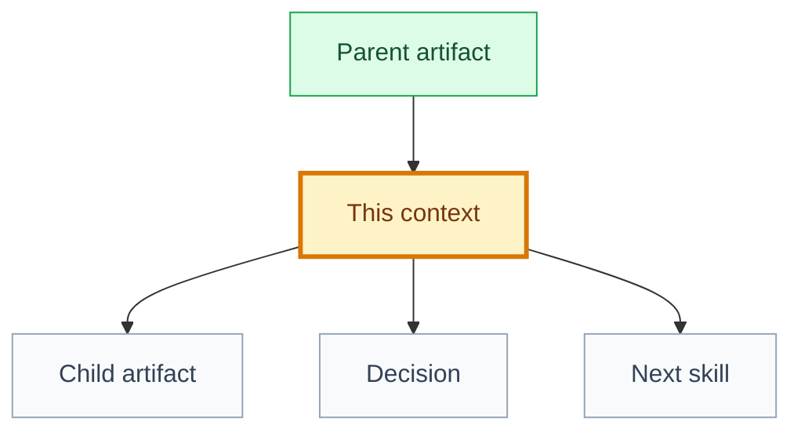

# Context: [artifact name]

## 🧾 Generation And Agent Self-Check

> Complete this section when materializing the artifact. Keep unresolved items explicit in the relevant scope, findings, risks, or handoff section.

| Field | Value |
| --- | --- |
| Generated on | `YYYY-MM-DD` |
| Purpose | `[decision, evidence, contract, or handoff this artifact supports]` |
| Use when | `[workflow stage, trigger, or condition]` |
| Prepared by | `[owning skill, role, or accountable person]` |
| Scope covered | `[artifact, product area, use case, or review boundary]` |
| Required inputs and evidence | `[links to approved parents, documents, code, decisions, or observations]` |
| Ready when | `[artifact-specific completion, evidence, and gate conditions]` |
| Current status | `[status allowed by this artifact's owning workflow]` |


## 🧭 Snapshot

```yaml
id: [DOMAIN-001 | GOAL-001 | FT-001 | UC-001 | SPEC-001 | TK-001]
type: [domain | goal | feature | use-case | specification | engineering-proposal | engineering-review | implementation-plan | execution-graph | task]
name: [human readable name]
status: [draft | proposed | approved | in_progress | implemented | validated | released | deprecated | superseded]
owner_skill: [skill name]
slug: [immutable-folder-slug]
rigor_tier: [S | M | L | N/A]
maturity: [declared | specified | implementation-ready] # use cases only; omit for other artifacts
engineering_triggers: []
last_updated: [YYYY-MM-DD]
delivery:
  level: [L0 | L1 | L2 | L3 | L4 | L5 | N/A]
  priority: [P0 | P1 | P2 | P3 | N/A]
  depends_on:
    - [artifact id/path]
  rationale: [why this artifact belongs here]
```

## 📌 Purpose

[One paragraph explaining why this artifact exists and what decision or work it enables.]

## Rigor Tier

| Field | Value |
| --- | --- |
| Tier | `[S | M | L | N/A]` |
| Trigger checklist | `[auth/permissions/payment/PII/upload/UGC/public/RLS/policies/none]` |
| Human approval | `[approval record or use-case gate]` |
| Rationale | `[why this tier is proportional]` |

## 🗺️ Artifact Map



## 🔗 Relationships

| Type | Artifact | Path | Relationship |
| --- | --- | --- | --- |
| Parent | `[id]` | `[path]` | `[relationship]` |
| Child | `[id]` | `[path]` | `[relationship]` |
| Related | `[id]` | `[path]` | `[relationship]` |

## 🚧 Dependencies

| Dependency | Why Needed | Blocking | Status |
| --- | --- | --- | --- |
| `[id/path]` | `[reason]` | `[yes/no]` | `[open/ready/blocked]` |

## 📂 Canonical Documents

| Document | Path |
| --- | --- |
| Primary | [`[primary document]`]([path]) |
| Specification | [`[specification]`]([path or N/A]) |
| Design | [`[design]`]([path or N/A]) |
| Engineering proposal | [`[engineering proposal]`]([path or N/A]) |
| Engineering review | [`[engineering review]`]([path or N/A]) |
| Implementation plan | [`[implementation plan]`]([path or N/A]) |
| Execution graph | [`[execution graph]`]([path or N/A]) |
| Tasks | [`[tasks]`]([path or N/A]) |

## 🔐 Decisions

| Decision | Summary | Status |
| --- | --- | --- |
| [`DEC-XXX`](<path-to-decision.md>#dec-xxx) | `[summary]` | `[status]` |

## ⚠️ Assumptions And Open Questions

| Type | Item | Owner | Blocks |
| --- | --- | --- | --- |
| Assumption | `[assumption]` | `[role]` | `[artifact/status]` |
| Question | `[question]` | `[role]` | `[artifact/status]` |

## 🏁 Handoff

| Field | Value |
| --- | --- |
| Next recommended skill | `[skill]` |
| Required reading | [`[artifact]`]([path]) |
| Stop condition | `[approval gate/blocker]` |

## ✅ Agent Verification Checklist

- [ ] Identity, immutable slug, type, status, owner, rigor tier, and delivery fields are valid.
- [ ] Parents, children, dependencies, consumers, decisions, and canonical documents use navigable links.
- [ ] Purpose, boundaries, open questions, and local risks match the canonical artifact.
- [ ] The handoff names the safe next action, owner, required inputs, and blocking conditions.
