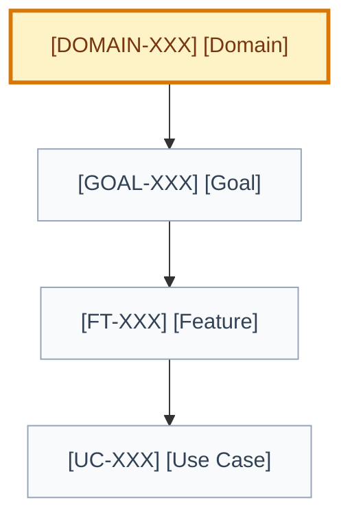

# Domain: [domain name]

## 🧾 Generation And Agent Self-Check

> Complete this section when materializing the artifact. Keep unresolved items explicit in the relevant scope, findings, risks, or handoff section.

| Field | Value |
| --- | --- |
| Generated on | `YYYY-MM-DD` |
| Purpose | `[decision, evidence, contract, or handoff this artifact supports]` |
| Use when | `[workflow stage, trigger, or condition]` |
| Prepared by | `[owning skill, role, or accountable person]` |
| Scope covered | `[artifact, product area, use case, or review boundary]` |
| Required inputs and evidence | `[links to approved parents, documents, code, decisions, or observations]` |
| Ready when | `[artifact-specific completion, evidence, and gate conditions]` |
| Current status | `[status allowed by this artifact's owning workflow]` |

## 🧭 Snapshot

| Field | Value |
| --- | --- |
| ID | `[DOMAIN-XXX]` |
| Status | `[draft | proposed | approved]` |
| Owner skill | Domain Architect AI |
| Parent strategy | [`STRAT-XXX`](<path-to-strategy.md>#strat-xxx) |
| Next skill | User Goal AI |

## 📌 Definition

[Define the domain and the coherent product/business area it owns.]

## 🧱 Owns

| Concept/workflow | Why this domain owns it |
| --- | --- |
| `[concept/workflow]` | `[ownership rationale]` |

## Does Not Own

| Concept/workflow | Owning domain/system | Boundary rationale |
| --- | --- | --- |
| `[out of scope]` | `[domain/system]` | `[why it belongs elsewhere]` |

## 🗺️ Domain Map

## 🧠 Core Concepts

| Concept | Definition | Notes |
| --- | --- | --- |
| `[concept]` | `[definition]` | `[notes]` |

## Invariants, Commands, And Events

| Type | Name | Rule/meaning | Source |
| --- | --- | --- | --- |
| Invariant | `[rule]` | `[must always hold]` | `[decision/evidence]` |
| Command | `[command]` | `[intent and authority]` | `[source]` |
| Event | `[event]` | `[observable fact]` | `[source]` |

## Data Ownership And Source Of Truth

| Concept/data | Owning domain/system | Source of truth | Consistency | Authorization boundary |
| --- | --- | --- | --- | --- |
| `[data]` | `[owner]` | `[system]` | `[transactional/eventual]` | `[who may read/write]` |

## Cross-domain Contracts

| Domain/system | Contract | Direction | Failure/compatibility expectations |
| --- | --- | --- | --- |
| `[dependency]` | `[API/event/process]` | `[in/out]` | `[expectations]` |

## 🎯 User Goals

| Goal | Status | Delivery | Priority |
| --- | --- | --- | --- |
| [`GOAL-XXX`](<path-to-goal.md>#goal-xxx) `[name]` | `[status]` | `[L0-L5]` | `[P0-P3]` |

## 📊 Metrics

| Metric | Purpose | Source |
| --- | --- | --- |
| `[metric]` | `[why it matters]` | `[artifact/event]` |

## ⚠️ Risks And Open Questions

| Item | Impact | Owner |
| --- | --- | --- |
| `[risk/question]` | `[impact]` | `[role]` |

## 🏁 Approval

| Field | Value |
| --- | --- |
| Approved by |  |
| Date |  |
| Notes |  |

## ✅ Agent Verification Checklist

- [ ] The domain states what it owns, does not own, and why the boundary is coherent.
- [ ] Concepts, invariants, commands, events, data ownership, and sources of truth agree.
- [ ] Cross-domain contracts identify providers, consumers, dependencies, and failure boundaries.
- [ ] Goals, metrics, risks, decisions, and approval state are traceable.
