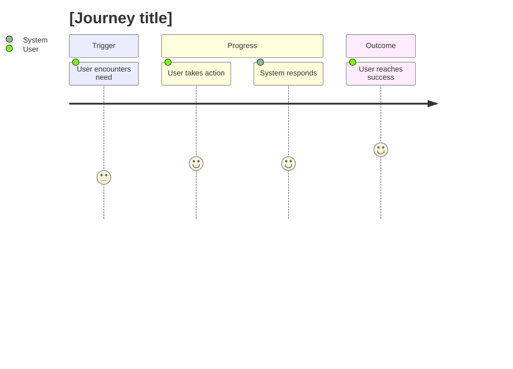

# Journey: [goal or scenario name]

## 🧾 Generation And Agent Self-Check

> Complete this section when materializing the artifact. Keep unresolved items explicit in the relevant scope, findings, risks, or handoff section.

| Field | Value |
| --- | --- |
| Generated on | `YYYY-MM-DD` |
| Purpose | `[decision, evidence, contract, or handoff this artifact supports]` |
| Use when | `[workflow stage, trigger, or condition]` |
| Prepared by | `[owning skill, role, or accountable person]` |
| Scope covered | `[artifact, product area, use case, or review boundary]` |
| Required inputs and evidence | `[links to approved parents, documents, code, decisions, or observations]` |
| Ready when | `[artifact-specific completion, evidence, and gate conditions]` |
| Current status | `[status allowed by this artifact's owning workflow]` |

## 🧭 Snapshot

| Field | Value |
| --- | --- |
| ID | `[JOURNEY-XXX]` |
| Status | `[draft | proposed | approved]` |
| Source goal | `[GOAL-XXX]` |
| Owner skill | Journey AI |
| Next skill | Feature AI |

## 👤 Actor

[Primary user or stakeholder moving through the journey.]

## 🎯 Desired Outcome

[What successful completion means for the user.]

## 🗺️ Journey Flow

## 🧩 Steps

| Step | User Action | System Response | Emotion/Friction | Opportunity |
| --- | --- | --- | --- | --- |
| 1 | `[action]` | `[response]` | `[emotion/friction]` | `[opportunity]` |

## 🔀 Decisions And Branches

| Decision Point | Path A | Path B | Risk |
| --- | --- | --- | --- |
| `[decision]` | `[path]` | `[path]` | `[risk]` |

## 📊 Metrics

| Metric | Meaning |
| --- | --- |
| `[metric]` | `[meaning]` |

## ⚠️ Open Questions

| Question | Owner | Blocks |
| --- | --- | --- |
| `[question]` | `[role]` | `[artifact]` |

## ✅ Agent Verification Checklist

- [ ] The journey identifies actor, trigger, desired outcome, scope, and source goal.
- [ ] Steps include user intent, touchpoint, system response, pain, evidence, and opportunity.
- [ ] Branches, failures, dependencies, metrics, and handoffs are represented.
- [ ] Open questions distinguish observed evidence from proposed product behavior.
