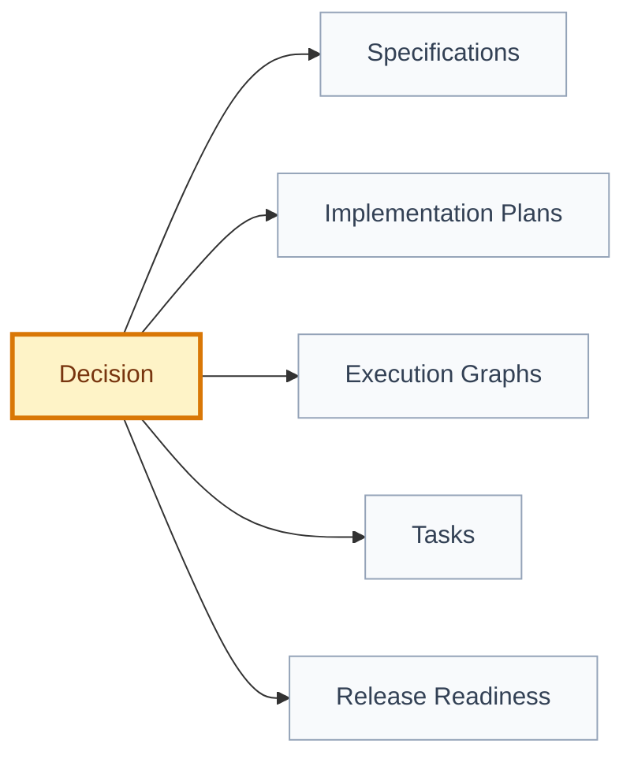

# Decision: [decision title]

## 🧾 Generation And Agent Self-Check

> Complete this section when materializing the artifact. Keep unresolved items explicit in the relevant scope, findings, risks, or handoff section.

| Field | Value |
| --- | --- |
| Generated on | `YYYY-MM-DD` |
| Purpose | `[decision, evidence, contract, or handoff this artifact supports]` |
| Use when | `[workflow stage, trigger, or condition]` |
| Prepared by | `[owning skill, role, or accountable person]` |
| Scope covered | `[artifact, product area, use case, or review boundary]` |
| Required inputs and evidence | `[links to approved parents, documents, code, decisions, or observations]` |
| Ready when | `[artifact-specific completion, evidence, and gate conditions]` |
| Current status | `[status allowed by this artifact's owning workflow]` |


## 🧭 Snapshot

| Field | Value |
| --- | --- |
| ID | `[DEC-XXX]` |
| Domain | `[product | cross-cutting | design | engineering]` |
| Status | `[proposed | approved | superseded | rejected]` |
| Date | `[YYYY-MM-DD]` |
| Type | `[product | architecture | security | data | delivery]` |
| Scope | `[artifact IDs or product-relative path prefixes]` |
| Owner | `[role/person]` |

`domain` identifies the owning area and determines the canonical directory. `type` describes the nature of the decision. `path` in `.product/decisions.json` is the canonical document location; it must match the configured root for `domain`.

## ✅ Decision

[State the decision clearly.]

## 🧠 Why

[Explain the product, technical, security, or operational reason.]

## ⚖️ Options Considered

| Option | Pros | Cons | Result |
| --- | --- | --- | --- |
| `[option]` | `[pros]` | `[cons]` | `[chosen/rejected]` |

## 🗺️ Decision Impact Flow



## 📌 Consequences

| Type | Consequence | Follow-up |
| --- | --- | --- |
| Positive | `[benefit]` | `[action]` |
| Negative | `[cost/risk]` | `[action]` |

## 📂 Affected Artifacts

| Artifact | Required Update |
| --- | --- |
| `[path/id]` | `[update]` |

## Workflow Effects

Mirror this structure in the decision's `.product/decisions.json` entry. Empty arrays are valid.

```json
{
  "requiredTaskTypes": [],
  "requiredGates": [],
  "requiredEvidence": [],
  "requiredWriteScopes": [],
  "sharedResources": []
}
```

## 🔁 Supersedes

- `[DEC-XXX or N/A]`

## 🏁 Approval

| Field | Value |
| --- | --- |
| Approved by |  |
| Date |  |
| Approval record | `[.product/history/approval-...]` |
| Notes |  |

## ✅ Agent Verification Checklist

- [ ] The decision ID, domain, type, scope, status, owner, and canonical path are consistent.
- [ ] Options, rationale, consequences, affected artifacts, and supersession are explicit.
- [ ] Workflow effects are structured, scoped, and do not silently create work or approval.
- [ ] Any approval reference points to real current evidence; no approval record was fabricated.
