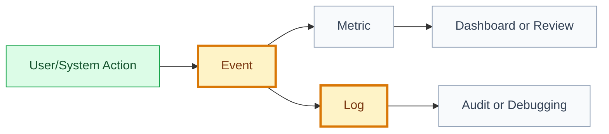

# Analytics: [use case or feature name]

## 🧾 Generation And Agent Self-Check

> Complete this section when materializing the artifact. Keep unresolved items explicit in the relevant scope, findings, risks, or handoff section.

| Field | Value |
| --- | --- |
| Generated on | `YYYY-MM-DD` |
| Purpose | `[decision, evidence, contract, or handoff this artifact supports]` |
| Use when | `[workflow stage, trigger, or condition]` |
| Prepared by | `[owning skill, role, or accountable person]` |
| Scope covered | `[artifact, product area, use case, or review boundary]` |
| Required inputs and evidence | `[links to approved parents, documents, code, decisions, or observations]` |
| Ready when | `[artifact-specific completion, evidence, and gate conditions]` |
| Current status | `[status allowed by this artifact's owning workflow]` |

## 🧭 Snapshot

| Field | Value |
| --- | --- |
| ID | `[ANA-XXX]` |
| Status | `[draft | proposed | approved]` |
| Source artifact | `[UC/FT/SPEC id]` |
| Owner skill | Documentation Writer AI or Analytics owner |

## ❓ Product Questions

| Question | Metric/Event Needed |
| --- | --- |
| `[question]` | `[metric/event]` |

## 📊 Events

| Event | Actor | Trigger | Properties | Purpose |
| --- | --- | --- | --- | --- |
| `[event_name]` | `[actor]` | `[trigger]` | `[properties]` | `[purpose]` |

## 🧾 Logs

| Log | Level | Purpose | Privacy Notes |
| --- | --- | --- | --- |
| `[log]` | `[info/warn/error]` | `[purpose]` | `[notes]` |

## 📈 Metrics

| Metric | Formula | Segment | Alert/Review |
| --- | --- | --- | --- |
| `[metric]` | `[formula]` | `[segment]` | `[alert/review]` |

## 🗺️ Instrumentation Flow

## 🔐 Privacy

- [What must not be logged or exposed.]

## ⚠️ Open Questions

| Question | Owner | Blocks |
| --- | --- | --- |
| `[question]` | `[role]` | `[artifact]` |

## ✅ Agent Verification Checklist

- [ ] Every product question maps to a defined event, log, or metric.
- [ ] Event properties, formulas, segments, and review thresholds are testable and unambiguous.
- [ ] Instrumentation ownership, privacy limits, and prohibited data are explicit.
- [ ] Open questions identify an owner and the artifact they block.
