# Release: [release name]

## 🧾 Generation And Agent Self-Check

> Complete this section when materializing the artifact. Keep unresolved items explicit in the relevant scope, findings, risks, or handoff section.

| Field | Value |
| --- | --- |
| Generated on | `YYYY-MM-DD` |
| Purpose | `[decision, evidence, contract, or handoff this artifact supports]` |
| Use when | `[workflow stage, trigger, or condition]` |
| Prepared by | `[owning skill, role, or accountable person]` |
| Scope covered | `[artifact, product area, use case, or review boundary]` |
| Required inputs and evidence | `[links to approved parents, documents, code, decisions, or observations]` |
| Ready when | `[artifact-specific completion, evidence, and gate conditions]` |
| Current status | `[status allowed by this artifact's owning workflow]` |

## 🧭 Snapshot

| Field | Value |
| --- | --- |
| ID | `[REL-XXX]` |
| Status | `[draft | proposed | approved | released]` |
| Release owner | `[role/person]` |
| Target environment | `[environment]` |
| Verdict | `[✅ ready | 🟡 ready_with_notes | 🔴 blocked]` |

## 🗺️ Release Flow

```mermaid
flowchart LR
  A["Approved artifacts"] --> B["Implementation complete"]
  B --> C["QA evidence"]
  C --> D["Security review"]
  D --> E["Audit"]
  E --> F["Release approval"]
  F --> G["Rollout"]
  G --> H["Monitor"]

  classDef done fill:#dcfce7,stroke:#16a34a,color:#14532d;
  classDef current fill:#fef3c7,stroke:#d97706,color:#78350f,stroke-width:3px;
  classDef pending fill:#f8fafc,stroke:#94a3b8,color:#334155;
  classDef blocked fill:#fee2e2,stroke:#dc2626,color:#7f1d1d;

  class A,B,C,D,E done;
  class F current;
  class G,H pending;
```

## 📦 Scope

| Type | Included Artifacts |
| --- | --- |
| Domains | `[domains]` |
| Goals | `[goals]` |
| Features | `[features]` |
| Use cases | `[use cases]` |

## 📂 Included Artifact Checklist

| Artifact Type | Paths | Status |
| --- | --- | --- |
| Specifications | `[paths]` | `[status]` |
| Designs | `[paths]` | `[status]` |
| Implementation plans | `[paths]` | `[status]` |
| Execution graphs | `[paths]` | `[status]` |
| Tasks | `[paths]` | `[status]` |
| Tests | `[paths]` | `[status]` |
| QA evidence | `[paths]` | `[status]` |
| Security reviews | `[paths]` | `[status]` |
| Audits | `[paths]` | `[status]` |

## 🚦 Readiness Gate

| Gate | Result | Evidence | Required Fix |
| --- | --- | --- | --- |
| Product approval | `[✅/🟡/🔴]` | `[path]` | `[fix]` |
| UX approval | `[✅/🟡/🔴/➖]` | `[path]` | `[fix]` |
| Engineering approval | `[✅/🟡/🔴]` | `[path]` | `[fix]` |
| QA approval | `[✅/🟡/🔴]` | `[path]` | `[fix]` |
| QA evidence completeness | `[✅/🟡/🔴]` | `[qa-evidence.md]` | `[fix]` |
| Security approval | `[✅/🟡/🔴/➖]` | `[security-review.md]` | `[fix]` |
| Residual risk approval | `[✅/🟡/🔴/➖]` | `[decision path]` | `[fix]` |
| Release approval | `[✅/🟡/🔴]` | `[path]` | `[fix]` |

## 🚢 Rollout

| Topic | Plan |
| --- | --- |
| Feature flags | `[flags]` |
| Migration/backfill | `[plan]` |
| Monitoring | `[metrics/logs/alerts]` |
| Rollback | `[plan]` |

## ⚠️ Known Risks

| Risk | Owner | Mitigation |
| --- | --- | --- |
| `[risk]` | `[owner]` | `[mitigation]` |

## 📝 Release Notes

[User-facing or internal summary.]

## 🏁 Approval

| Field | Value |
| --- | --- |
| Approved by |  |
| Date |  |
| Notes |  |

## ✅ Agent Verification Checklist

- [ ] Release scope maps artifacts, tasks, commits, PRs, environments, and user-visible changes.
- [ ] QA, code review, security, audit, approvals, and residual-risk acceptance are current.
- [ ] Rollout, monitoring, rollback, ownership, and incident response are executable.
- [ ] Release notes, known risks, verdict, and approval do not claim deployment without evidence.
