# Specification: [use case name]

## 🧾 Generation And Agent Self-Check

> Complete this section when materializing the artifact. Keep unresolved items explicit in the relevant scope, findings, risks, or handoff section.

| Field | Value |
| --- | --- |
| Generated on | `YYYY-MM-DD` |
| Purpose | `[decision, evidence, contract, or handoff this artifact supports]` |
| Use when | `[workflow stage, trigger, or condition]` |
| Prepared by | `[owning skill, role, or accountable person]` |
| Scope covered | `[artifact, product area, use case, or review boundary]` |
| Required inputs and evidence | `[links to approved parents, documents, code, decisions, or observations]` |
| Ready when | `[artifact-specific completion, evidence, and gate conditions]` |
| Current status | `[status allowed by this artifact's owning workflow]` |

## 🧭 Snapshot

| Field | Value |
| --- | --- |
| ID | `[SPEC-XXX]` |
| Status | `[draft | proposed | approved]` |
| Source use case | `[UC-XXX]` |
| Source feature | `[FT-XXX]` |
| Contract version | `2` |
| Owner skill | Specification AI |
| Next skill | UX/UI AI |

## 🔗 Navigation

| Artifact | Link |
| --- | --- |
| Context | [context.md](context.md) |
| Use Case | [use-case.md](use-case.md) |
| Design | [design.md](design.md) |
| Implementation Plan | [implementation-plan.md](implementation-plan.md) |
| Execution Graph | [execution-graph.json](execution-graph.json) |
| Tasks | [tasks.md](tasks.md) |
| Tests | [tests.md](tests.md) |
| QA Evidence | [qa-evidence.md](qa-evidence.md) |
| Security Review | [security-review.md](security-review.md) |
| Analytics | [analytics.md](analytics.md) |
| Audit | [audit.md](audit.md) |
| Technical Discovery | [technical-discovery.md](technical-discovery.md) |
| Product contract | [contracts/product.md](contracts/product.md) |
| Behavior contract | [contracts/behavior.md](contracts/behavior.md) |
| UX contract | [contracts/ux.md](contracts/ux.md) |
| API contract | [contracts/api.md](contracts/api.md) |
| Data contract | [contracts/data.md](contracts/data.md) |
| Security contract | [contracts/security.md](contracts/security.md) |
| Quality contract | [contracts/quality.md](contracts/quality.md) |
| Observability contract | [contracts/observability.md](contracts/observability.md) |
| Rollout contract | [contracts/rollout.md](contracts/rollout.md) |

## Contract Applicability

| Contract | Applies | Status | Rationale |
| --- | --- | --- | --- |
| Product | `[yes/no]` | `[draft/approved/N/A]` | `[reason]` |
| Behavior | `yes` | `[draft/approved]` | `[reason]` |
| UX | `[yes/no]` | `[draft/approved/N/A]` | `[reason]` |
| API | `[yes/no]` | `[draft/approved/N/A]` | `[reason]` |
| Data | `[yes/no]` | `[draft/approved/N/A]` | `[reason]` |
| Security | `[yes/no]` | `[draft/approved/N/A]` | `[reason]` |
| Quality | `yes` | `[draft/approved]` | `[reason]` |
| Observability | `[yes/no]` | `[draft/approved/N/A]` | `[reason]` |
| Rollout | `[yes/no]` | `[draft/approved/N/A]` | `[reason]` |

## 🚚 Delivery

| Field | Value |
| --- | --- |
| Level | `[L0 | L1 | L2 | L3 | L4 | L5]` |
| Priority | `[P0 | P1 | P2 | P3]` |
| Depends on | `[artifact ids/paths]` |
| Rationale | `[why this belongs here]` |

## 🗺️ Contract Flow

```mermaid
flowchart LR
  U["Use Case"] --> S["Specification"]
  S --> D["Design"]
  D --> P["Implementation Plan"]
  P --> G["Execution Graph"]
  G --> T["Tasks"]
  T --> Q["QA Evidence"]
  Q --> SR["Security Review"]

  classDef done fill:#dcfce7,stroke:#16a34a,color:#14532d;
  classDef current fill:#fef3c7,stroke:#d97706,color:#78350f,stroke-width:3px;
  classDef pending fill:#f8fafc,stroke:#94a3b8,color:#334155;
  classDef blocked fill:#fee2e2,stroke:#dc2626,color:#7f1d1d;

  class U done;
  class S current;
  class D,P,G,T,Q,SR pending;
```

## Evidence And Boundary

| Kind | Evidence or statement | Source | Confidence/decision status |
| --- | --- | --- | --- |
| Observation | `[verified product or code evidence]` | `[link]` | `verified` |
| Inference | `[interpretation that still needs confirmation]` | `[link]` | `[confidence]` |
| Scope | `[bounded interaction included]` | `[use case]` | `approved/draft` |
| Non-goal | `[explicitly excluded behavior]` | `[feature/use case]` | `approved/draft` |

## Cross-Contract Synthesis

| Concern | Implementable outcome | Contract | Blocking dependency |
| --- | --- | --- | --- |
| Product and behavior | `[observable outcome and governing invariants]` | [product.md](contracts/product.md), [behavior.md](contracts/behavior.md) | `[id/link or None]` |
| Experience and interfaces | `[states and interface boundary]` | [ux.md](contracts/ux.md), [api.md](contracts/api.md) | `[id/link or None]` |
| Data and trust | `[ownership, privacy, and control summary]` | [data.md](contracts/data.md), [security.md](contracts/security.md) | `[id/link or None]` |
| Quality and operations | `[verification, signals, and release safety]` | [quality.md](contracts/quality.md), [observability.md](contracts/observability.md), [rollout.md](contracts/rollout.md) | `[id/link or None]` |

## Traceability Summary

| Requirement range | Acceptance range | Source contracts | Test/evidence destination |
| --- | --- | --- | --- |
| `[REQ-001..REQ-XXX]` | `[AC-001..AC-XXX]` | `[contract links]` | [tests.md](tests.md) |

## Adversarial Review

| Check | Result | Evidence or routed correction |
| --- | --- | --- |
| Contradictions and duplicated requirements | `[passed/blocked]` | `[links]` |
| Alternate, error, edge, and abuse coverage | `[passed/blocked]` | `[links]` |
| Unsafe assumptions and missing decisions | `[passed/blocked]` | `[links]` |
| Cross-contract terminology and ownership | `[passed/blocked]` | `[links]` |

## 🔐 Open Questions And Decisions

| Question/Decision | Owner | Blocks |
| --- | --- | --- |
| `[question]` | `[role]` | `[artifact]` |

## 🏁 Approval

| Field | Value |
| --- | --- |
| Approved by |  |
| Date |  |
| Notes |  |

## ✅ Agent Verification Checklist

- [ ] The specification traces to approved use case, feature, decisions, and applicable modular contracts.
- [ ] Main, alternate, error, and edge flows cover product, UX, API, data, permissions, and rules.
- [ ] Requirements and acceptance criteria are stable, testable, linked, and non-duplicative.
- [ ] Analytics, observability, performance, reliability, rollout, risks, and open decisions are complete.
- [ ] Root content synthesizes and links concern contracts without duplicating them.
- [ ] Adversarial review has no unresolved material gap or blocking question.
