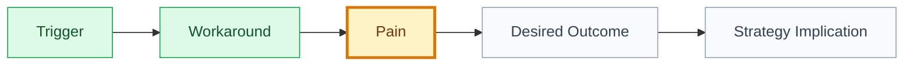

# Persona: [persona name]

## 🧾 Generation And Agent Self-Check

> Complete this section when materializing the artifact. Keep unresolved items explicit in the relevant scope, findings, risks, or handoff section.

| Field | Value |
| --- | --- |
| Generated on | `YYYY-MM-DD` |
| Purpose | `[decision, evidence, contract, or handoff this artifact supports]` |
| Use when | `[workflow stage, trigger, or condition]` |
| Prepared by | `[owning skill, role, or accountable person]` |
| Scope covered | `[artifact, product area, use case, or review boundary]` |
| Required inputs and evidence | `[links to approved parents, documents, code, decisions, or observations]` |
| Ready when | `[artifact-specific completion, evidence, and gate conditions]` |
| Current status | `[status allowed by this artifact's owning workflow]` |

## 🧭 Snapshot

| Field | Value |
| --- | --- |
| ID | `[PER-XXX]` |
| Status | `[draft | proposed | approved]` |
| Source strategy | `[STRAT-XXX]` |
| Owner skill | Strategy AI |

## 👤 Segment

[Who this persona represents.]

## 🎯 Job To Be Done

When `[situation]`, `[persona]` wants to `[motivation]`, so they can `[outcome]`.

## 🧩 Persona Card

| Field | Value |
| --- | --- |
| Context | `[context]` |
| Current workaround | `[workaround]` |
| Main pain | `[pain]` |
| Desired outcome | `[outcome]` |
| Constraints | `[constraints]` |

## 🔍 Evidence

| Source | Finding | Confidence |
| --- | --- | --- |
| `[research/interview/path]` | `[finding]` | `[low/medium/high]` |

## 🗺️ Need Flow

## ⚠️ Risks

| Risk | Impact | Mitigation |
| --- | --- | --- |
| `[risk]` | `[impact]` | `[mitigation]` |

## 🏁 Approval

| Field | Value |
| --- | --- |
| Approved by |  |
| Date |  |
| Notes |  |

## ✅ Agent Verification Checklist

- [ ] The persona represents an evidenced segment rather than an invented individual.
- [ ] Jobs, situations, behaviors, needs, constraints, and exclusions are explicit.
- [ ] Claims cite research or product evidence with confidence and limitations.
- [ ] Risks, misuse boundaries, decisions, and approval status are recorded.
