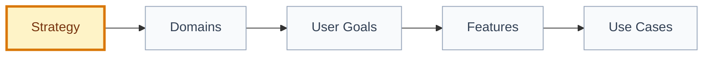

# Strategy: [strategy name]

## 🧾 Generation And Agent Self-Check

> Complete this section when materializing the artifact. Keep unresolved items explicit in the relevant scope, findings, risks, or handoff section.

| Field | Value |
| --- | --- |
| Generated on | `YYYY-MM-DD` |
| Purpose | `[decision, evidence, contract, or handoff this artifact supports]` |
| Use when | `[workflow stage, trigger, or condition]` |
| Prepared by | `[owning skill, role, or accountable person]` |
| Scope covered | `[artifact, product area, use case, or review boundary]` |
| Required inputs and evidence | `[links to approved parents, documents, code, decisions, or observations]` |
| Ready when | `[artifact-specific completion, evidence, and gate conditions]` |
| Current status | `[status allowed by this artifact's owning workflow]` |

## 🧭 Snapshot

| Field | Value |
| --- | --- |
| ID | `[STRAT-XXX]` |
| Type | `strategy` |
| Parent IDs | `[VIS-XXX, PRINCIPLES-XXX, NORTH-STAR-XXX]` |
| Status | `[draft | proposed | approved]` |
| Source vision | `[VIS-XXX/path]` |
| Owner skill | Strategy AI |
| Next skill | Domain Architect AI |

## 🎯 Strategic Focus

[Describe the strategic bet, target segment, and intended product outcome.]

## 👥 Segments And Personas

| Persona | Job To Be Done | Priority | Evidence |
| --- | --- | --- | --- |
| `[persona]` | `[job]` | `[P0-P3]` | `[path/source]` |

## 📊 Metrics

| Metric | Type | Why It Matters | Guardrail |
| --- | --- | --- | --- |
| `[metric]` | `[north-star/activation/quality/safety/ops]` | `[reason]` | `[guardrail]` |

## 🗺️ Roadmap By Delivery Level

| Level | Strategic Intent | Candidate Scope | Exit Criteria |
| --- | --- | --- | --- |
| L0 Foundation | `[intent]` | `[scope]` | `[criteria]` |
| L1 Walking Skeleton | `[intent]` | `[scope]` | `[criteria]` |
| L2 Core Loop | `[intent]` | `[scope]` | `[criteria]` |
| L3 Trust, Safety and Quality | `[intent]` | `[scope]` | `[criteria]` |
| L4 Operations and Scale | `[intent]` | `[scope]` | `[criteria]` |
| L5 Growth and Optimization | `[intent]` | `[scope]` | `[criteria]` |

## 🧱 Domain Handoff

## ⚠️ Risks And Trade-offs

| Risk/Trade-off | Impact | Mitigation |
| --- | --- | --- |
| `[risk]` | `[impact]` | `[mitigation]` |

## 🔐 Decisions Needed

| Decision | Blocks | Owner |
| --- | --- | --- |
| `[decision]` | `[artifact]` | `[role]` |

## 🏁 Approval

| Field | Value |
| --- | --- |
| Approved by |  |
| Date |  |
| Notes |  |

## ✅ Agent Verification Checklist

- [ ] Strategy traces to approved Foundation inputs and states target segments and strategic bets.
- [ ] Metrics, guardrails, trade-offs, risks, domains, and roadmap levels are coherent.
- [ ] Sequencing and pause/advance criteria are evidence-based and explicitly owned.
- [ ] Decisions, approval, and domain handoff do not silently expand product scope.
