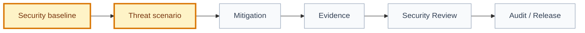

# Threat Register

## 🧾 Generation And Agent Self-Check

> Complete this section when materializing the artifact. Keep unresolved items explicit in the relevant scope, findings, risks, or handoff section.

| Field | Value |
| --- | --- |
| Generated on | `YYYY-MM-DD` |
| Purpose | `[decision, evidence, contract, or handoff this artifact supports]` |
| Use when | `[workflow stage, trigger, or condition]` |
| Prepared by | `[owning skill, role, or accountable person]` |
| Scope covered | `[artifact, product area, use case, or review boundary]` |
| Required inputs and evidence | `[links to approved parents, documents, code, decisions, or observations]` |
| Ready when | `[artifact-specific completion, evidence, and gate conditions]` |
| Current status | `[status allowed by this artifact's owning workflow]` |

## Snapshot

| Field | Value |
| --- | --- |
| ID | `[THREAT-REGISTER-XXX]` |
| Status | `[draft | proposed | approved]` |
| Owner skill | Threat Modeler AI |
| Governed by | `FRAMEWORK.md security policy` |
| Scope | `[product/domain/release]` |
| Last reviewed | `YYYY-MM-DD` |

## Threat Flow

## Register

| ID | Status | Severity | Likelihood | Scenario | Affected Artifacts | Required Mitigation | Evidence | Route | Owner |
| --- | --- | --- | --- | --- | --- | --- | --- | --- | --- |
| `[THR-001]` | `[open/mitigated/accepted/blocked]` | `[blocker/high/medium/low]` | `[high/medium/low]` | `[attack or failure scenario]` | `[paths]` | `[control]` | `[path/log/test/decision]` | `[code-runner/qa/bug-fixer/product-historian/security-review]` | `[owner]` |

## Accepted Residual Risks

| Threat ID | Risk | Approval | Compensating Control | Review Date |
| --- | --- | --- | --- | --- |
| `[THR-XXX]` | `[risk]` | `[DEC/approval/PR]` | `[control]` | `YYYY-MM-DD` |

## Review Notes

| Date | Reviewer | Change | Follow-up |
| --- | --- | --- | --- |
| `YYYY-MM-DD` | `[name/skill]` | `[what changed]` | `[next step]` |

## ✅ Agent Verification Checklist

- [ ] Each threat identifies asset, actor, precondition, scenario, impact, likelihood, and scope.
- [ ] Controls, owners, evidence, status, residual risk, and review triggers are current.
- [ ] Accepted risks name authorized acceptance evidence and expiry or reassessment conditions.
- [ ] Review notes link affected deliveries, incidents, decisions, baselines, and follow-up actions.
