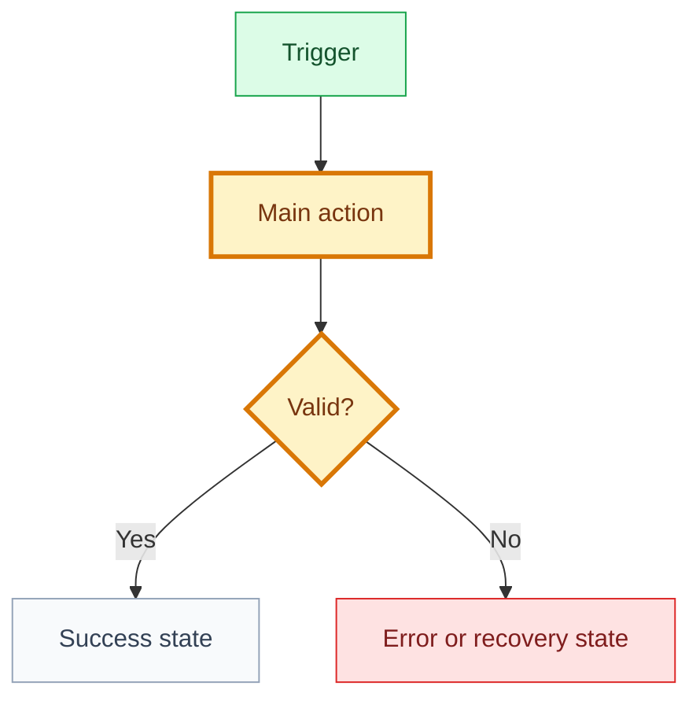

# Use Case: [use case name]

## 🧾 Generation And Agent Self-Check

> Complete this section when materializing the artifact. Keep unresolved items explicit in the relevant scope, findings, risks, or handoff section.

| Field | Value |
| --- | --- |
| Generated on | `YYYY-MM-DD` |
| Purpose | `[decision, evidence, contract, or handoff this artifact supports]` |
| Use when | `[workflow stage, trigger, or condition]` |
| Prepared by | `[owning skill, role, or accountable person]` |
| Scope covered | `[artifact, product area, use case, or review boundary]` |
| Required inputs and evidence | `[links to approved parents, documents, code, decisions, or observations]` |
| Ready when | `[artifact-specific completion, evidence, and gate conditions]` |
| Current status | `[status allowed by this artifact's owning workflow]` |

## 🧭 Snapshot

| Field | Value |
| --- | --- |
| ID | `[UC-XXX]` |
| Status | `[draft | proposed | approved]` |
| Feature | [`[FT-XXX]`]([../feature-or-context-path]) |
| Owner skill | Use Case AI |
| Next skill | Specification AI |

## Rigor Tier

| Field | Value |
| --- | --- |
| Tier | `[S | M | L]` |
| Trigger checklist | `[auth/permissions/payment/PII/upload/UGC/public/RLS/policies/none]` |
| Required artifact set | `[tier-required artifacts]` |
| Rationale | `[why this tier is proportional to risk and complexity]` |

## 🔗 Navigation

| Artifact | Link |
| --- | --- |
| Context | [context.md](context.md) |
| Specification | [specification.md](specification.md) |
| Design | [design.md](design.md) |
| Implementation Plan | [implementation-plan.md](implementation-plan.md) |
| Execution Graph | [execution-graph.json](execution-graph.json) |
| Tasks | [tasks.md](tasks.md) |
| Tests | [tests.md](tests.md) |
| Analytics | [analytics.md](analytics.md) |
| Audit | [audit.md](audit.md) |

## 🚚 Delivery

| Field | Value |
| --- | --- |
| Level | `[L0 | L1 | L2 | L3 | L4 | L5]` |
| Priority | `[P0 | P1 | P2 | P3]` |
| Depends on | `[artifact ids/paths]` |
| Rationale | `[why this belongs here]` |

## Delivery Slice

| Field | Value |
| --- | --- |
| User value | `[observable value]` |
| Entry point | `[trigger]` |
| End state | `[observable completion]` |
| Independently releasable | `[yes/no]` |
| Reversible | `[yes/no and how]` |
| Deferred | `[explicitly postponed behavior]` |

## 👤 Actors

| Actor | Role In Flow |
| --- | --- |
| `[primary actor]` | `[what they do]` |
| `[secondary actor/system]` | `[what they do]` |

## 🎯 Goal

[Observable goal achieved by the actor.]

## 🚦 Preconditions

- [Condition that must be true before the flow starts.]

## 🗺️ Flow Diagram

## ✅ Main Flow

1. [Step]
2. [Step]
3. [Step]

## 🔁 Alternate Flows

| Flow | Expected Behavior |
| --- | --- |
| `[alternate]` | `[behavior]` |

## ⚠️ Error And Edge Cases

| Case | Expected Behavior | Analytics/Log |
| --- | --- | --- |
| `[case]` | `[behavior]` | `[event/log]` |

## 📏 Business Rules

| Rule | Source |
| --- | --- |
| `[rule]` | `[decision/path]` |

## 🎨 UX States

| State | Meaning |
| --- | --- |
| `[state]` | `[meaning]` |

## ✅ Acceptance Criteria

- [ ] [Observable behavior]
- [ ] [Permission/security behavior]
- [ ] [Failure behavior]
- [ ] [Analytics/observability behavior]

## 🔐 Decisions Needed

| Decision | Blocks | Owner |
| --- | --- | --- |
| `[decision]` | `[artifact]` | `[role]` |

## 🏁 Approval

| Field | Value |
| --- | --- |
| Approved by |  |
| Date |  |
| Notes |  |

## ✅ Agent Verification Checklist

- [ ] The use case traces to one feature and states actors, trigger, goal, preconditions, and outcome.
- [ ] Rigor tier, automatic triggers, delivery slice, level, priority, and dependencies agree.
- [ ] Main, alternate, error, and edge flows cover rules, UX states, data, permissions, and risks.
- [ ] Acceptance criteria, decisions, approval, and specification handoff are complete and testable.
