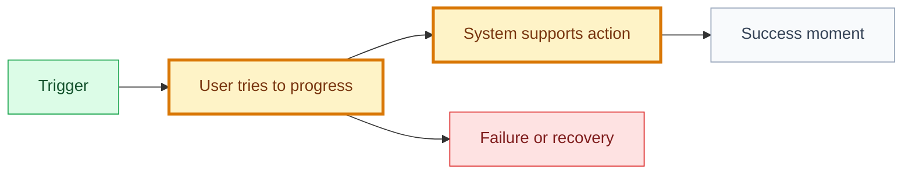

# User Goal: [goal name]

## 🧾 Generation And Agent Self-Check

> Complete this section when materializing the artifact. Keep unresolved items explicit in the relevant scope, findings, risks, or handoff section.

| Field | Value |
| --- | --- |
| Generated on | `YYYY-MM-DD` |
| Purpose | `[decision, evidence, contract, or handoff this artifact supports]` |
| Use when | `[workflow stage, trigger, or condition]` |
| Prepared by | `[owning skill, role, or accountable person]` |
| Scope covered | `[artifact, product area, use case, or review boundary]` |
| Required inputs and evidence | `[links to approved parents, documents, code, decisions, or observations]` |
| Ready when | `[artifact-specific completion, evidence, and gate conditions]` |
| Current status | `[status allowed by this artifact's owning workflow]` |

## 🧭 Snapshot

| Field | Value |
| --- | --- |
| ID | `[GOAL-XXX]` |
| Status | `[draft | proposed | approved]` |
| Domain | [`DOMAIN-XXX`](<path-to-domain.md>#domain-xxx) |
| Owner skill | User Goal AI |
| Next skill | Journey AI or Feature AI |

## 🎯 User Intent

As a `[user]`, I want to `[goal]`, so I can `[outcome]`.

## 💡 Why This Goal Matters

[Explain the product value and how it traces to strategy.]

## 🗺️ Journey Summary

## 🧱 Candidate Features

| Feature | Status | Delivery | Priority | Notes |
| --- | --- | --- | --- | --- |
| [`FT-XXX`](<path-to-feature.md>#ft-xxx) `[name]` | `[status]` | `[L0-L5]` | `[P0-P3]` | `[notes]` |

## 📏 Rules And Constraints

| Rule/Constraint | Source | Impact |
| --- | --- | --- |
| `[rule]` | `[decision/path]` | `[impact]` |

## 📊 Metrics

| Metric | Meaning |
| --- | --- |
| `[metric]` | `[meaning]` |

## ⚠️ Risks And Open Questions

| Item | Blocks | Owner |
| --- | --- | --- |
| `[risk/question]` | `[artifact]` | `[role]` |

## 🏁 Approval

| Field | Value |
| --- | --- |
| Approved by |  |
| Date |  |
| Notes |  |

## ✅ Agent Verification Checklist

- [ ] The goal expresses a stable user intent and outcome rather than a proposed solution.
- [ ] Domain ownership, journey, constraints, candidate features, and dependencies are coherent.
- [ ] Metrics measure user-value progress and include relevant guardrails.
- [ ] Risks, open questions, decisions, approval, and handoff are explicit.
