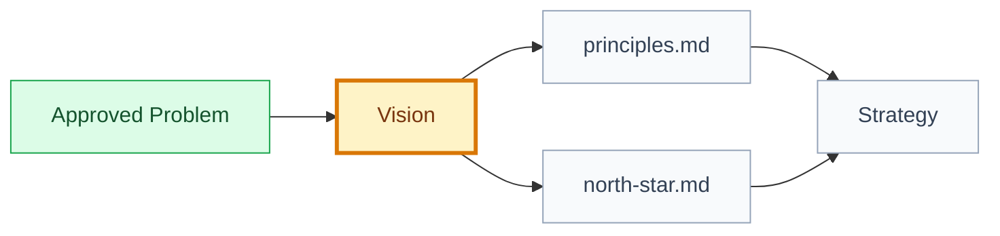

# Vision: [product or area name]

## 🧾 Generation And Agent Self-Check

> Complete this section when materializing the artifact. Keep unresolved items explicit in the relevant scope, findings, risks, or handoff section.

| Field | Value |
| --- | --- |
| Generated on | `YYYY-MM-DD` |
| Purpose | `[decision, evidence, contract, or handoff this artifact supports]` |
| Use when | `[workflow stage, trigger, or condition]` |
| Prepared by | `[owning skill, role, or accountable person]` |
| Scope covered | `[artifact, product area, use case, or review boundary]` |
| Required inputs and evidence | `[links to approved parents, documents, code, decisions, or observations]` |
| Ready when | `[artifact-specific completion, evidence, and gate conditions]` |
| Current status | `[status allowed by this artifact's owning workflow]` |

## 🧭 Snapshot

| Field | Value |
| --- | --- |
| ID | `[VIS-XXX]` |
| Type | `vision` |
| Parent IDs | `[PROB-XXX]` |
| Status | `[draft | proposed | approved]` |
| Source problem | `[PROB-XXX/path]` |
| Owner skill | Vision AI |
| Next skill | Strategy AI |

## 🌟 Vision Statement

[Describe the product future, for whom, why now, and what durable outcome it should create.]

## 👥 Target Users

| User | Desired Outcome | Current Friction |
| --- | --- | --- |
| `[user segment]` | `[outcome]` | `[friction]` |

## 🧭 Companion Contracts

| Contract | Canonical Artifact |
| --- | --- |
| Product principles, trade-offs, examples, and anti-principles | `principles.md` |
| North-star outcome, metric, measurement notes, and guardrails | `north-star.md` |

## 🗺️ Vision To Strategy Flow

## 🚫 Non-Goals

- [What this vision does not include.]

## 🔐 Decisions Needed

| Decision | Blocks | Owner |
| --- | --- | --- |
| `[decision]` | `[artifact]` | `[role]` |

## 🏁 Approval

| Field | Value |
| --- | --- |
| Approved by |  |
| Date |  |
| Notes |  |

## ✅ Agent Verification Checklist

- [ ] The vision traces to an evidenced problem and identifies users, future state, value, and why now.
- [ ] Boundaries and non-goals remain distinct from principles, North Star, and Strategy.
- [ ] Companion contracts and unresolved decisions use canonical links and clear ownership.
- [ ] Approval status and Strategy handoff reflect current Foundation gates.
