# Knowledge Templates

## Purpose

This folder stores reusable artifact templates for the Product Engineering Framework. Templates keep the document chain consistent from Problem through Tasks without changing the architecture defined in `FRAMEWORK.md`.

## When To Use

Use these templates whenever a new canonical artifact is created or an existing artifact must be normalized. A template is not a substitute for product thinking; it is the checklist that keeps the output traceable, auditable, and ready for the next skill.

## Expected Files

- `context-template.md`: baseline for every `context.md`.
- `problem-template.md`, `vision-template.md`, `strategy-template.md`: foundation artifacts.
- `interview-note-template.md`, `research-summary-template.md`: reusable problem-evidence notes stored in adopter-owned Foundation paths when needed.
- `feature-brief-template.md`: bounded `existing-feature` entry contract with one Target Feature.
- `product-baseline-template.md`: code-first current-state contract for `existing-product`.
- `implementation-assessment-template.md`: observed implementation evidence before full Foundation.
- `persona-template.md`, `metric-template.md`, `roadmap-item-template.md`: strategy support artifacts.
- `domain-template.md`, `goal-template.md`, `feature-template.md`, `use-case-template.md`: product hierarchy artifacts.
- `journey-template.md`: user journey artifact.
- `specification-template.md`, `design-template.md`, `design-system-template.md`, `design-component-template.md`, `design-pattern-template.md`, `engineering-system-template.md`, `engineering-proposal-template.md`, `engineering-review-template.md`, `implementation-plan-template.md`: planning, shared Design and Engineering contracts, and independent technical review.
- `engineering-system-template.yaml`, `quality-system-template.md`, `quality-system-template.yaml`, `quality-model-template.md`, `test-strategy-template.md`, `fitness-functions-template.yaml`: mechanical Engineering System catalog and shared product quality contracts.
- `execution-graph-template.json`, `tasks-template.md`, `tests-template.md`: executable planning artifacts.
- `qa-evidence-template.md`, `security-review-template.md`, `security-baseline-template.md`, `threat-register-template.md`: validation evidence, security gate, and proactive threat modeling artifacts.
- `analytics-template.md`, `audit-template.md`, `readiness-report-template.md`: validation and measurement artifacts.
- `decision-template.md`, `approval-record-template.json`, `derivation-record-template.json`, `release-template.md`: human approval, derivation, decision, and release artifacts.
- `domain-evolution-template.md`: opportunity mapping, candidate comparison, slicing, and explicit feature selection.
- `technical-discovery-template.md`: requirement-to-codebase mapping and Architecture Gate.
- `execution-graph-template.json`: proposed DAG contract; task paths become mandatory after atomic materialization.
- `task-template.md`: canonical task contract and readiness handoff.
- `specification-contract-template.md`: reusable structure for modular product, behavior, UX, API, data, security, quality, observability, and rollout contracts.

## Responsible Skill

Primary owner: Documentation Writer AI.

Supporting skills: Product Historian AI for decisions, Specification AI for specification completeness, UX/UI AI for design coverage, Task AI for executable task structure, QA AI for evidence coverage, Security Review AI for security gates, Threat Modeler AI for security baselines and threat registers.

## Visual Standard

Templates should produce artifacts that are easy to scan in GitHub and Codex:

- use a `🧭 Snapshot` table near the top;
- use status icons such as `✅`, `🟡`, `🔴`, and `➖` where a report or gate has a result;
- use tables for scope, decisions, risks, dependencies, owners, and acceptance;
- use Mermaid diagrams for flows, artifact chains, gates, journeys, and dependencies;
- keep prose focused on decisions, evidence, and handoff.

## Link Standard

Generated documents should use real Markdown links for local artifacts instead of plain paths when the target exists.

Use repository-relative paths in indexes and root-level reports:

```markdown
[FRAMEWORK.md](../../FRAMEWORK.md)
```

Use sibling-relative links inside artifact bundles:

```markdown
[Context](context.md)
[Specification](specification.md)
[Implementation Plan](implementation-plan.md)
[Execution Graph](execution-graph.json)
```

When a template contains placeholders, keep the placeholder in the label and use the expected target shape:

```markdown
[`[SPEC-XXX] Specification`](specification.md)
```

Do not link to a file that does not exist yet unless the link target is an explicit placeholder such as `[planned-output.md]`, `TBD`, or `N/A`. Real relative Markdown links in templates are validated by `framework/validators/framework-validator.mjs`.

## Mermaid Progress Classes

When a Mermaid flow represents framework progress, include visual classes:

```mermaid
flowchart LR
  %% artifact: SPEC-XXX node: H %%
  A["Problem"] --> B["Vision"] --> C["Strategy"] --> D["Domain"] --> E["User Goal"] --> F["Feature"] --> G["Use Case"] --> H["Specification"] --> I["Design"] --> J["Implementation Plan"] --> K["Execution Graph"] --> L["Tasks"]

  classDef done fill:#dcfce7,stroke:#16a34a,color:#14532d;
  classDef current fill:#fef3c7,stroke:#d97706,color:#78350f,stroke-width:3px;
  classDef pending fill:#f8fafc,stroke:#94a3b8,color:#334155;
  classDef blocked fill:#fee2e2,stroke:#dc2626,color:#7f1d1d;

  class A,B,C,D,E,F,G done;
  class H current;
  class I,J,K,L pending;
```



Responsibility:

| Owner | Responsibility |
| --- | --- |
| Skill that owns the current artifact | Update the local Mermaid flow and `context.md` when artifact status changes. |
| Documentation Orchestrator | Synchronize Mermaid progress across reports, templates, indexes, and context files. |
| Audit Orchestrator | Verify visual state matches real artifact status during audits. |
| Release Orchestrator | Verify release/readiness visual flows before release approval. |

Semantic validation:

Use a Mermaid comment to bind a node to a framework artifact when the node represents a real artifact:

```text
%% artifact: UC-002 node: U %%
```

Placeholder IDs such as `SPEC-XXX` are examples. Generated documents should replace them with real artifact IDs before relying on semantic validation.

The validator maps artifact status from `.product/artifacts.json` to visual state:

| Artifact status | Expected Mermaid class |
| --- | --- |
| `approved`, `implemented`, `validated`, `released` | `done` |
| `draft`, `proposed`, `in_progress` | `current` |
| `deprecated`, `superseded` | `blocked` |
| `unknown` or missing | `pending` |

## Next Step

When creating an artifact, read the relevant parent `context.md`, copy the matching template structure into the target document, replace placeholders with concrete content, and leave the artifact in `draft` or `proposed` until human approval is recorded.

## Reference links

Every cross-artifact reference in a materialized document must be a Markdown link to the canonical file and, when applicable, its section anchor. This includes tasks, bugs, decisions, requirements, acceptance criteria, QA/security evidence, audits, releases, gaps, mappings, and any other document registered by the product. An ID by itself (for example `GAP-003`, `MAP-010`, `TASK-021`, or `DEC-014`) is not sufficient for navigation. During drafting, use the explicit placeholder form `[GAP-003](<path-to-gap-003.md>#gap-003)` and replace the path with the real product-relative path before handoff. Keep the ID in the link label so search, registry checks, and human navigation all retain the stable identity.
