# Code Review: [use case or task name]

## Snapshot

| Field | Value |
| --- | --- |
| ID | `[CR-XXX]` |
| Status | `[draft | proposed | approved | validated]` |
| Source use case | `[UC-XXX]` |
| Source tasks | `[TASKSET-XXX or task ids]` |
| Source QA evidence | `[QA-XXX or N/A]` |
| Owner skill | Code Review AI |
| Next skill | QA AI, Security Review AI, bug-fixer, code-runner, or Audit Orchestrator |

## Navigation

| Artifact | Link |
| --- | --- |
| Context | [context.md](context.md) |
| Specification | [specification.md](specification.md) |
| Implementation Plan | [implementation-plan.md](implementation-plan.md) |
| Execution Graph | [execution-graph.json](execution-graph.json) |
| Tasks Index | [tasks.md](tasks.md) |
| QA Evidence | [qa-evidence.md](qa-evidence.md) |
| Security Review | [security-review.md](security-review.md) |

## Review Flow

```mermaid
flowchart LR
  A["Source artifacts"] --> B["Code evidence"]
  B --> C["Completeness"]
  C --> D["Adherence"]
  D --> E["Quality"]
  E --> F["Findings routed"]
  F --> G["Review verdict"]

  classDef done fill:#dcfce7,stroke:#16a34a,color:#14532d;
  classDef current fill:#fef3c7,stroke:#d97706,color:#78350f,stroke-width:3px;
  classDef pending fill:#f8fafc,stroke:#94a3b8,color:#334155;
  classDef blocked fill:#fee2e2,stroke:#dc2626,color:#7f1d1d;

  class A,B done;
  class C,D,E current;
  class F,G pending;
```

## Review Target

| Field | Value |
| --- | --- |
| Branch | `[branch or N/A]` |
| Base commit | `[commit hash]` |
| Reviewed diff hash | `[sha256]` |
| Commits | `[commit hashes or N/A]` |
| PR | `[PR URL/id or N/A]` |
| Code paths | `[repo-relative paths]` |
| Gates reviewed | `[gate ids/logs]` |
| Commit convention | `knowledge/conventions/commits.md` |
| PR convention | `knowledge/conventions/pull-requests.md` |

## Completeness

| Requirement | Source | Evidence | Result | Notes |
| --- | --- | --- | --- | --- |
| `[requirement]` | `[spec/task/test]` | `[path/line/log]` | `[passed/failed/blocked/not reviewed]` | `[notes]` |

## Adherence

| Contract | Source | Evidence | Result | Notes |
| --- | --- | --- | --- | --- |
| `[architecture/data/permission/API/non-goal]` | `[artifact section]` | `[path/line]` | `[passed/failed/blocked/not reviewed]` | `[notes]` |

## Quality

| Area | Evidence | Result | Notes |
| --- | --- | --- | --- |
| Maintainability | `[path/line]` | `[passed/failed/blocked/not reviewed]` | `[notes]` |
| Error handling | `[path/line]` | `[passed/failed/blocked/not reviewed]` | `[notes]` |
| Dead code or unnecessary complexity | `[path/line]` | `[passed/failed/blocked/not reviewed]` | `[notes]` |
| Performance appropriate to delivery level | `[path/line]` | `[passed/failed/blocked/not reviewed]` | `[notes]` |
| Security-sensitive coding concerns | `[path/line]` | `[passed/failed/blocked/not reviewed]` | `[notes]` |

## Findings

| Severity | Finding | Evidence | Required Fix | Route | Owner |
| --- | --- | --- | --- | --- | --- |
| `[blocker/required_fix/note]` | `[finding]` | `[file:line]` | `[fix or N/A]` | `[bug-fixer/code-runner/qa/product-historian/N/A]` | `[skill/person]` |

## Residual Risk

| Risk | Severity | Mitigation | Approval Needed | Owner |
| --- | --- | --- | --- | --- |
| `[risk]` | `[low/medium/high]` | `[mitigation]` | `[yes/no/decision id]` | `[role]` |

## Review Verdict

| Field | Value |
| --- | --- |
| Verdict | `[passed | passed_with_notes | blocked]` |
| Completeness passed | `[yes/no]` |
| Adherence passed | `[yes/no]` |
| Quality passed | `[yes/no]` |
| Blocks validation | `[yes/no]` |
| Blocks release | `[yes/no]` |
| Next owner | `[skill/role]` |
