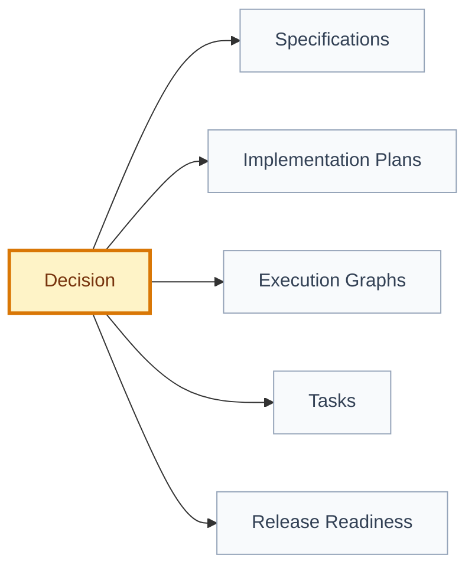

# Decision: [decision title]

## 🧭 Snapshot

| Field | Value |
| --- | --- |
| ID | `[DEC-XXX]` |
| Status | `[proposed | approved | superseded | rejected]` |
| Date | `[YYYY-MM-DD]` |
| Scope | `[product/security/architecture/data/UX/release]` |
| Owner | `[role/person]` |

## ✅ Decision

[State the decision clearly.]

## 🧠 Why

[Explain the product, technical, security, or operational reason.]

## ⚖️ Options Considered

| Option | Pros | Cons | Result |
| --- | --- | --- | --- |
| `[option]` | `[pros]` | `[cons]` | `[chosen/rejected]` |

## 🗺️ Decision Impact Flow

## 📌 Consequences

| Type | Consequence | Follow-up |
| --- | --- | --- |
| Positive | `[benefit]` | `[action]` |
| Negative | `[cost/risk]` | `[action]` |

## 📂 Affected Artifacts

| Artifact | Required Update |
| --- | --- |
| `[path/id]` | `[update]` |

## 🔁 Supersedes

- `[DEC-XXX or N/A]`

## 🏁 Approval

| Field | Value |
| --- | --- |
| Approved by |  |
| Date |  |
| Approval record | `[.product/history/approval-...]` |
| Notes |  |
