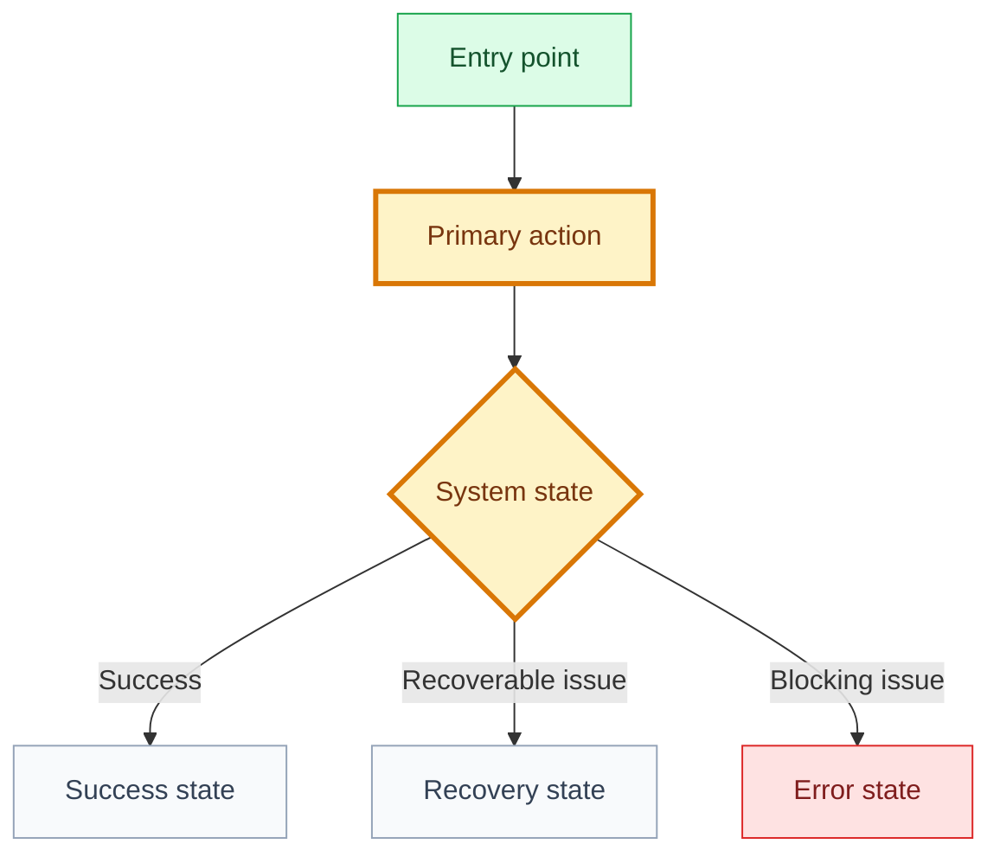

# Design: [use case name]

## 🧭 Snapshot

| Field | Value |
| --- | --- |
| ID | `[DES-XXX]` |
| Status | `[draft | proposed | approved | Not applicable]` |
| Source specification | `[SPEC-XXX]` |
| Owner skill | UX/UI AI |
| Next skill | Implementation Planner AI |

## 🔗 Navigation

| Artifact | Link |
| --- | --- |
| Context | [context.md](context.md) |
| Specification | [specification.md](specification.md) |
| Use Case | [use-case.md](use-case.md) |
| Implementation Plan | [implementation-plan.md](implementation-plan.md) |
| Audit | [audit.md](audit.md) |

## 🚚 Delivery

| Field | Value |
| --- | --- |
| Level | `[L0 | L1 | L2 | L3 | L4 | L5]` |
| Priority | `[P0 | P1 | P2 | P3]` |
| Depends on | `[SPEC-XXX/path]` |
| Rationale | `[why this design belongs here]` |

## Design Contract

```yaml
design:
  origin_mode: generate # generate | evolve | adopt
  maturity: contract # contract | wireframe | mockup | prototype
  fidelity_policy: balanced # strict | balanced | exploratory
sources:
  - id: SPEC-XXX
    type: specification
    authority: behavioral # behavioral | visual_canonical | reference | inspiration
    location: specification.md
    version: content-hash
```

```yaml
design_system:
  id: DSYS-001
  path: design/system/design-system.md
  version: 0.1.0
  authority: canonical
uses:
  tokens: []
  components: []
  patterns: []
  deviations: []
```

Precedence: approved decisions and safety requirements -> Specification -> canonical visual source -> design system -> references -> inspiration.

## 🎯 UX Goal

[Describe the user experience outcome this design must make possible.]

## 🗺️ User Flow



## 🚪 Entry Points

| Entry Point | User Intent | Notes |
| --- | --- | --- |
| `[entry point]` | `[intent]` | `[notes]` |

## 🧩 UI Regions And Components

| Region | Components | Data Displayed |
| --- | --- | --- |
| `[region]` | `[components]` | `[data]` |

## 🎛️ States

| State | User Sees | System Behavior | Accessibility Requirement |
| --- | --- | --- | --- |
| Default | `[copy/UI]` | `[behavior]` | `[requirement]` |
| Loading | `[copy/UI]` | `[behavior]` | `[requirement]` |
| Empty | `[copy/UI]` | `[behavior]` | `[requirement]` |
| Success | `[copy/UI]` | `[behavior]` | `[requirement]` |
| Error | `[copy/UI]` | `[behavior]` | `[requirement]` |

## ♿ Accessibility

- [Requirement]

## ✍️ Content Guidelines

- [Copy or content rule.]

## 🖼️ Mockups Or Wireframes

| Asset ID | Stage | Path/Link | Viewport | Source | Status |
| --- | --- | --- | --- | --- | --- |
| `[VIS-XXX]` | `[wireframe/mockup/prototype]` | `[path/link]` | `[mobile/desktop/etc.]` | `[DSRC-XXX]` | `[draft/reviewed/missing]` |

## Screen Inventory And Coverage

| Screen ID | Screen/State | REQ/AC | Coverage | Notes |
| --- | --- | --- | --- | --- |
| `[SCREEN-XXX]` | `[screen and state]` | `[REQ-*/AC-*]` | `[covered/partial/missing/conflict/not-verifiable/not-applicable]` | `[notes]` |

## Fidelity And Deviations

| Source | Target | Result | Evidence | Required Action |
| --- | --- | --- | --- | --- |
| `[DSRC-XXX/SCREEN-XXX]` | `[asset or implementation]` | `[match/deviation/unverified]` | `[path/link]` | `[none/review/decision]` |

## 🔐 Open Questions And Decisions

| Question/Decision | Owner | Blocks |
| --- | --- | --- |
| `[question]` | `[role]` | `[artifact]` |

## 🏁 Approval

| Field | Value |
| --- | --- |
| UX approved by |  |
| Date |  |
| Notes |  |
