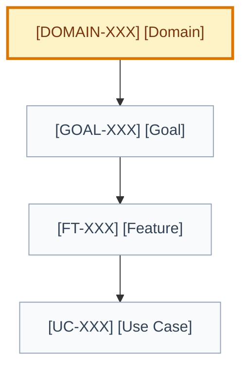

# Domain: [domain name]

## 🧭 Snapshot

| Field | Value |
| --- | --- |
| ID | `[DOMAIN-XXX]` |
| Status | `[draft | proposed | approved]` |
| Owner skill | Domain Architect AI |
| Parent strategy | `[STRAT-XXX/path]` |
| Next skill | User Goal AI |

## 📌 Definition

[Define the domain and the coherent product/business area it owns.]

## 🧱 Boundaries

| Owns | Does Not Own | Depends On |
| --- | --- | --- |
| `[concept/workflow]` | `[out of scope]` | `[domain/system]` |

## 🗺️ Domain Map

## 🧠 Core Concepts

| Concept | Definition | Notes |
| --- | --- | --- |
| `[concept]` | `[definition]` | `[notes]` |

## Invariants, Commands, And Events

| Type | Name | Rule/meaning | Source |
| --- | --- | --- | --- |
| Invariant | `[rule]` | `[must always hold]` | `[decision/evidence]` |
| Command | `[command]` | `[intent and authority]` | `[source]` |
| Event | `[event]` | `[observable fact]` | `[source]` |

## Data Ownership And Source Of Truth

| Concept/data | Owning domain/system | Source of truth | Consistency | Authorization boundary |
| --- | --- | --- | --- | --- |
| `[data]` | `[owner]` | `[system]` | `[transactional/eventual]` | `[who may read/write]` |

## Cross-domain Contracts

| Domain/system | Contract | Direction | Failure/compatibility expectations |
| --- | --- | --- | --- |
| `[dependency]` | `[API/event/process]` | `[in/out]` | `[expectations]` |

## 🎯 User Goals

| Goal | Status | Delivery | Priority |
| --- | --- | --- | --- |
| `[GOAL-XXX] [name]` | `[status]` | `[L0-L5]` | `[P0-P3]` |

## 📊 Metrics

| Metric | Purpose | Source |
| --- | --- | --- |
| `[metric]` | `[why it matters]` | `[artifact/event]` |

## ⚠️ Risks And Open Questions

| Item | Impact | Owner |
| --- | --- | --- |
| `[risk/question]` | `[impact]` | `[role]` |

## 🏁 Approval

| Field | Value |
| --- | --- |
| Approved by |  |
| Date |  |
| Notes |  |
