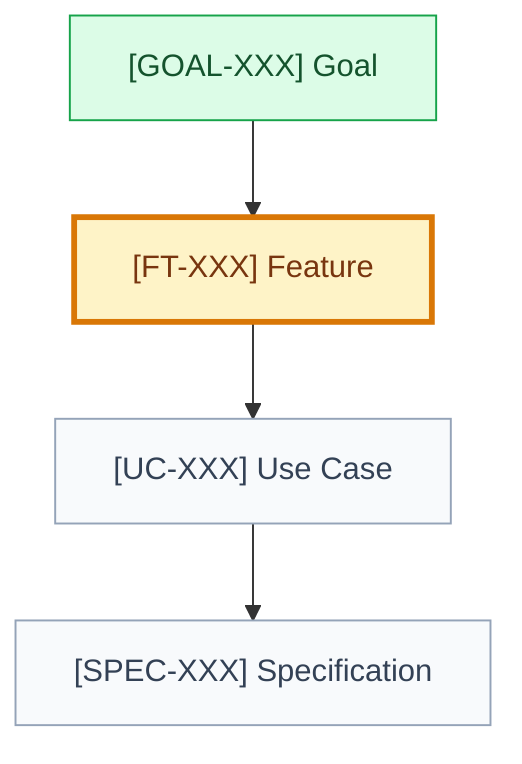

# Feature: [feature name]

## 🧭 Snapshot

| Field | Value |
| --- | --- |
| ID | `[FT-XXX]` |
| Status | `[draft | proposed | approved]` |
| Domain | [`DOMAIN-XXX`](<path-to-domain.md>#domain-xxx) |
| User goal | [`GOAL-XXX`](<path-to-goal.md>#goal-xxx) |
| Owner skill | Feature AI |
| Next skill | Use Case AI |

## 🚚 Delivery

| Field | Value |
| --- | --- |
| Level | `[L0 | L1 | L2 | L3 | L4 | L5]` |
| Priority | `[P0 | P1 | P2 | P3]` |
| Depends on | `[artifact ids/paths]` |
| Rationale | `[why this belongs here]` |

## 📌 Summary

[Describe the concrete solution and how it supports the parent goal.]

## 🎯 Problem Fit

| User Problem | Business Reason | Evidence |
| --- | --- | --- |
| `[problem]` | `[reason]` | `[path/source]` |

## 🧱 Scope

| In Scope | Non-Goals |
| --- | --- |
| `[behavior]` | `[excluded behavior]` |

## Delivery Slice

| Field | Value |
| --- | --- |
| User value | `[observable value]` |
| Entry point | `[where the slice begins]` |
| End state | `[observable completion]` |
| Independently releasable | `[yes/no]` |
| Reversible | `[yes/no and how]` |
| Deferred | `[explicitly postponed behavior]` |

## 🎬 Use Cases

| Use Case | Status | Delivery | Priority | Notes |
| --- | --- | --- | --- | --- |
| [`UC-XXX`](<path-to-use-case.md>#uc-xxx) `[name]` | `[status]` | `[L0-L5]` | `[P0-P3]` | `[notes]` |

## 🗺️ Feature Flow

## 🎨 UX Notes

| Area | Notes |
| --- | --- |
| Entry points | `[entry points]` |
| Core states | `[states]` |
| Empty/loading/error states | `[states]` |
| Accessibility | `[requirements]` |

## 🔐 Data, Permissions, And Risks

| Topic | Detail |
| --- | --- |
| Data touched | `[entities/fields]` |
| Permission model | `[who can do what]` |
| Sensitive data or abuse risks | `[risk]` |

## 📊 Analytics

| Event | Meaning |
| --- | --- |
| `[event]` | `[meaning]` |

## ⚠️ Open Questions

| Question | Blocks | Owner |
| --- | --- | --- |
| `[question]` | `[artifact]` | `[role]` |

## 🏁 Approval

| Field | Value |
| --- | --- |
| Approved by |  |
| Date |  |
| Notes |  |
