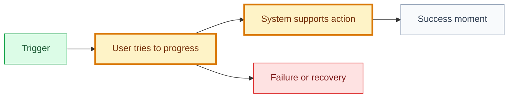

# User Goal: [goal name]

## 🧭 Snapshot

| Field | Value |
| --- | --- |
| ID | `[GOAL-XXX]` |
| Status | `[draft | proposed | approved]` |
| Domain | [`DOMAIN-XXX`](<path-to-domain.md>#domain-xxx) |
| Owner skill | User Goal AI |
| Next skill | Journey AI or Feature AI |

## 🎯 User Intent

As a `[user]`, I want to `[goal]`, so I can `[outcome]`.

## 💡 Why This Goal Matters

[Explain the product value and how it traces to strategy.]

## 🗺️ Journey Summary

## 🧱 Candidate Features

| Feature | Status | Delivery | Priority | Notes |
| --- | --- | --- | --- | --- |
| [`FT-XXX`](<path-to-feature.md>#ft-xxx) `[name]` | `[status]` | `[L0-L5]` | `[P0-P3]` | `[notes]` |

## 📏 Rules And Constraints

| Rule/Constraint | Source | Impact |
| --- | --- | --- |
| `[rule]` | `[decision/path]` | `[impact]` |

## 📊 Metrics

| Metric | Meaning |
| --- | --- |
| `[metric]` | `[meaning]` |

## ⚠️ Risks And Open Questions

| Item | Blocks | Owner |
| --- | --- | --- |
| `[risk/question]` | `[artifact]` | `[role]` |

## 🏁 Approval

| Field | Value |
| --- | --- |
| Approved by |  |
| Date |  |
| Notes |  |
