# Implementation Plan: [use case name]

## 🧭 Snapshot

| Field | Value |
| --- | --- |
| ID | `[PLAN-XXX]` |
| Status | `[draft | proposed | approved]` |
| Source specification | `[SPEC-XXX]` |
| Source design | `[DES-XXX | Not applicable]` |
| Owner skill | Implementation Planner AI |
| Next skill | Execution Graph AI |

## 🔗 Navigation

| Artifact | Link |
| --- | --- |
| Context | [context.md](context.md) |
| Specification | [specification.md](specification.md) |
| Design | [design.md](design.md) |
| Technical Discovery | [technical-discovery.md](technical-discovery.md) |
| Engineering Proposal | [engineering-proposal.md](engineering-proposal.md) |
| Engineering Review | [engineering-review.md](engineering-review.md) |
| Applicable decisions | `[DEC-* ids or N/A]` |
| Execution Graph | [execution-graph.json](execution-graph.json) |
| Tasks | [tasks.md](tasks.md) |
| Tests | [tests.md](tests.md) |
| QA Evidence | [qa-evidence.md](qa-evidence.md) |
| Security Review | [security-review.md](security-review.md) |
| Audit | [audit.md](audit.md) |

## 🚚 Delivery

| Field | Value |
| --- | --- |
| Level | `[L0 | L1 | L2 | L3 | L4 | L5]` |
| Priority | `[P0 | P1 | P2 | P3]` |
| Depends on | `[artifact ids/paths]` |
| Rationale | `[why this plan belongs here]` |

## 🎯 Technical Objective

[Describe the technical outcome without writing application code.]

## 🧱 Scope

| In Scope | Out Of Scope |
| --- | --- |
| `[technical area]` | `[excluded area]` |

## 🗺️ Delivery Sequence

```mermaid
flowchart LR
  A["Data/model"] --> B["Rules and permissions"]
  B --> C["API/services"]
  C --> D["UI/states"]
  D --> E["Analytics and observability"]
  E --> F["Tests and QA evidence"]
  F --> G["Security review"]
  G --> H["Release readiness"]

  classDef done fill:#dcfce7,stroke:#16a34a,color:#14532d;
  classDef current fill:#fef3c7,stroke:#d97706,color:#78350f,stroke-width:3px;
  classDef pending fill:#f8fafc,stroke:#94a3b8,color:#334155;
  classDef blocked fill:#fee2e2,stroke:#dc2626,color:#7f1d1d;

  class A current;
  class B,C,D,E,F,G,H pending;
```

## 🧩 Phases

| Phase | Output | Dependencies | Risks |
| --- | --- | --- | --- |
| `[phase]` | `[output]` | `[dependencies]` | `[risks]` |

## 🔗 Dependencies

| Dependency | Type | Blocking | Notes |
| --- | --- | --- | --- |
| `[dependency]` | `[data/api/design/decision]` | `[yes/no]` | `[notes]` |

## ⚠️ Risks

| Risk | Impact | Mitigation |
| --- | --- | --- |
| `[risk]` | `[impact]` | `[mitigation]` |

## 🧪 Test Plan

| Test Area | Coverage |
| --- | --- |
| Unit | `[coverage]` |
| Integration | `[coverage]` |
| UI | `[coverage]` |
| Accessibility | `[coverage]` |
| Security/privacy | `[authz, data, abuse, logging, secrets]` |
| Analytics/observability | `[coverage]` |

## 🔙 Rollback Plan

| Scenario | Rollback Action | Owner |
| --- | --- | --- |
| `[scenario]` | `[action]` | `[role]` |

## 📁 Probable Application Areas

These are planning hints, not files to create in this framework repo.

| Area | Expected Work |
| --- | --- |
| `[module/service/screen]` | `[work]` |

## 🔐 Decisions Needing ADR Or Approval

| Decision | Blocks | Owner |
| --- | --- | --- |
| `[decision]` | `[artifact/task]` | `[role]` |

## ✅ Candidate Tasks

- [Task candidate that will become a graph node.]
