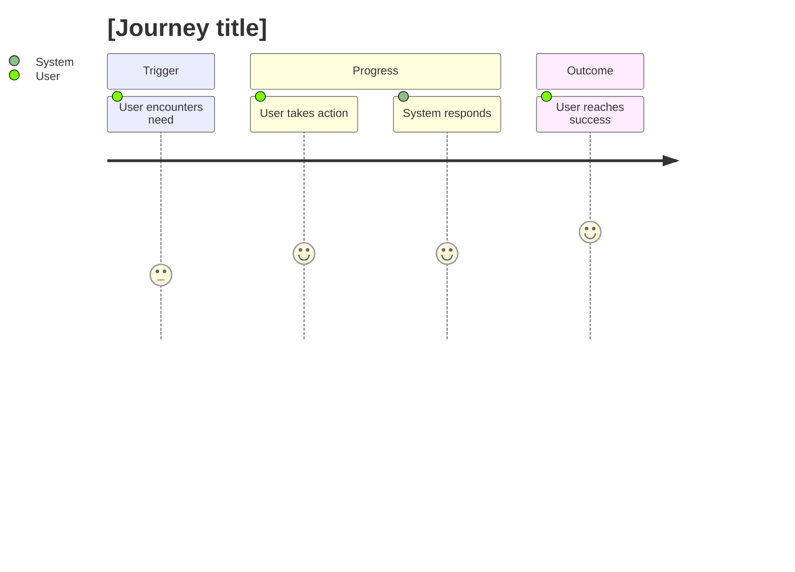

# Journey: [goal or scenario name]

## 🧭 Snapshot

| Field | Value |
| --- | --- |
| ID | `[JOURNEY-XXX]` |
| Status | `[draft | proposed | approved]` |
| Source goal | `[GOAL-XXX]` |
| Owner skill | Journey AI |
| Next skill | Feature AI |

## 👤 Actor

[Primary user or stakeholder moving through the journey.]

## 🎯 Desired Outcome

[What successful completion means for the user.]

## 🗺️ Journey Flow

## 🧩 Steps

| Step | User Action | System Response | Emotion/Friction | Opportunity |
| --- | --- | --- | --- | --- |
| 1 | `[action]` | `[response]` | `[emotion/friction]` | `[opportunity]` |

## 🔀 Decisions And Branches

| Decision Point | Path A | Path B | Risk |
| --- | --- | --- | --- |
| `[decision]` | `[path]` | `[path]` | `[risk]` |

## 📊 Metrics

| Metric | Meaning |
| --- | --- |
| `[metric]` | `[meaning]` |

## ⚠️ Open Questions

| Question | Owner | Blocks |
| --- | --- | --- |
| `[question]` | `[role]` | `[artifact]` |
