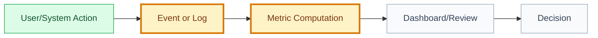

# Metric: [metric name]

## 🧭 Snapshot

| Field | Value |
| --- | --- |
| ID | `[MET-XXX]` |
| Status | `[draft | proposed | approved]` |
| Source artifact | `[STRAT/GOAL/FT/UC id or path]` |
| Owner | `[role/person]` |

## 📊 Definition

[Precise metric definition.]

## 🧮 Formula

| Component | Definition |
| --- | --- |
| Numerator | `[definition]` |
| Denominator | `[definition]` |
| Window | `[time window]` |
| Filters/exclusions | `[filters]` |

## 🗺️ Measurement Flow

## 🎯 Why It Matters

[Product, quality, safety, or operational reason.]

## 🧯 Guardrails

| Guardrail | Why Needed |
| --- | --- |
| `[guardrail]` | `[reason]` |

## 🔌 Instrumentation

| Source | Name | Notes |
| --- | --- | --- |
| Event | `[event]` | `[notes]` |
| Log | `[log]` | `[notes]` |
| Data source | `[source]` | `[notes]` |

## 🏁 Approval

| Field | Value |
| --- | --- |
| Approved by |  |
| Date |  |
| Notes |  |
