# QA Evidence: [use case name]

## Snapshot

| Field | Value |
| --- | --- |
| ID | `[QA-XXX]` |
| Status | `[draft | proposed | approved | validated]` |
| Source use case | `[UC-XXX]` |
| Source specification | `[SPEC-XXX]` |
| Source tests | `[TEST-XXX]` |
| Engineering System | `[ENGSYS-XXX @ semver | Not configured]` |
| Quality policy | `[engineering/quality/quality-system.md | Legacy quality model]` |
| Owner skill | QA AI |
| Next skill | Security Review AI or Audit Orchestrator |

## Navigation

| Artifact | Link |
| --- | --- |
| Context | [context.md](context.md) |
| Specification | [specification.md](specification.md) |
| Implementation Plan | [implementation-plan.md](implementation-plan.md) |
| Execution Graph | [execution-graph.json](execution-graph.json) |
| Tasks Index | [tasks.md](tasks.md) |
| Tests | [tests.md](tests.md) |
| Security Review | [security-review.md](security-review.md) |
| Audit | [audit.md](audit.md) |

## QA Evidence Flow

```mermaid
flowchart LR
  A["Acceptance criteria"] --> T["Test cases"]
  T --> C["Code traceability"]
  C --> E["Evidence"]
  E --> S["Security checks"]
  S --> V["QA verdict"]
  V --> R["Security review or audit"]

  classDef done fill:#dcfce7,stroke:#16a34a,color:#14532d;
  classDef current fill:#fef3c7,stroke:#d97706,color:#78350f,stroke-width:3px;
  classDef pending fill:#f8fafc,stroke:#94a3b8,color:#334155;
  classDef blocked fill:#fee2e2,stroke:#dc2626,color:#7f1d1d;

  class A,T done;
  class C,E current;
  class S,V,R pending;
```

## Code Traceability

| Task | Branch | Commits | PR | Code Paths |
| --- | --- | --- | --- | --- |
| `[TK-XXX-001]` | `[branch]` | `[commit hashes]` | `[PR URL or id]` | `[repo-relative paths]` |

## Gate Evidence

| Field | Value |
| --- | --- |
| Gate source | `knowledge/conventions/gates.md` |
| Base commit | `[commit hash]` |
| Verified diff hash | `[same sha256 approved by Code Review]` |
| Test command | `[command or method]` |
| Gate logs | `[path, URL, or captured command output]` |
| CI URL | `[URL or N/A]` |
| Screenshots | `[paths or N/A]` |
| Environment | `[local/staging/production/CI]` |
| Limitations | `[unavailable gate/environment limitation or N/A]` |

## Independent QA Checks

| Check | Evidence | Result | Notes |
| --- | --- | --- | --- |
| Gates re-run independently | `[log/output/path]` | `[passed/failed/blocked/not run]` | `[notes]` |
| Hollow test scan | `[test/path/review notes]` | `[passed/failed/blocked/not run]` | `[notes]` |
| Negative and permission cases | `[test/path/review notes]` | `[passed/failed/blocked/not run]` | `[notes]` |
| Scope drift against writeScope | `[diff/path/review notes]` | `[passed/failed/blocked/not run]` | `[notes]` |
| Specification divergence | `[spec section/evidence]` | `[passed/failed/blocked/not run]` | `[notes]` |
| Quality System conformity | `[policy section/evidence/N/A]` | `[passed/failed/blocked/not run/N/A]` | `[deviations and exceptions]` |
| Environment and test data policy | `[environment/data evidence/N/A]` | `[passed/failed/blocked/not run/N/A]` | `[notes]` |
| Flaky test and exception policy | `[QEX-* or scan notes/N/A]` | `[passed/failed/blocked/not run/N/A]` | `[notes]` |

## Visual And Accessibility Evidence

| Requirement | Evidence | Result | Notes |
| --- | --- | --- | --- |
| Visual surface applies | `[yes/no]` | `[N/A or required]` | `[why]` |
| Screenshot | `[path/CI artifact/N/A]` | `[passed/failed/blocked/not run/N/A]` | `[notes]` |
| Roles and labels | `[review/test/N/A]` | `[passed/failed/blocked/not run/N/A]` | `[notes]` |
| Focus and touch targets | `[review/test/N/A]` | `[passed/failed/blocked/not run/N/A]` | `[notes]` |
| Contrast | `[review/test/N/A]` | `[passed/failed/blocked/not run/N/A]` | `[notes]` |

## Acceptance Evidence Matrix

| Acceptance Criterion | Source | Validation Method | Evidence | Result |
| --- | --- | --- | --- | --- |
| `[AC-001]` | `[specification.md section]` | `[automated/manual/review]` | `[path/log/screenshot/test run]` | `[passed/failed/blocked/not run]` |

## Test Execution

| Test | Type | Command Or Method | Evidence | Result |
| --- | --- | --- | --- | --- |
| `[test id]` | `[unit/integration/e2e/manual/security/accessibility]` | `[command/method]` | `[path]` | `[passed/failed/blocked/not run]` |

## Security And Privacy Evidence

| Control | Evidence | Result | Notes |
| --- | --- | --- | --- |
| Authorization | `[path/test/log]` | `[passed/failed/blocked/not run]` | `[notes]` |
| Data privacy | `[path/test/log]` | `[passed/failed/blocked/not run]` | `[notes]` |
| Abuse/edge cases | `[path/test/log]` | `[passed/failed/blocked/not run]` | `[notes]` |
| Safe logging/analytics | `[path/test/log]` | `[passed/failed/blocked/not run]` | `[notes]` |

## Failure Routing

| Finding Type | Route | Owner | Re-entry Gate |
| --- | --- | --- | --- |
| Defect/regression/security bug with known expected behavior | `bug-fixer` | `[owner]` | QA |
| Missing or hollow test coverage | `qa` | `[owner]` | QA |
| Incomplete implementation or code outside task contract | `code-runner` | `[owner]` | QA |
| Missing decision or ambiguous product/security rule | `product-historian` | `[human owner]` | Approval gate |

## Defects And Fix Verification

| Finding | Severity | Fix Evidence | Status | Route | Owner |
| --- | --- | --- | --- | --- | --- |
| `[finding]` | `[blocker/high/medium/low]` | `[path]` | `[open/fixed/accepted]` | `[bug-fixer/code-runner/qa/product-historian]` | `[skill/person]` |

## Residual Risk

| Risk | Why It Remains | Mitigation | Approval |
| --- | --- | --- | --- |
| `[risk]` | `[reason]` | `[mitigation]` | `[DEC-XXX/N/A]` |

## QA Verdict

| Field | Value |
| --- | --- |
| Verdict | `[passed | passed_with_notes | blocked]` |
| Coverage complete | `[yes/no]` |
| Security evidence complete | `[yes/no]` |
| Blocks validation | `[yes/no]` |
| Blocks release | `[yes/no]` |
| Next owner | `[skill/role]` |
