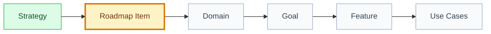

# Roadmap Item: [item name]

## 🧭 Snapshot

| Field | Value |
| --- | --- |
| ID | `[ROAD-XXX]` |
| Status | `[draft | proposed | approved]` |
| Source strategy | `[STRAT-XXX]` |
| Owner skill | Strategy AI |

## 🚚 Delivery

| Field | Value |
| --- | --- |
| Level | `[L0 | L1 | L2 | L3 | L4 | L5]` |
| Priority | `[P0 | P1 | P2 | P3]` |
| Depends on | `[artifact ids/paths]` |
| Rationale | `[why this level and priority are assigned]` |

## 🎯 Outcome

[What changes for users or operations when complete.]

## 🧱 Scope

| Includes | Excludes |
| --- | --- |
| `[scope]` | `[non-goal]` |

## 🗺️ Roadmap Flow

## 📂 Candidate Artifacts

| Type | Artifact | Status |
| --- | --- | --- |
| Domain | `[DOMAIN-XXX]` | `[status]` |
| Goal | `[GOAL-XXX]` | `[status]` |
| Feature | `[FT-XXX]` | `[status]` |
| Use case | `[UC-XXX]` | `[status]` |

## ⚠️ Risks

| Risk | Impact | Mitigation |
| --- | --- | --- |
| `[risk]` | `[impact]` | `[mitigation]` |

## 🏁 Approval

| Field | Value |
| --- | --- |
| Approved by |  |
| Date |  |
| Notes |  |
