# Specification: [use case name]

## 🧭 Snapshot

| Field | Value |
| --- | --- |
| ID | `[SPEC-XXX]` |
| Status | `[draft | proposed | approved]` |
| Source use case | `[UC-XXX]` |
| Source feature | `[FT-XXX]` |
| Owner skill | Specification AI |
| Next skill | UX/UI AI |

## 🔗 Navigation

| Artifact | Link |
| --- | --- |
| Context | [context.md](context.md) |
| Use Case | [use-case.md](use-case.md) |
| Design | [design.md](design.md) |
| Implementation Plan | [implementation-plan.md](implementation-plan.md) |
| Execution Graph | [execution-graph.json](execution-graph.json) |
| Tasks | [tasks.md](tasks.md) |
| Tests | [tests.md](tests.md) |
| QA Evidence | [qa-evidence.md](qa-evidence.md) |
| Security Review | [security-review.md](security-review.md) |
| Analytics | [analytics.md](analytics.md) |
| Audit | [audit.md](audit.md) |

## 🚚 Delivery

| Field | Value |
| --- | --- |
| Level | `[L0 | L1 | L2 | L3 | L4 | L5]` |
| Priority | `[P0 | P1 | P2 | P3]` |
| Depends on | `[artifact ids/paths]` |
| Rationale | `[why this belongs here]` |

## 🗺️ Contract Flow

```mermaid
flowchart LR
  U["Use Case"] --> S["Specification"]
  S --> D["Design"]
  D --> P["Implementation Plan"]
  P --> G["Execution Graph"]
  G --> T["Tasks"]
  T --> Q["QA Evidence"]
  Q --> SR["Security Review"]

  classDef done fill:#dcfce7,stroke:#16a34a,color:#14532d;
  classDef current fill:#fef3c7,stroke:#d97706,color:#78350f,stroke-width:3px;
  classDef pending fill:#f8fafc,stroke:#94a3b8,color:#334155;
  classDef blocked fill:#fee2e2,stroke:#dc2626,color:#7f1d1d;

  class U done;
  class S current;
  class D,P,G,T,Q,SR pending;
```

## 📌 Product Context

[Why this use case matters and which outcome it supports.]

## 🧱 Scope

| In Scope | Non-Goals |
| --- | --- |
| `[behavior to implement]` | `[behavior explicitly excluded]` |

## ⚙️ Functional Behavior

### Main Flow

1. [Step]
2. [Step]
3. [Step]

### Alternate, Error, And Edge Flows

| Type | Case | Expected Behavior |
| --- | --- | --- |
| Alternate | `[flow]` | `[behavior]` |
| Error | `[error]` | `[behavior/logging/analytics]` |
| Edge | `[edge case]` | `[behavior]` |

## 📏 Business Rules

| Rule | Source | Impact |
| --- | --- | --- |
| `[rule]` | `[decision/path]` | `[impact]` |

## 🎨 UX Contract

| Area | Requirement |
| --- | --- |
| Entry points | `[entry points]` |
| UI states | `[states]` |
| Accessibility | `[requirements]` |
| Copy/content | `[requirements]` |
| Design artifact required | `[yes/no]` |

## 🔌 API Contract

| API | Request | Response | Errors |
| --- | --- | --- | --- |
| `[command/query]` | `[shape]` | `[shape]` | `[errors]` |

## 🗃️ Data Contract

| Entity/Table | Fields | Constraints | Privacy/Retention |
| --- | --- | --- | --- |
| `[entity]` | `[fields]` | `[constraints]` | `[notes]` |

## 🔐 Permissions And Security

| Topic | Requirement |
| --- | --- |
| Who can read | `[actors]` |
| Who can write | `[actors]` |
| Server-authoritative checks | `[checks]` |
| Abuse cases | `[cases]` |
| Privacy/LGPD notes | `[notes]` |

## 📊 Analytics And Observability

| Type | Name | Purpose |
| --- | --- | --- |
| Event | `[event]` | `[purpose]` |
| Log | `[log]` | `[purpose]` |
| Metric | `[metric]` | `[purpose]` |
| Alert | `[alert]` | `[purpose]` |

## ⚡ Performance And Reliability

| Topic | Expectation |
| --- | --- |
| Latency | `[expectation]` |
| Offline/retry behavior | `[behavior]` |
| Concurrency/idempotency | `[behavior]` |

## 🚢 Rollout

| Topic | Plan |
| --- | --- |
| Feature flag | `[flag or N/A]` |
| Migration/backfill | `[plan or N/A]` |
| Rollback | `[plan]` |

## ✅ Acceptance Criteria

- [ ] [End-to-end observable behavior]
- [ ] [Permission/security behavior]
- [ ] [Analytics/observability behavior]
- [ ] [Failure mode behavior]

## 🔐 Open Questions And Decisions

| Question/Decision | Owner | Blocks |
| --- | --- | --- |
| `[question]` | `[role]` | `[artifact]` |

## 🏁 Approval

| Field | Value |
| --- | --- |
| Approved by |  |
| Date |  |
| Notes |  |
