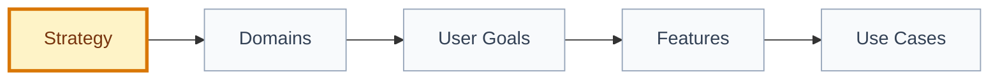

# Strategy: [strategy name]

## 🧭 Snapshot

| Field | Value |
| --- | --- |
| ID | `[STRAT-XXX]` |
| Status | `[draft | proposed | approved]` |
| Source vision | `[VIS-XXX/path]` |
| Owner skill | Strategy AI |
| Next skill | Domain Architect AI |

## 🎯 Strategic Focus

[Describe the strategic bet, target segment, and intended product outcome.]

## 👥 Segments And Personas

| Persona | Job To Be Done | Priority | Evidence |
| --- | --- | --- | --- |
| `[persona]` | `[job]` | `[P0-P3]` | `[path/source]` |

## 📊 Metrics

| Metric | Type | Why It Matters | Guardrail |
| --- | --- | --- | --- |
| `[metric]` | `[north-star/activation/quality/safety/ops]` | `[reason]` | `[guardrail]` |

## 🗺️ Roadmap By Delivery Level

| Level | Strategic Intent | Candidate Scope | Exit Criteria |
| --- | --- | --- | --- |
| L0 Foundation | `[intent]` | `[scope]` | `[criteria]` |
| L1 Walking Skeleton | `[intent]` | `[scope]` | `[criteria]` |
| L2 Core Loop | `[intent]` | `[scope]` | `[criteria]` |
| L3 Trust, Safety and Quality | `[intent]` | `[scope]` | `[criteria]` |
| L4 Operations and Scale | `[intent]` | `[scope]` | `[criteria]` |
| L5 Growth and Optimization | `[intent]` | `[scope]` | `[criteria]` |

## 🧱 Domain Handoff

## ⚠️ Risks And Trade-offs

| Risk/Trade-off | Impact | Mitigation |
| --- | --- | --- |
| `[risk]` | `[impact]` | `[mitigation]` |

## 🔐 Decisions Needed

| Decision | Blocks | Owner |
| --- | --- | --- |
| `[decision]` | `[artifact]` | `[role]` |

## 🏁 Approval

| Field | Value |
| --- | --- |
| Approved by |  |
| Date |  |
| Notes |  |
